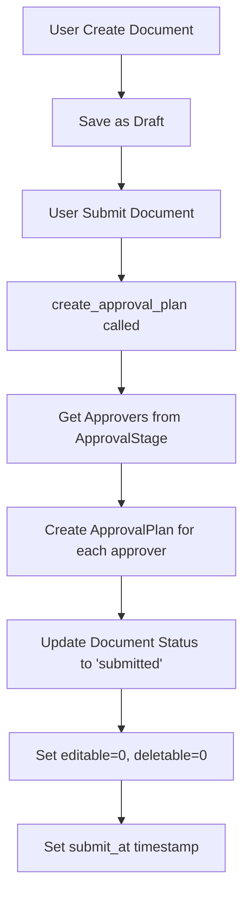
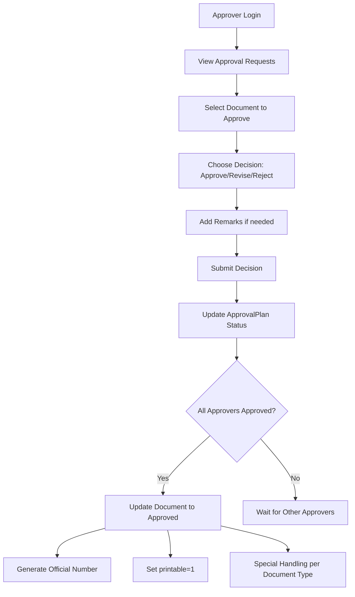

# Sistem Approval Payreq-X v3

## 📋 Daftar Isi

1. [Overview Sistem Approval](#overview-sistem-approval)
2. [Arsitektur Database](#arsitektur-database)
3. [Model dan Relasi](#model-dan-relasi)
4. [Controller dan Logic](#controller-dan-logic)
5. [View dan UI](#view-dan-ui)
6. [Workflow Approval](#workflow-approval)
7. [Permission dan Role](#permission-dan-role)
8. [Penerapan pada Dokumen](#penerapan-pada-dokumen)
9. [Fitur Khusus](#fitur-khusus)
10. [API dan Integration](#api-dan-integration)

---

## 🎯 Overview Sistem Approval

Sistem approval di Payreq-X v3 adalah sistem workflow yang kompleks untuk mengelola persetujuan dokumen keuangan. Sistem ini mendukung 3 jenis dokumen utama:

-   **Payment Request (Payreq)** - Permintaan pembayaran
-   **Realization** - Realisasi pengeluaran
-   **RAB (Anggaran)** - Rencana Anggaran Biaya

### Karakteristik Utama

-   **Multi-level Approval**: Setiap dokumen dapat memiliki multiple approver
-   **Project-based**: Approval berdasarkan project dan department
-   **Flexible Configuration**: Approval stages dapat dikonfigurasi per project, department, dan document type
-   **Status Tracking**: Tracking lengkap status approval dengan remarks
-   **Bulk Operations**: Support untuk bulk approval
-   **Document Lifecycle**: Manajemen siklus hidup dokumen dari draft hingga approved

---

## 🗄️ Arsitektur Database

### 1. Tabel `approval_stages`

```sql
CREATE TABLE approval_stages (
    id BIGINT PRIMARY KEY AUTO_INCREMENT,
    project VARCHAR(255) NOT NULL,
    department_id VARCHAR(255) NOT NULL,
    approver_id VARCHAR(255) NOT NULL,
    document_type VARCHAR(20) NULL, -- payreq / realization / rab
    created_at TIMESTAMP NULL,
    updated_at TIMESTAMP NULL
);
```

**Fungsi**: Menyimpan konfigurasi approval stages untuk setiap kombinasi project, department, dan document type.

### 2. Tabel `approval_plans`

```sql
CREATE TABLE approval_plans (
    id BIGINT PRIMARY KEY AUTO_INCREMENT,
    document_id INT NOT NULL,
    document_type VARCHAR(255) NOT NULL, -- payreq | realization | rab
    approver_id BIGINT UNSIGNED NOT NULL,
    status INT DEFAULT 0, -- pending=0 | approved=1 | revised=2 | rejected=3 | cancelled=4
    remarks VARCHAR(255) NULL,
    is_open BOOLEAN DEFAULT TRUE, -- approval yg disetujui dihitung hanya yg is_open=true
    is_read BOOLEAN DEFAULT TRUE,
    created_at TIMESTAMP NULL,
    updated_at TIMESTAMP NULL
);
```

**Fungsi**: Menyimpan instance approval untuk setiap dokumen yang disubmit.

### 3. Tabel Dokumen Utama

#### `payreqs`

```sql
-- Fields terkait approval
status VARCHAR(20) NULL, -- draft/submitted/approved/rejected/paid/realized/verified/canceled
submit_at TIMESTAMP NULL,
approved_at TIMESTAMP NULL,
editable BOOLEAN DEFAULT TRUE,
deletable BOOLEAN DEFAULT TRUE,
printable BOOLEAN DEFAULT FALSE
```

#### `realizations`

```sql
-- Fields terkait approval
status VARCHAR(50) NULL, -- draft/approved/reject/cancel/pending/verified
submit_at TIMESTAMP NULL,
approved_at TIMESTAMP NULL,
editable BOOLEAN DEFAULT TRUE,
deletable BOOLEAN DEFAULT TRUE,
printable BOOLEAN DEFAULT FALSE
```

#### `anggarans`

```sql
-- Fields terkait approval
status VARCHAR(50) NULL,
submit_at TIMESTAMP NULL,
approved_at TIMESTAMP NULL,
editable BOOLEAN DEFAULT TRUE,
deletable BOOLEAN DEFAULT TRUE,
printable BOOLEAN DEFAULT FALSE
```

---

## 🏗️ Model dan Relasi

### 1. Model `ApprovalStage`

```php
class ApprovalStage extends Model
{
    protected $guarded = [];

    public function approver()
    {
        return $this->belongsTo(User::class, 'approver_id');
    }

    public function department()
    {
        return $this->belongsTo(Department::class);
    }
}
```

### 2. Model `ApprovalPlan`

```php
class ApprovalPlan extends Model
{
    protected $guarded = [];

    public function approver()
    {
        return $this->belongsTo(User::class, 'approver_id')->withDefault([
            'name' => 'N/A',
        ]);
    }

    public function payreq()
    {
        return $this->belongsTo(PayReq::class, 'document_id', 'id');
    }

    public function realization()
    {
        return $this->belongsTo(Realization::class, 'document_id', 'id');
    }

    public function anggaran()
    {
        return $this->belongsTo(Anggaran::class, 'document_id', 'id');
    }
}
```

### 3. Model Dokumen dengan Approval

#### `Payreq`

```php
public function approval_plans()
{
    return $this->hasMany(ApprovalPlan::class);
}
```

#### `Realization`

```php
public function approval_plans()
{
    return $this->hasMany(ApprovalPlan::class);
}
```

#### `Anggaran`

```php
public function approval_plans()
{
    return $this->hasMany(ApprovalPlan::class);
}
```

### 4. Model `User`

```php
public function approval_stages()
{
    return $this->hasMany(ApprovalStage::class, 'approver_id', 'id');
}
```

---

## 🎮 Controller dan Logic

### 1. `ApprovalPlanController`

Controller utama yang menangani workflow approval untuk semua jenis dokumen.

#### Method `create_approval_plan($document_type, $document_id)`

```php
/**
 * Create approval plans for a document
 *
 * This function creates approval plans for a specific document based on its type.
 * It identifies the appropriate approvers from the ApprovalStage model and
 * creates an approval plan entry for each approver.
 *
 * @param string $document_type Type of document ('payreq', 'realization', 'rab')
 * @param int $document_id ID of the document
 * @return int|bool Number of approvers created or false if failed
 */
public function create_approval_plan($document_type, $document_id)
{
    // Retrieve the document based on its type
    if ($document_type == 'payreq') {
        $document = Payreq::findOrFail($document_id);
    } elseif ($document_type == 'realization') {
        $document = Realization::findOrFail($document_id);
    } elseif ($document_type == 'rab') {
        $document = Anggaran::findOrFail($document_id);
    } else {
        return false; // Invalid document type
    }

    // Get all approvers for this document type, project and department
    $approvers = ApprovalStage::where('project', $document->project)
        ->where('department_id', $document->department_id)
        ->where('document_type', $document_type)
        ->get();

    // If approvers exist, create approval plans
    if ($approvers->count() > 0) {
        // Create an approval plan for each approver
        foreach ($approvers as $approver) {
            ApprovalPlan::create([
                'document_id' => $document_id,
                'document_type' => $document_type,
                'approver_id' => $approver->approver_id,
            ]);
        }

        // Update document to mark it as submitted and no longer editable
        $document->submit_at = Carbon::now();
        $document->editable = 0;
        $document->deletable = 0;
        $document->save();

        return $approvers->count(); // Return number of approvers
    }

    // Return false if no approvers found
    return false;
}
```

#### Method `update(Request $request, $id)`

```php
/**
 * Update approval decision
 *
 * This function processes an approval decision (approve, revise, reject)
 * and updates both the approval plan and the associated document.
 *
 * Approval status codes:
 * 0 = Pending
 * 1 = Approved
 * 2 = Revise
 * 3 = Reject
 * 4 = Canceled
 *
 * @param Request $request The HTTP request containing approval data
 * @param int $id The ID of the approval plan to update
 * @return \Illuminate\Http\RedirectResponse Redirect to appropriate page
 */
public function update(Request $request, $id)
{
    // Find and update the approval plan with the decision
    $approval_plan = ApprovalPlan::findOrFail($id);
    $approval_plan->update([
        'status' => $request->status,
        'remarks' => $request->remarks,
        'is_read' => $request->remarks ? 0 : 1, // Mark as unread if there are remarks
    ]);

    // Get document type and retrieve the associated document
    $document_type = $approval_plan->document_type;

    if ($document_type == 'payreq') {
        $document = Payreq::where('id', $approval_plan->document_id)->first();
    } elseif ($document_type == 'realization') {
        $document = Realization::findOrFail($approval_plan->document_id);
    } elseif ($document_type == 'rab') {
        $document = Anggaran::findOrFail($approval_plan->document_id);
    } else {
        return false; // Invalid document type
    }

    // Get all active approval plans for this document
    $approval_plans = ApprovalPlan::where('document_id', $document->id)
        ->where('document_type', $document_type)
        ->where('is_open', 1)
        ->get();

    // Count different approval decisions
    $rejected_count = 0;
    $revised_count = 0;
    $approved_count = 0;

    foreach ($approval_plans as $approval_plan) {
        if ($approval_plan->status == 3) { // Rejected
            $rejected_count++;
        }
        if ($approval_plan->status == 2) { // Revised
            $revised_count++;
        }
        if ($approval_plan->status == 1) { // Approved
            $approved_count++;
        }
    }

    // Handle document revision request
    if ($revised_count > 0) {
        $document->update([
            'status' => 'revise',
            'editable' => 1,
            'deletable' => 1,
        ]);

        // find its payment request if it exists
        $payment_request = Payreq::where('id', $document->payreq_id)->first();
        if ($payment_request) {
            $payment_request->update([
                'status' => 'paid'
            ]);
        }

        // Close all open approval plans for this document
        $this->closeOpenApprovalPlans($document_type, $document->id);
    }

    // Handle document rejection
    if ($rejected_count > 0) {
        $document->update([
            'status' => 'rejected',
            'deletable' => 1,
        ]);

        // find its payment request if it exists
        $payment_request = Payreq::where('id', $document->payreq_id)->first();
        if ($payment_request) {
            $payment_request->update([
                'status' => 'paid'
            ]);
        }

        // Close all open approval plans for this document
        $this->closeOpenApprovalPlans($document_type, $document->id);
    }

    // Handle document approval (when all approvers have approved)
    if ($approved_count === $approval_plans->count()) {
        // Set printable = 1 untuk semua dokumen
        $printable_value = 1;

        // Update document status to approved
        $updateData = [
            'status' => 'approved',
            'printable' => $printable_value,
            'editable' => 0,
            'approved_at' => $approval_plan->updated_at,
        ];

        // Generate official number hanya untuk payreq advance (bukan reimburse)
        if ($document_type === 'payreq' && $document->type !== 'reimburse') {
            $updateData['draft_no'] = $document->nomor;
            $updateData['nomor'] = app(DocumentNumberController::class)->generate_document_number($document_type, auth()->user()->project);
        }

        $document->update($updateData);

        // Find its payment request if it exists
        $payment_request = Payreq::where('id', $document->payreq_id)->first();
        if ($payment_request) {
            $payment_request->update([
                'status' => 'realization',
            ]);
        }

        // Special handling for reimbursement type payment requests
        if ($document_type === 'payreq') {
            if ($document->type === 'reimburse') {
                $realization = Realization::where('payreq_id', $document->id)->first();
                if ($realization) {
                    $realization->update([
                        'status' => 'reimburse-approved',
                        'approved_at' => $approval_plan->updated_at,
                    ]);
                }
            }
        }

        // Special handling for realization documents
        if ($document_type === 'realization') {
            // Set due date for realization (3 days from now)
            $realization = Realization::findOrFail($document->id);
            $realization->update([
                'due_date' => Carbon::now()->addDays(3),
            ]);

            // Check variance between payment request and realization amounts
            app(UserRealizationController::class)->check_realization_amount($document->id);
        }

        // Special handling for budget (RAB) documents
        if ($document_type === 'rab') {
            $document->update([
                'periode_ofr' => $request->periode_ofr ?? null,
                'usage' => $request->usage ?? null,
                'periode_anggaran' => $request->periode_anggaran ?? null,
            ]);
        }
    }

    // Determine the appropriate success message based on the approval status
    $status_text = '';
    if ($request->status == 1) {
        $status_text = 'approved';
    } elseif ($request->status == 2) {
        $status_text = 'sent back for revision';
    } elseif ($request->status == 3) {
        $status_text = 'rejected';
    } else {
        $status_text = 'updated';
    }

    // Check if the request is AJAX
    if ($request->ajax()) {
        return response()->json([
            'success' => true,
            'message' => ucfirst($document_type) . ' has been ' . $status_text,
            'document_type' => $document_type
        ]);
    }

    // Redirect to appropriate page based on document type for non-AJAX requests
    if ($document_type === 'payreq') {
        return redirect()->route('approvals.request.payreqs.index')->with('success', 'Payment Request has been ' . $status_text);
    } elseif ($document_type === 'realization') {
        return redirect()->route('approvals.request.realizations.index')->with('success', 'Realization has been ' . $status_text);
    } elseif ($document_type === 'rab') {
        return redirect()->route('approvals.request.anggarans.index')->with('success', 'Budget (RAB) has been ' . $status_text);
    } else {
        return false; // Invalid document type
    }
}
```

#### Method `approvalStatus()`

```php
/**
 * Get approval status descriptions
 *
 * Returns an array mapping status codes to their text descriptions
 *
 * @return array Array of approval status descriptions
 */
public function approvalStatus()
{
    return [
        0 => 'Pending',
        1 => 'Approved',
        2 => 'Revised',
        3 => 'Rejected',
        4 => 'Canceled',
    ];
}
```

#### Method `closeOpenApprovalPlans($document_type, $document_id)`

```php
/**
 * Close all open approval plans for a document
 *
 * This function is called when a document is rejected or needs revision.
 * It marks all open approval plans for the document as closed (is_open = 0).
 *
 * @param string $document_type Type of document
 * @param int $document_id ID of the document
 * @return void
 */
public function closeOpenApprovalPlans($document_type, $document_id)
{
    // Find all open approval plans for this document
    $approval_plans = ApprovalPlan::where('document_id', $document_id)
        ->where('document_type', $document_type)
        ->where('is_open', 1)
        ->get();

    // Close all open approval plans
    if ($approval_plans->count() > 0) {
        foreach ($approval_plans as $approval_plan) {
            $approval_plan->update(['is_open' => 0]);
        }
    }
}
```

#### Method `cekExistingAndDisableOpen($document_type, $document_id)` (Deprecated)

```php
/**
 * @deprecated Use closeOpenApprovalPlans() instead
 */
public function cekExistingAndDisableOpen($document_type, $document_id)
{
    return $this->closeOpenApprovalPlans($document_type, $document_id);
}
```

#### Method `bulkApprove(Request $request)`

```php
/**
 * Bulk approve multiple documents
 *
 * This method allows approving multiple documents at once.
 *
 * @param Request $request The HTTP request containing the IDs of documents to approve
 * @return \Illuminate\Http\JsonResponse JSON response with success/error message
 */
public function bulkApprove(Request $request)
{
    // Validate request
    $request->validate([
        'ids' => 'required|array',
        'ids.*' => 'required|integer',
        'document_type' => 'required|string|in:payreq,realization,rab',
        'remarks' => 'nullable|string',
    ]);

    $successCount = 0;
    $failCount = 0;
    $document_type = $request->document_type;

    // Process each approval plan
    foreach ($request->ids as $id) {
        $approval_plan = ApprovalPlan::findOrFail($id);

        // Skip if not the correct document type or already processed
        if ($approval_plan->document_type !== $document_type || $approval_plan->status !== 0 || $approval_plan->is_open !== 1) {
            $failCount++;
            continue;
        }

        // Update the approval plan
        $approval_plan->update([
            'status' => 1, // Approved
            'remarks' => $request->remarks,
            'is_read' => $request->remarks ? 0 : 1,
        ]);

        // Get the document
        if ($document_type == 'payreq') {
            $document = Payreq::where('id', $approval_plan->document_id)->first();
        } elseif ($document_type == 'realization') {
            $document = Realization::findOrFail($approval_plan->document_id);
        } elseif ($document_type == 'rab') {
            $document = Anggaran::findOrFail($approval_plan->document_id);
        } else {
            $failCount++;
            continue;
        }

        // Get all active approval plans for this document
        $approval_plans = ApprovalPlan::where('document_id', $document->id)
            ->where('document_type', $document_type)
            ->where('is_open', 1)
            ->get();

        // Count approved plans
        $approved_count = $approval_plans->where('status', 1)->count();

        // Check if all approvers have approved
        if ($approved_count === $approval_plans->count()) {
            // Set printable = 1 untuk semua dokumen
            $printable_value = 1;

            // Update document status to approved
            $updateData = [
                'status' => 'approved',
                'printable' => $printable_value,
                'editable' => 0,
                'approved_at' => now(),
            ];

            // Generate official number hanya untuk payreq advance (bukan reimburse)
            if ($document_type === 'payreq' && $document->type !== 'reimburse') {
                $updateData['draft_no'] = $document->nomor;
                $updateData['nomor'] = app(DocumentNumberController::class)->generate_document_number($document_type, auth()->user()->project);
            }

            $document->update($updateData);

            // Find its payment request if it exists
            $payment_request = Payreq::where('id', $document->payreq_id)->first();
            if ($payment_request) {
                $payment_request->update([
                    'status' => 'realization',
                ]);
            }

            // Special handling for reimbursement type payment requests
            if ($document_type === 'payreq') {
                if ($document->type === 'reimburse') {
                    $realization = Realization::where('payreq_id', $document->id)->first();
                    if ($realization) {
                        $realization->update([
                            'status' => 'reimburse-approved',
                            'approved_at' => now(),
                        ]);
                    }
                }
            }

            // Special handling for realization documents
            if ($document_type === 'realization') {
                // Set due date for realization (3 days from now)
                $realization = Realization::findOrFail($document->id);
                $realization->update([
                    'due_date' => Carbon::now()->addDays(3),
                ]);

                // Check variance between payment request and realization amounts
                app(UserRealizationController::class)->check_realization_amount($document->id);
            }

            // Special handling for budget (RAB) documents
            if ($document_type === 'rab') {
                $document->update([
                    'periode_ofr' => $request->periode_ofr ?? null,
                    'usage' => $request->usage ?? null,
                    'periode_anggaran' => $request->periode_anggaran ?? null,
                ]);
            }
        }

        $successCount++;
    }

    // Return response
    if ($successCount > 0) {
        $documentTypeLabel = ucfirst($document_type);
        if ($document_type === 'payreq') {
            $documentTypeLabel = 'Payment Request';
        } elseif ($document_type === 'rab') {
            $documentTypeLabel = 'Budget (RAB)';
        }

        return response()->json([
            'success' => true,
            'message' => $successCount . ' ' . $documentTypeLabel . ($successCount > 1 ? 's' : '') . ' have been approved successfully' . ($failCount > 0 ? ' (' . $failCount . ' failed)' : ''),
        ]);
    } else {
        return response()->json([
            'success' => false,
            'message' => 'Failed to approve any documents',
        ], 422);
    }
}
```

### 2. `ApprovalStageController`

Controller untuk mengelola konfigurasi approval stages.

#### Method `index()`

```php
public function index()
{
    // $approvers = User::role('approver')->select('id', 'name')->get();
    $approvers = User::role('manager')->select('id', 'name')->get();
    $projects = Project::orderBy('code', 'asc')->get();
    $departments = Department::orderBy('department_name', 'asc')->get();

    return view('approval-stages.index', compact('approvers', 'projects', 'departments'));
}
```

#### Method `store(Request $request)`

```php
public function store(Request $request)
{
    $request->validate([
        'approver_id' => 'required',
        'project' => 'required',
        'departments' => 'required',
        'documents' => 'required',
    ]);

    $departments = Department::whereIn('id', $request->departments)->get();

    // $stage = new ApprovalStage();
    foreach ($departments as $department) {
        foreach ($request->documents as $document) {

            // check for duplication
            $check = ApprovalStage::where('department_id', $department->id)
                ->where('approver_id', $request->approver_id)
                ->where('project', $request->project)
                ->where('document_type', $document)
                ->first();

            if ($check) {
                continue;
            }

            ApprovalStage::create([
                'department_id' => $department->id,
                'approver_id' => $request->approver_id,
                'project' => $request->project,
                'document_type' => $document,
            ]);
        }
    }

    return redirect()->route('approval-stages.index')->with('success', 'Approval stage created successfully.');
}
```

#### Method `auto_generate(Request $request)`

```php
public function auto_generate(Request $request)
{
    $request->validate([
        'approver_id' => 'required',
        'project' => 'required',
    ]);

    $departments = Department::all();
    $documents = ['payreq', 'realization', 'rab'];

    foreach ($departments as $department) {
        foreach ($documents as $document) {

            // check for duplication
            $check = ApprovalStage::where('department_id', $department->id)
                ->where('approver_id', $request->approver_id)
                ->where('project', $request->project)
                ->where('document_type', $document)
                ->first();

            if ($check) {
                continue;
            }

            ApprovalStage::create([
                'department_id' => $department->id,
                'approver_id' => $request->approver_id,
                'project' => $request->project,
                'document_type' => $document,
            ]);
        }
    }

    return redirect()->route('approval-stages.index')->with('success', 'Approval stages created successfully for approver: ' . User::find($request->approver_id)->name . ' and on Project: ' . $request->project);
}
```

#### Method `destroy($id)`

```php
public function destroy($id)
{
    ApprovalStage::destroy($id);
    return response()->json(['success' => 'Approval stage deleted successfully.']);
}
```

#### Method `data()`

```php
public function data()
{
    // list of users where has role approver
    $approvers = User::select('id', 'name')
        ->whereHas('approval_stages')
        ->get();

    return datatables()->of($approvers)
        ->addColumn('approver', function ($approver) {
            return $approver->name;
        })
        ->addColumn('stages', function ($approver) {
            // $stages = ApprovalStage::select('project', 'department_id', 'approver_id')
            //         ->where('approver_id', $approver->id)
            //         ->groupBy(['department_id', 'project', 'approver_id'])
            //         ->get();

            $stages = ApprovalStage::where('approver_id', $approver->id)->orderBy('department_id', 'asc')->get();
            $html = '<ul class="list-group">';

            foreach ($stages as $stage) {
                // $stage_documents = ApprovalStage::where('approver_id', $approver->id)
                //     ->where('department_id', $stage->department_id)->get();
                // $documents = '';
                // foreach ($stage_documents as $stage_document) {
                //     $documents .= ucfirst($stage_document->document_type) . ', ';
                // }
                $delete_button = '<button type="button" class="btn btn-danger btn-xs" onclick="deleteApprovalStage(' . $stage->id . ')"><i class="fas fa-trash"></i></button>';
                $html .= '<li class="list-group-item d-flex justify-content-between align-items-center">' . $stage->project . ' - ' . $stage->department->department_name . ' - ' . ucfirst($stage->document_type === 'payreq' ? 'Payment Request' : $stage->document_type) . $delete_button . '</li>';
            }
            $html .= '</ul>';
            return $html;
        })
        ->addIndexColumn()
        ->addColumn('action', 'approval-stages.action')
        ->rawColumns(['action', 'stages'])
        ->toJson();
}
```

### 3. Controller Request Approval

#### `ApprovalRequestPayreqController`

Controller untuk menangani approval request untuk Payment Request.

##### Method `index()`

```php
public function index()
{
    $document_count = app(ToolController::class)->approval_documents_count();

    return view('approvals-request.payreqs.index', compact('document_count'));
}
```

##### Method `show($id)`

```php
public function show($id)
{
    $document = ApprovalPlan::find($id);
    $payreq = $document->payreq;
    $realization = $payreq->realization;
    $realization_details = $realization->realizationDetails;

    return view('approvals-request.payreqs.show', compact([
        'document',
        'payreq',
        'realization',
        'realization_details',
    ]));
}
```

##### Method `data()`

```php
public function data()
{
    $approval_requests = ApprovalPlan::where('document_type', 'payreq')
        ->where('is_open', 1)
        ->where('status', 0)
        ->where('approver_id', auth()->user()->id)
        ->get();

    return datatables()->of($approval_requests)
        ->addColumn('id', function ($approval_request) {
            return $approval_request->id;
        })
        ->addColumn('nomor', function ($approval_request) {
            return $approval_request->payreq->nomor;
        })
        ->addColumn('created_at', function ($approval_request) {
            return $approval_request->payreq->created_at->addHours(8)->format('d-M-Y H:i:s');
        })
        ->addColumn('type', function ($approval_request) {
            return ucfirst($approval_request->payreq->type);
        })
        ->addColumn('amount', function ($approval_request) {
            // if payreq type is advance
            if ($approval_request->payreq->type == 'advance') {
                return number_format($approval_request->payreq->amount, 2);
            } else {
                // $realization_details = $approval_request->payreq->realization->realizationDetails;
                // $amount = $realization_details->sum('amount');
                return number_format($approval_request->payreq->realization->realizationDetails->sum('amount'), 2);
            }
        })
        ->addColumn('requestor', function ($approval_request) {
            return $approval_request->payreq->requestor->name;
        })
        ->addColumn('days', function ($approval_request) {
            return $approval_request->payreq->created_at->diffInDays(now());
        })
        ->addIndexColumn()
        ->addColumn('action', 'approvals-request.payreqs.action')
        ->rawColumns(['action'])
        ->toJson();
}
```

#### `ApprovalRequestRealizationController`

Controller untuk menangani approval request untuk Realization.

##### Method `index()`

```php
public function index()
{
    $document_count = app(ToolController::class)->approval_documents_count();

    return view('approvals-request.realizations.index', compact('document_count'));
}
```

##### Method `show($id)`

```php
public function show($id)
{
    $document = ApprovalPlan::find($id);
    $document_details = $document->realization->realizationDetails;
    $payreq = $document->realization->payreq;

    return view('approvals-request.realizations.show', compact([
        'document',
        'document_details',
        'payreq'
    ]));
}
```

##### Method `data()`

```php
public function data()
{
    $approval_requests = ApprovalPlan::where('is_open', 1)
        ->where('document_type', 'realization')
        ->where('status', 0)
        ->where('approver_id', auth()->user()->id)
        ->get();

    return datatables()->of($approval_requests)
        ->addColumn('id', function ($approval_request) {
            return $approval_request->id;
        })
        ->addColumn('nomor', function ($approval_request) {
            return $approval_request->realization->nomor;
        })
        ->addColumn('payreq_no', function ($approval_request) {
            return $approval_request->realization->payreq->nomor;
        })
        ->addColumn('submit_at', function ($approval_request) {
            $date = new \Carbon\Carbon($approval_request->realization->submit_at);
            return $date->addHours(8)->format('d-M-Y H:i:s') . ' wita';
        })
        ->addColumn('amount', function ($approval_request) {
            return number_format($approval_request->realization->realizationDetails->sum('amount'), 2);
        })
        ->addColumn('requestor', function ($approval_request) {
            return $approval_request->realization->requestor->name;
        })
        ->addColumn('days', function ($approval_request) {
            return $approval_request->realization->created_at->diffInDays(now());
        })
        ->addIndexColumn()
        ->addColumn('action', 'approvals-request.realizations.action')
        ->rawColumns(['action'])
        ->toJson();
}
```

#### `ApprovalRequestAnggaranController`

Controller untuk menangani approval request untuk RAB (Anggaran).

##### Method `index()`

```php
public function index()
{
    $document_count = app(ToolController::class)->approval_documents_count();

    return view('approvals-request.anggarans.index', compact('document_count'));
}
```

##### Method `data()`

```php
public function data()
{
    $approval_requests = ApprovalPlan::where('document_type', 'rab')
        ->where('is_open', 1)
        ->where('status', 0)
        ->where('approver_id', auth()->user()->id)
        ->get();

    return datatables()->of($approval_requests)
        ->addColumn('id', function ($approval_request) {
            return $approval_request->id;
        })
        ->addColumn('nomor', function ($approval_request) {
            return $approval_request->anggaran->nomor;
        })
        ->addColumn('project', function ($approval_request) {
            return $approval_request->anggaran->rab_project;
        })
        ->addColumn('created_at', function ($approval_request) {
            return $approval_request->anggaran->created_at->addHours(8)->format('d-M-Y H:i:s');
        })
        ->addColumn('type', function ($approval_request) {
            return ucfirst($approval_request->anggaran->type);
        })
        ->addColumn('amount', function ($approval_request) {
            return number_format($approval_request->anggaran->amount, 2);
        })
        ->addColumn('requestor', function ($approval_request) {
            return $approval_request->anggaran->createdBy->name;
        })
        ->addColumn('days', function ($approval_request) {
            return $approval_request->anggaran->created_at->diffInDays(now());
        })
        ->addIndexColumn()
        ->addColumn('action', 'approvals-request.anggarans.action')
        ->rawColumns(['action'])
        ->toJson();
}
```

---

## 🎨 View dan UI

### 1. Approval Stages Management

#### `resources/views/approval-stages/index.blade.php`

-   Interface untuk mengelola approval stages
-   Form untuk create manual dan auto-generate
-   DataTable untuk menampilkan stages per approver
-   Modal untuk create dan auto-generate

### 2. Approval Request Interface

#### `resources/views/approvals-request/payreqs/index.blade.php`

-   DataTable dengan dokumen yang perlu diapprove
-   Bulk approval functionality
-   Filter dan search
-   Badge counter untuk pending documents

#### `resources/views/approvals-request/payreqs/action.blade.php`

-   Modal untuk approval decision
-   Form dengan status options (Approve/Revise/Reject)
-   Remarks field
-   Document details display

### 3. Document Show Views

#### `resources/views/approvals-request/payreqs/show.blade.php`

-   Detail lengkap dokumen
-   Approval history
-   Action buttons untuk approval

### 4. Menu Navigation

#### `resources/views/templates/partials/menu/approvals.blade.php`

```php
@can('akses_approval_stage')
<li><a href="{{ route('approval-stages.index') }}">Approval Stages</a></li>
@endcan
@can('akses_approval_request')
<li><a href="{{ route('approvals.request.payreqs.index') }}">Payment Request</a></li>
<li><a href="{{ route('approvals.request.realizations.index') }}">Realizations</a></li>
<li><a href="{{ route('approvals.request.anggarans.index') }}">RAB</a></li>
@endcan
```

---

## 🔄 Workflow Approval

### 1. Document Submission



### 2. Approval Process



### 3. Status Flow

#### Payment Request

```
draft → submitted → approved → paid → close
                ↓
            rejected/revise
```

#### Realization

```
draft → submitted → approved → verification-complete
                ↓
            rejected/revise
```

#### RAB (Anggaran)

```
draft → submitted → approved → active
                ↓
            rejected/revise
```

### 4. Approval Status Codes

```php
0 = Pending
1 = Approved
2 = Revised
3 = Rejected
4 = Canceled
```

---

## 🔐 Permission dan Role

### 1. Permission System

Sistem menggunakan **Spatie Laravel Permission** package.

#### Permission Registration

```php
// app/Http/Kernel.php
'permission' => \Spatie\Permission\Middlewares\PermissionMiddleware::class,
'role' => \Spatie\Permission\Middlewares\RoleMiddleware::class,
'role_or_permission' => \Spatie\Permission\Middlewares\RoleOrPermissionMiddleware::class,
```

#### Approval-related Permissions

```php
'akses_approval_stage'     // Access to approval stages management
'akses_approval_request'   // Access to approval requests
'akses_reports'           // Access to approval reports
```

### 2. Role-based Access

#### Manager Role

```php
// ApprovalStageController.php
$approvers = User::role('manager')->select('id', 'name')->get();
```

#### Approver Selection

```php
// Get users who have approval_stages
$approvers = User::select('id', 'name')
    ->whereHas('approval_stages')
    ->get();
```

### 3. View-level Protection

```php
@can('akses_approval_stage')
<li><a href="{{ route('approval-stages.index') }}">Approval Stages</a></li>
@endcan

@can('akses_approval_request')
<li><a href="{{ route('approvals.request.payreqs.index') }}">Payment Request</a></li>
@endcan
```

---

## 📄 Penerapan pada Dokumen

### 1. Payment Request (Payreq)

#### Submission Process

```php
// PayreqAdvanceController.php
public function submit($id)
{
    $response = app(ApprovalPlanController::class)->create_approval_plan('payreq', $id);

    if ($response) {
        $payreq->update([
            'status' => 'submitted',
            'editable' => '0',
            'deletable' => '0',
        ]);
    }
}
```

#### Special Handling

```php
// ApprovalPlanController.php - update method
if ($document_type === 'payreq') {
    if ($document->type === 'reimburse') {
        $realization = Realization::where('payreq_id', $document->id)->first();
        if ($realization) {
            $realization->update([
                'status' => 'reimburse-approved',
                'approved_at' => $approval_plan->updated_at,
            ]);
        }
    }
}
```

### 2. Realization

#### Submission Process

```php
// UserRealizationController.php
public function submit_realization(Request $request)
{
    $approval_plan = app(ApprovalPlanController::class)->create_approval_plan('realization', $realization->id);

    $realization->update([
        'status' => 'submitted',
        'printable' => 1,
        'draft_no' => $realization->nomor,
        'nomor' => app(DocumentNumberController::class)->generate_document_number('realization', auth()->user()->project),
    ]);
}
```

#### Special Handling

```php
if ($document_type === 'realization') {
    // Set due date for realization (3 days from now)
    $realization = Realization::findOrFail($document->id);
    $realization->update([
        'due_date' => Carbon::now()->addDays(3),
    ]);

    // Check variance between payment request and realization amounts
    app(UserRealizationController::class)->check_realization_amount($document->id);
}
```

### 3. RAB (Anggaran)

#### Submission Process

```php
// UserAnggaranController.php
public function submit($id)
{
    $response = app(ApprovalPlanController::class)->create_approval_plan('rab', $id);

    if ($response) {
        $anggaran = Anggaran::find($id);
        $anggaran->update([
            'status' => 'submitted',
        ]);
    }
}
```

#### Special Handling

```php
if ($document_type === 'rab') {
    $document->update([
        'periode_ofr' => $request->periode_ofr ?? null,
        'usage' => $request->usage ?? null,
        'periode_anggaran' => $request->periode_anggaran ?? null,
    ]);
}
```

---

## ⚡ Fitur Khusus

### 1. Bulk Approval

```php
// ApprovalPlanController.php
public function bulkApprove(Request $request)
{
    $request->validate([
        'ids' => 'required|array',
        'ids.*' => 'required|integer',
        'document_type' => 'required|string|in:payreq,realization,rab',
        'remarks' => 'nullable|string',
    ]);

    foreach ($request->ids as $id) {
        $approval_plan = ApprovalPlan::findOrFail($id);
        $approval_plan->update([
            'status' => 1, // Approved
            'remarks' => $request->remarks,
        ]);

        // Check if all approvers approved
        // Update document status if needed
    }
}
```

### 2. Document Number Generation

```php
// Generate official number hanya untuk payreq advance (bukan reimburse)
if ($document_type === 'payreq' && $document->type !== 'reimburse') {
    $updateData['draft_no'] = $document->nomor;
    $updateData['nomor'] = app(DocumentNumberController::class)->generate_document_number($document_type, auth()->user()->project);
}
```

### 3. LOT Integration

```php
// If payreq has LOT number, try to claim it
if ($realization->payreq->lot_no) {
    $lotService = app(LotService::class);
    $claimResult = $lotService->claim($realization->payreq->lot_no);

    if (!$claimResult['success']) {
        throw new \Exception('Failed to claim LOT: ' . $claimResult['message']);
    }
}
```

### 4. Variance Checking

```php
// Check variance between payment request and realization amounts
app(UserRealizationController::class)->check_realization_amount($document->id);
```

### 5. Auto-generate Approval Stages

```php
public function auto_generate(Request $request)
{
    $departments = Department::all();
    $documents = ['payreq', 'realization', 'rab'];

    foreach ($departments as $department) {
        foreach ($documents as $document) {
            // Check for duplication
            $check = ApprovalStage::where('department_id', $department->id)
                ->where('approver_id', $request->approver_id)
                ->where('project', $request->project)
                ->where('document_type', $document)
                ->first();

            if (!$check) {
                ApprovalStage::create([
                    'department_id' => $department->id,
                    'approver_id' => $request->approver_id,
                    'project' => $request->project,
                    'document_type' => $document,
                ]);
            }
        }
    }
}
```

---

## 🔌 API dan Integration

### 1. Document Count API

```php
// ToolController.php
public function approval_documents_count_api()
{
    $counts = [
        'payreq' => ApprovalPlan::where('document_type', 'payreq')
            ->where('is_open', 1)
            ->where('status', 0)
            ->where('approver_id', auth()->user()->id)
            ->count(),
        'realization' => ApprovalPlan::where('document_type', 'realization')
            ->where('is_open', 1)
            ->where('status', 0)
            ->where('approver_id', auth()->user()->id)
            ->count(),
        'rab' => ApprovalPlan::where('document_type', 'rab')
            ->where('is_open', 1)
            ->where('status', 0)
            ->where('approver_id', auth()->user()->id)
            ->count(),
    ];

    return response()->json($counts);
}
```

### 2. Routes

```php
// routes/approvals.php
Route::prefix('approvals')->name('approvals.')->group(function () {
    Route::prefix('request')->name('request.')->group(function () {
        Route::get('/document-count', [ToolController::class, 'approval_documents_count_api']);

        Route::prefix('payreqs')->name('payreqs.')->group(function () {
            Route::get('/data', [ApprovalRequestPayreqController::class, 'data']);
            Route::get('/', [ApprovalRequestPayreqController::class, 'index']);
            Route::get('/{id}', [ApprovalRequestPayreqController::class, 'show']);
        });

        Route::prefix('realizations')->name('realizations.')->group(function () {
            Route::get('/data', [ApprovalRequestRealizationController::class, 'data']);
            Route::get('/', [ApprovalRequestRealizationController::class, 'index']);
            Route::get('/{id}', [ApprovalRequestRealizationController::class, 'show']);
        });

        Route::prefix('anggarans')->name('anggarans.')->group(function () {
            Route::get('/data', [ApprovalRequestAnggaranController::class, 'data']);
            Route::get('/', [ApprovalRequestAnggaranController::class, 'index']);
        });
    });

    Route::prefix('plan')->name('plan.')->group(function () {
        Route::put('/{id}/update', [ApprovalPlanController::class, 'update']);
        Route::post('/bulk-approve', [ApprovalPlanController::class, 'bulkApprove']);
    });
});

// APPROVAL STAGES
Route::prefix('approval-stages')->name('approval-stages.')->group(function () {
    Route::get('/data', [ApprovalStageController::class, 'data']);
    Route::post('/auto-generate', [ApprovalStageController::class, 'auto_generate']);
});
Route::resource('approval-stages', ApprovalStageController::class);
```

### 3. AJAX Responses

```php
// AJAX response untuk approval update
if ($request->ajax()) {
    return response()->json([
        'success' => true,
        'message' => ucfirst($document_type) . ' has been ' . $status_text,
        'document_type' => $document_type
    ]);
}
```

---

## 📊 Monitoring dan Reporting

### 1. Approval Status Tracking

-   **Pending**: Dokumen menunggu approval
-   **In Progress**: Sebagian approver sudah approve
-   **Completed**: Semua approver sudah approve
-   **Rejected**: Ada approver yang reject
-   **Revised**: Ada approver yang minta revise

### 2. Performance Metrics

-   Approval time per document type
-   Approval time per approver
-   Rejection rate
-   Revision rate
-   Document throughput

### 3. Audit Trail

-   Timestamp untuk setiap approval decision
-   Remarks history
-   Approver identification
-   Document status changes

---

## 🔧 Maintenance dan Troubleshooting

### 1. Common Issues

#### No Approvers Found

```php
// Check if approval stages exist for the document
$approvers = ApprovalStage::where('project', $document->project)
    ->where('department_id', $document->department_id)
    ->where('document_type', $document_type)
    ->get();

if ($approvers->count() == 0) {
    // Handle no approvers found
    return false;
}
```

#### Stuck Approval Plans

```php
// Close stuck approval plans
public function closeOpenApprovalPlans($document_type, $document_id)
{
    $approval_plans = ApprovalPlan::where('document_id', $document_id)
        ->where('document_type', $document_type)
        ->where('is_open', 1)
        ->get();

    foreach ($approval_plans as $approval_plan) {
        $approval_plan->update(['is_open' => 0]);
    }
}
```

### 2. Database Maintenance

#### Indexes

```sql
-- Recommended indexes for performance
CREATE INDEX idx_approval_plans_document ON approval_plans(document_id, document_type);
CREATE INDEX idx_approval_plans_approver ON approval_plans(approver_id, status);
CREATE INDEX idx_approval_stages_config ON approval_stages(project, department_id, document_type);
```

#### Cleanup Queries

```sql
-- Clean up old approval plans
DELETE FROM approval_plans
WHERE created_at < DATE_SUB(NOW(), INTERVAL 1 YEAR)
AND status IN (1, 3); -- approved or rejected

-- Archive old approval stages
INSERT INTO approval_stages_archive
SELECT * FROM approval_stages
WHERE updated_at < DATE_SUB(NOW(), INTERVAL 6 MONTHS);
```

---

## 🚀 Future Enhancements

### 1. Planned Features

-   **Email Notifications**: Auto-email untuk approval requests
-   **Mobile App**: Approval via mobile application
-   **Advanced Workflow**: Conditional approval paths
-   **Integration**: SAP/ERP integration
-   **Analytics**: Advanced approval analytics dashboard

### 2. Performance Optimizations

-   **Caching**: Cache approval configurations
-   **Queue**: Background processing untuk bulk operations
-   **Database**: Optimize queries dengan proper indexing
-   **API**: RESTful API untuk external integrations

---

## 📝 Kesimpulan

Sistem approval Payreq-X v3 adalah sistem yang kompleks dan fleksibel yang mendukung:

1. **Multi-document Type**: Payreq, Realization, dan RAB
2. **Flexible Configuration**: Approval stages per project, department, dan document type
3. **Comprehensive Tracking**: Status tracking dengan remarks dan timestamps
4. **Bulk Operations**: Support untuk bulk approval
5. **Permission-based Access**: Role-based access control
6. **Special Handling**: Custom logic untuk setiap document type
7. **Integration Ready**: API endpoints untuk external integrations

Sistem ini dirancang untuk menangani workflow approval yang kompleks dalam lingkungan enterprise dengan multiple projects dan departments.
