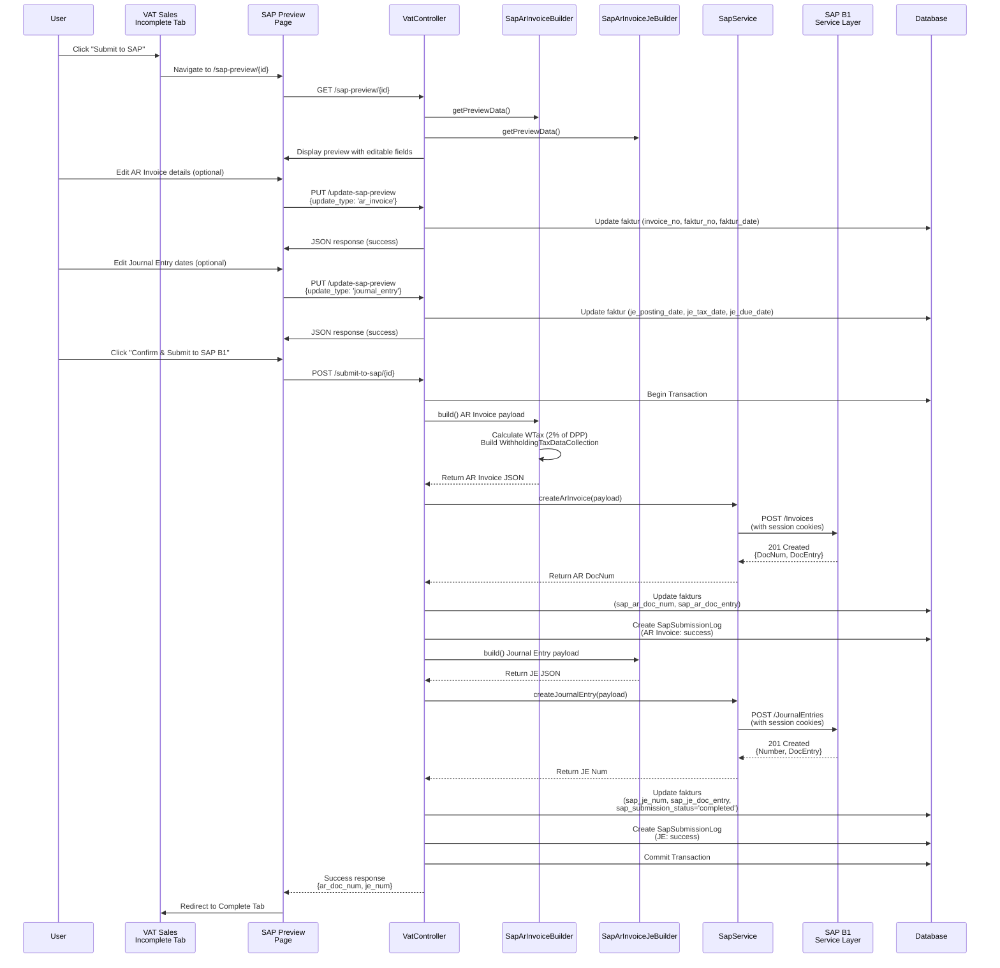
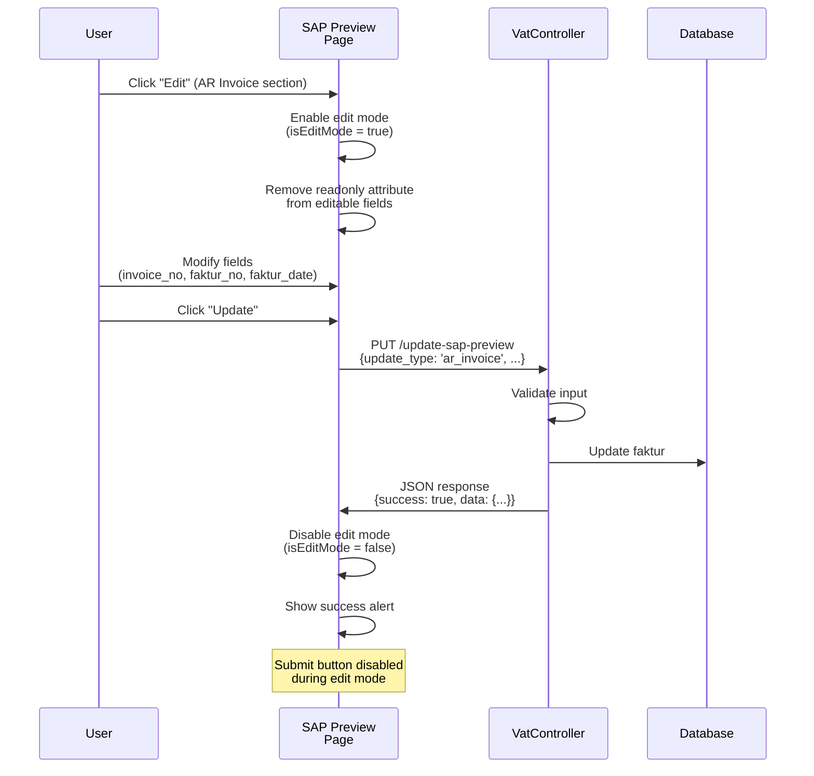

# SAP B1 AR Invoice Integration - Developer Reference Guide

**Purpose**: Comprehensive technical reference for developers working with the SAP B1 AR Invoice integration feature  
**Last Updated**: 2026-01-XX  
**Version**: 1.0

---

## Table of Contents

1. [Overview](#overview)
2. [Architecture](#architecture)
3. [Data Flow](#data-flow)
4. [Database Schema](#database-schema)
5. [API Endpoints & Routes](#api-endpoints--routes)
6. [Service Classes](#service-classes)
7. [Configuration](#configuration)
8. [Common Development Tasks](#common-development-tasks)
9. [Troubleshooting](#troubleshooting)
10. [Best Practices](#best-practices)
11. [Code Examples](#code-examples)

---

## Overview

The SAP B1 AR Invoice integration enables automatic creation of AR Invoices and Journal Entries in SAP Business One from Faktur (Sales Invoice) documents in the Accounting One system. This feature provides:

- **Dual Document Creation**: Creates both AR Invoice and Journal Entry documents in SAP B1
- **Withholding Tax (WTax) Support**: Automatically calculates and includes WTax (2% of DPP) in AR Invoices
- **Edit/Update Functionality**: Allows users to edit faktur details before submission
- **Status Tracking**: Tracks submission status with incomplete/complete tabs
- **Audit Trail**: Comprehensive logging of all SAP submissions

### Key Features

- **Incomplete/Complete Tab Filtering**: Documents are filtered based on SAP submission status (`sap_ar_doc_num`)
- **SAP Preview Page**: Review and edit AR Invoice and Journal Entry details before submission
- **Edit/Update Workflow**: Edit AR Invoice details (Invoice No, Faktur No, Faktur Date) and Journal Entry dates independently
- **Transaction Safety**: Database transactions ensure data consistency
- **Error Handling**: Comprehensive error handling with rollback on failure

---

## Architecture

### Component Overview

```
┌─────────────────────────────────────────────────────────────┐
│                    User Interface Layer                      │
├─────────────────────────────────────────────────────────────┤
│  VAT Sales Page (Incomplete/Complete Tabs)                   │
│  └─> SAP Preview Page (Edit/Update Functionality)          │
└─────────────────────────────────────────────────────────────┘
                            │
                            ▼
┌─────────────────────────────────────────────────────────────┐
│                    Controller Layer                         │
├─────────────────────────────────────────────────────────────┤
│  VatController                                              │
│  ├─> previewSapSubmission()                                 │
│  ├─> updateSapPreview()                                     │
│  └─> submitToSap()                                          │
└─────────────────────────────────────────────────────────────┘
                            │
                            ▼
┌─────────────────────────────────────────────────────────────┐
│                    Service Layer                             │
├─────────────────────────────────────────────────────────────┤
│  SapArInvoiceBuilder                                        │
│  ├─> build() - Builds AR Invoice payload                   │
│  ├─> getPreviewData() - Returns preview data                │
│  └─> validate() - Validates faktur data                     │
│                                                              │
│  SapArInvoiceJeBuilder                                      │
│  ├─> build() - Builds Journal Entry payload                │
│  └─> getPreviewData() - Returns preview data                │
│                                                              │
│  SapService                                                 │
│  ├─> createArInvoice() - Creates AR Invoice in SAP B1      │
│  └─> createJournalEntry() - Creates JE in SAP B1          │
└─────────────────────────────────────────────────────────────┘
                            │
                            ▼
┌─────────────────────────────────────────────────────────────┐
│                    SAP B1 Service Layer API                  │
├─────────────────────────────────────────────────────────────┤
│  POST /Invoices (AR Invoice)                                │
│  POST /JournalEntries (Journal Entry)                        │
└─────────────────────────────────────────────────────────────┘
```

### Key Components

#### 1. **VatController** (`app/Http/Controllers/Accounting/VatController.php`)

Main controller handling VAT-related operations:

- **`previewSapSubmission(Faktur $faktur)`**: Displays SAP preview page with AR Invoice and Journal Entry preview data
- **`updateSapPreview(Request $request, Faktur $faktur)`**: Handles AJAX updates for AR Invoice and Journal Entry details
- **`submitToSap(Request $request, Faktur $faktur)`**: Submits faktur to SAP B1, creating both AR Invoice and Journal Entry

#### 2. **SapArInvoiceBuilder** (`app/Services/SapArInvoiceBuilder.php`)

Service class for building AR Invoice payloads:

- **`build()`**: Constructs complete AR Invoice JSON payload for SAP B1
- **`getPreviewData()`**: Returns formatted preview data for display
- **`validate()`**: Validates faktur data before submission
- **`calculateWTaxAmount()`**: Calculates WTax amount (2% of DPP)

**Key Responsibilities**:
- Builds AR Invoice document structure
- Calculates DPP, VAT, and WTax amounts
- Constructs `WithholdingTaxDataCollection` for WTax
- Sets AR Account (`11401039` - Piutang Usaha Belum Ditagih)
- Handles currency and exchange rate conversion

#### 3. **SapArInvoiceJeBuilder** (`app/Services/SapArInvoiceJeBuilder.php`)

Service class for building Journal Entry payloads:

- **`build()`**: Constructs complete Journal Entry JSON payload for SAP B1
- **`getPreviewData()`**: Returns formatted preview data for display

**Key Responsibilities**:
- Builds Journal Entry document structure
- Sets AR Account debit (fixed at `11401039`)
- Sets Revenue Account credit (selectable: `41101` or `41201`)
- Handles PPN and WTax lines
- Sets project and department codes

#### 4. **SapService** (`app/Services/SapService.php`)

Service class for SAP B1 API communication:

- **`createArInvoice(array $payload)`**: Creates AR Invoice in SAP B1
- **`createJournalEntry(array $payload)`**: Creates Journal Entry in SAP B1
- **`getServiceItems()`**: Retrieves service items from SAP B1

---

## Data Flow

### Submission Flow



### Edit/Update Flow



---

## Database Schema

### Fakturs Table Fields

The `fakturs` table tracks SAP submission status and related data:

#### SAP Tracking Fields

```php
// AR Invoice tracking
'sap_ar_doc_num' => 'string|null',        // SAP AR Invoice DocNum
'sap_ar_doc_entry' => 'string|null',      // SAP AR Invoice DocEntry
'sap_je_num' => 'string|null',            // SAP Journal Entry Number
'sap_je_doc_entry' => 'string|null',      // SAP Journal Entry DocEntry
'sap_submission_status' => 'string|null',   // 'pending', 'completed', 'failed', 'partial'
'sap_submission_attempts' => 'integer',    // Number of submission attempts
'sap_submission_error' => 'text|null',     // Error message if submission failed
'sap_submitted_at' => 'datetime|null',    // Timestamp of successful submission
'sap_submitted_by' => 'integer|null',      // User ID who submitted
```

#### Journal Entry Configuration Fields

```php
'je_posting_date' => 'date|null',         // JE Posting Date (default: previous EOM)
'je_tax_date' => 'date|null',             // JE Tax Date
'je_due_date' => 'date|null',             // JE Due Date
'revenue_account_code' => 'string|null',  // Revenue Account (41101 or 41201)
'project' => 'string|null',                // Project code
```

#### AR Invoice Fields (Editable)

```php
'invoice_no' => 'string',                 // Invoice Number (editable)
'faktur_no' => 'string',                 // Faktur Number (editable)
'faktur_date' => 'date',                  // Faktur Date (editable)
```

### SapSubmissionLogs Table

Audit trail for all SAP submissions:

```php
'id' => 'bigIncrements',
'faktur_id' => 'unsignedBigInteger',
'document_type' => 'string',              // 'ar_invoice' or 'journal_entry'
'sap_doc_num' => 'string',               // SAP Document Number
'sap_doc_entry' => 'string',              // SAP Document Entry
'status' => 'string',                     // 'success' or 'failed'
'error_message' => 'text|null',
'request_payload' => 'json|null',         // Request payload sent to SAP
'response_data' => 'json|null',           // Response from SAP
'submitted_by' => 'unsignedBigInteger',
'submitted_at' => 'timestamp',
```

---

## API Endpoints & Routes

### Routes Definition

Routes are defined in `routes/accounting.php`:

```php
// SAP Preview Page
Route::get('/fakturs/{faktur}/sap-preview', [VatController::class, 'previewSapSubmission'])
    ->name('vat.sap-preview');

// Update SAP Preview (AJAX)
Route::put('/fakturs/{faktur}/update-sap-preview', [VatController::class, 'updateSapPreview'])
    ->name('update-sap-preview');

// Submit to SAP B1
Route::post('/fakturs/{faktur}/submit-to-sap', [VatController::class, 'submitToSap'])
    ->name('vat.submit-to-sap');
```

### Endpoint Details

#### 1. GET `/accounting/vat/fakturs/{faktur}/sap-preview`

**Purpose**: Display SAP preview page with AR Invoice and Journal Entry preview data

**Parameters**:
- `faktur` (Route Model Binding): Faktur model instance

**Response**: Blade view `accounting.vat.ar.sap_preview`

**Permission Required**: `submit-sap-ar-invoice`

**View Data**:
```php
[
    'faktur' => Faktur,
    'arPreview' => [
        'invoice_no' => string,
        'faktur_no' => string,
        'faktur_date' => date,
        'customer' => array,
        'amounts' => array,
        'wtax' => array,
        // ... more fields
    ],
    'jePreview' => [
        'dates' => array,
        'accounts' => array,
        'amounts' => array,
        // ... more fields
    ],
    'itemCode' => string,
]
```

#### 2. PUT `/accounting/vat/fakturs/{faktur}/update-sap-preview`

**Purpose**: Update AR Invoice or Journal Entry details via AJAX

**Request Body**:
```json
{
    "update_type": "ar_invoice",  // or "journal_entry"
    "invoice_no": "INV-001",      // Required if update_type = "ar_invoice"
    "faktur_no": "FP-001",        // Required if update_type = "ar_invoice"
    "faktur_date": "2026-01-15",  // Required if update_type = "ar_invoice"
    "je_posting_date": "2026-01-31",  // Required if update_type = "journal_entry"
    "je_tax_date": "2026-01-31",      // Required if update_type = "journal_entry"
    "je_due_date": "2026-01-31",      // Required if update_type = "journal_entry"
    "revenue_account_code": "41101"   // Optional, must be "41101" or "41201"
}
```

**Response**:
```json
{
    "success": true,
    "message": "AR Invoice details updated successfully.",
    "data": {
        "invoice_no": "INV-001",
        "faktur_no": "FP-001",
        "faktur_date": "2026-01-15"
    }
}
```

**Permission Required**: `submit-sap-ar-invoice`

#### 3. POST `/accounting/vat/fakturs/{faktur}/submit-to-sap`

**Purpose**: Submit faktur to SAP B1, creating both AR Invoice and Journal Entry

**Request Body** (optional, fields may be pre-saved via update endpoint):
```json
{
    "invoice_no": "INV-001",
    "faktur_no": "FP-001",
    "faktur_date": "2026-01-15",
    "je_posting_date": "2026-01-31",
    "je_tax_date": "2026-01-31",
    "je_due_date": "2026-01-31",
    "revenue_account_code": "41101",
    "project": "PROJECT-001"
}
```

**Response**:
```json
{
    "success": true,
    "message": "Successfully submitted to SAP B1",
    "data": {
        "ar_doc_num": "12345",
        "je_num": "67890"
    }
}
```

**Permission Required**: `submit-sap-ar-invoice`

**Error Response**:
```json
{
    "success": false,
    "message": "SAP B1 Error: [error message]"
}
```

---

## Service Classes

### SapArInvoiceBuilder

**Location**: `app/Services/SapArInvoiceBuilder.php`

**Constructor**:
```php
public function __construct(Faktur $faktur, ?string $itemCode = null)
```

**Key Methods**:

#### `build(): array`

Builds complete AR Invoice payload for SAP B1.

**Returns**: Array structure matching SAP B1 AR Invoice format

**Key Features**:
- Uses G/L Account-based lines (not item-based)
- Calculates WTax (2% of DPP) and includes in `WithholdingTaxDataCollection`
- Sets AR Account to `11401039` (Piutang Usaha Belum Ditagih)
- Handles currency conversion
- Sets project and department codes from customer

**Example Output Structure**:
```php
[
    'CardCode' => 'C00001',
    'DocDate' => '2026-01-15',
    'DocDueDate' => '2026-02-14',
    'TaxDate' => '2026-01-15',
    'DocCurrency' => 'IDR',
    'DocRate' => 1.0,
    'NumAtCard' => 'INV-001',
    'U_MIS_InvOrderNo' => 'INV-001',
    'DocumentLines' => [
        [
            'ItemCode' => 'SERVICE',
            'AccountCode' => '11401039',
            'LineTotal' => 1000000.0,
            'UseBaseUnits' => 'N',
            'CostingCode' => '60',
            'ProjectCode' => 'PROJECT-001',
            'WTaxCode' => '1019',
            'WTaxLiable' => 'Y',
        ]
    ],
    'WithholdingTaxDataCollection' => [
        [
            'WTCode' => '1019',
            'WTAmount' => 20000.0,  // 2% of DPP
        ]
    ],
    // ... more fields
]
```

#### `getPreviewData(): array`

Returns formatted preview data for display on SAP preview page.

**Returns**: Array with `ar_invoice` key containing preview data

**Structure**:
```php
[
    'ar_invoice' => [
        'invoice_no' => string,
        'faktur_no' => string,
        'faktur_date' => date,
        'customer' => [
            'code' => string,
            'name' => string,
        ],
        'amounts' => [
            'dpp' => float,
            'ppn' => float,
            'wtax' => float,
            'total' => float,
        ],
        'wtax' => [
            'code' => string,
            'percentage' => float,
            'amount' => float,
        ],
        // ... more fields
    ]
]
```

#### `validate(): array`

Validates faktur data before submission.

**Returns**: Array of error messages (empty if valid)

**Validation Checks**:
- Customer exists and has SAP code
- Faktur has required fields (invoice_no, faktur_no, faktur_date)
- Amounts are valid (DPP > 0)
- Customer has project code

### SapArInvoiceJeBuilder

**Location**: `app/Services/SapArInvoiceJeBuilder.php`

**Constructor**:
```php
public function __construct(
    Faktur $faktur,
    ?Carbon $jePostingDate = null,
    ?Carbon $jeTaxDate = null,
    ?Carbon $jeDueDate = null
)
```

**Key Methods**:

#### `build(): array`

Builds complete Journal Entry payload for SAP B1.

**Returns**: Array structure matching SAP B1 Journal Entry format

**Key Features**:
- AR Account debit: Fixed at `11401039` (Piutang Usaha Belum Ditagih)
- Revenue Account credit: Selectable (`41101` or `41201`)
- Includes PPN line (11% of DPP)
- Includes WTax line (2% of DPP)
- Sets project and department codes

**Example Output Structure**:
```php
[
    'ReferenceDate' => '2026-01-31',
    'TaxDate' => '2026-01-31',
    'DueDate' => '2026-01-31',
    'Reference' => 'INV-001',
    'Remarks' => 'AR Invoice: INV-001',
    'JournalEntryLines' => [
        // Line 1: Credit Revenue
        [
            'AccountCode' => '41101',
            'Debit' => 0.0,
            'Credit' => 1000000.0,
            'LineMemo' => 'Revenue for Invoice: INV-001',
            'ProjectCode' => 'PROJECT-001',
            'CostingCode' => '60',
        ],
        // Line 2: Debit AR
        [
            'AccountCode' => '11401039',
            'Debit' => 1000000.0,
            'Credit' => 0.0,
            'LineMemo' => 'AR for Invoice: INV-001',
            'ProjectCode' => 'PROJECT-001',
            'CostingCode' => '60',
        ],
        // Line 3: Credit PPN
        [
            'AccountCode' => '21101',
            'Debit' => 0.0,
            'Credit' => 110000.0,  // 11% of DPP
            'LineMemo' => 'PPN for Invoice: INV-001',
        ],
        // Line 4: Credit WTax
        [
            'AccountCode' => '21102',
            'Debit' => 0.0,
            'Credit' => 20000.0,  // 2% of DPP
            'LineMemo' => 'WTax for Invoice: INV-001',
        ],
    ]
]
```

#### `getPreviewData(): array`

Returns formatted preview data for display on SAP preview page.

**Returns**: Array with `journal_entry` key containing preview data

---

## Configuration

### Environment Variables

Add these to your `.env` file:

```env
# SAP B1 Connection
SAP_SERVER_URL=https://your-sap-server.com:50000/b1s/v1
SAP_DB_NAME=YOUR_DB_NAME
SAP_USER=your_username
SAP_PASSWORD=your_password

# AR Invoice Defaults
SAP_AR_INVOICE_DEFAULT_AR_ACCOUNT=11401039
SAP_AR_INVOICE_DEFAULT_REVENUE_ACCOUNT=41101
SAP_AR_INVOICE_DEFAULT_ITEM_CODE=SERVICE
SAP_AR_INVOICE_DEFAULT_DEPARTMENT_CODE=60
SAP_AR_INVOICE_DEFAULT_WTAX_CODE=1019
SAP_AR_INVOICE_WTAX_PERCENTAGE=2
SAP_AR_INVOICE_DEFAULT_PAYMENT_TERMS=15

# Faktur Pajak Fields (Optional)
SAP_AR_INVOICE_AUTHORIZED_NAME_INVOICE=John Doe
SAP_AR_INVOICE_AUTHORIZED_NAME_FP=Jane Doe
SAP_AR_INVOICE_KODE_TRANSAKSI_FP=01

# Bank Account Fields (Optional)
SAP_AR_INVOICE_BANK_NAME_USD=Bank Name USD
SAP_AR_INVOICE_BANK_ACCOUNT_USD=1234567890
SAP_AR_INVOICE_BANK_NAME_IDR=Bank Name IDR
SAP_AR_INVOICE_BANK_ACCOUNT_IDR=0987654321
```

### Config File

Configuration is stored in `config/services.php`:

```php
'sap' => [
    'ar_invoice' => [
        'default_ar_account' => env('SAP_AR_INVOICE_DEFAULT_AR_ACCOUNT', '11401039'),
        'default_revenue_account' => env('SAP_AR_INVOICE_DEFAULT_REVENUE_ACCOUNT', '41101'),
        'default_item_code' => env('SAP_AR_INVOICE_DEFAULT_ITEM_CODE', 'SERVICE'),
        'default_department_code' => env('SAP_AR_INVOICE_DEFAULT_DEPARTMENT_CODE', '60'),
        'default_wtax_code' => env('SAP_AR_INVOICE_DEFAULT_WTAX_CODE', ''),
        'wtax_percentage' => env('SAP_AR_INVOICE_WTAX_PERCENTAGE', 2),
        'default_payment_terms' => env('SAP_AR_INVOICE_DEFAULT_PAYMENT_TERMS', 15),
        // ... more config
    ],
],
```

### Permissions

Required permission: `submit-sap-ar-invoice`

Assign this permission to users who need to submit fakturs to SAP B1:

```php
$user->givePermissionTo('submit-sap-ar-invoice');
```

---

## Common Development Tasks

### Task 1: Add a New Revenue Account Option

**Scenario**: You need to add a third revenue account option (e.g., `41301`).

**Steps**:

1. **Update Validation** in `VatController::updateSapPreview()`:
```php
// In updateSapPreview() method, Journal Entry section
$validAccounts = ['41101', '41201', '41301'];  // Add new account
if (in_array($request->revenue_account_code, $validAccounts)) {
    $faktur->revenue_account_code = $request->revenue_account_code;
}
```

2. **Update Submit Validation** in `VatController::submitToSap()`:
```php
$validAccounts = ['41101', '41201', '41301'];  // Add new account
if (!in_array($request->revenue_account_code, $validAccounts)) {
    return response()->json([
        'success' => false,
        'message' => 'Invalid revenue account code.',
    ], 422);
}
```

3. **Update View** in `resources/views/accounting/vat/ar/sap_preview.blade.php`:
```blade
<select name="revenue_account_code" id="revenue_account_code" class="form-control je-editable-field bg-light" readonly required>
    <option value="41101" {{ $jePreview['accounts']['revenue_account'] == '41101' ? 'selected' : '' }}>41101</option>
    <option value="41201" {{ $jePreview['accounts']['revenue_account'] == '41201' ? 'selected' : '' }}>41201</option>
    <option value="41301" {{ $jePreview['accounts']['revenue_account'] == '41301' ? 'selected' : '' }}>41301</option>
</select>
```

### Task 2: Change Default AR Account

**Scenario**: You need to change the default AR account from `11401039` to a different account.

**Steps**:

1. **Update Environment Variable**:
```env
SAP_AR_INVOICE_DEFAULT_AR_ACCOUNT=YOUR_NEW_ACCOUNT_CODE
```

2. **Verify Service Classes**: The AR account is used in:
   - `SapArInvoiceBuilder::buildDocumentLines()` - Sets `AccountCode` in document lines
   - `SapArInvoiceJeBuilder::build()` - Sets AR Account debit line

Both classes read from config: `config('services.sap.ar_invoice.default_ar_account')`

### Task 3: Modify WTax Calculation

**Scenario**: You need to change WTax percentage from 2% to 3%.

**Steps**:

1. **Update Environment Variable**:
```env
SAP_AR_INVOICE_WTAX_PERCENTAGE=3
```

2. **Verify Calculation**: WTax is calculated in `SapArInvoiceBuilder::calculateWTaxAmount()`:
```php
$wtaxPercentage = $this->config['wtax_percentage'] ?? 2;
$wtaxAmount = $dppAmount * ($wtaxPercentage / 100);
```

### Task 4: Add a New Editable Field

**Scenario**: You want to make the `project` field editable on the SAP preview page.

**Steps**:

1. **Add Field to View** (`resources/views/accounting/vat/ar/sap_preview.blade.php`):
```blade
<div class="form-group">
    <label for="project">Project Code</label>
    <input type="text" name="project" id="project" class="form-control je-editable-field bg-light" value="{{ $faktur->project }}" readonly>
</div>
```

2. **Update JavaScript** to include field in edit mode:
```javascript
// In enableJeEditMode() function
$('#project').removeAttr('readonly').removeClass('bg-light');

// In cancelJeEditMode() function
$('#project').attr('readonly', 'readonly').addClass('bg-light');
$('#project').val(originalValues.project);

// In updateJeDetails() function
data.project = $('#project').val();
```

3. **Update Controller** (`VatController::updateSapPreview()`):
```php
// In Journal Entry section
if ($request->has('project') && !empty($request->project)) {
    $faktur->project = $request->project;
}
```

4. **Update Original Values Tracking**:
```javascript
let originalValues = {
    // ... existing fields
    project: $('#project').val()
};
```

### Task 5: Add Custom Validation

**Scenario**: You want to validate that faktur_date is not in the future.

**Steps**:

1. **Add Validation in `VatController::updateSapPreview()`**:
```php
if ($updateType === 'ar_invoice') {
    $request->validate([
        'invoice_no' => 'required|string|max:255',
        'faktur_no' => 'required|string|max:255',
        'faktur_date' => [
            'required',
            'date',
            'before_or_equal:today',  // Add custom rule
        ],
    ]);
    // ... rest of code
}
```

2. **Add Custom Validation Message** (optional):
```php
$messages = [
    'faktur_date.before_or_equal' => 'Faktur date cannot be in the future.',
];
$request->validate([...], $messages);
```

---

## Troubleshooting

### Common Issues and Solutions

#### Issue 1: "WTax code '1019' not allowed for this business partner"

**Error Message**:
```
SAP B1 Error: 1250000075 - Withholding tax code '1019' not allowed for this business partner; specify a withholding tax code that has been assigned in the business partner master data [WithholdingTaxDataCollection.WTCode][line: 1]
```

**Cause**: The WTax code is not assigned to the business partner in SAP B1 master data.

**Solution**:
1. Open SAP B1
2. Navigate to Business Partner master data
3. Find the customer (CardCode)
4. Go to the Withholding Tax tab
5. Assign WTax code `1019` to the business partner
6. Retry submission

#### Issue 2: "Account code '11401039' not found"

**Error Message**:
```
SAP B1 Error: Account code '11401039' not found
```

**Cause**: The AR account code doesn't exist in SAP B1 or is inactive.

**Solution**:
1. Verify the account exists in SAP B1 Chart of Accounts
2. Verify the account is active
3. Check if the account code is correct in `.env` file
4. Update `.env` if needed and clear config cache: `php artisan config:clear`

#### Issue 3: "Project code 'PROJECT-001' not found"

**Error Message**:
```
SAP B1 Error: Project code 'PROJECT-001' not found
```

**Cause**: The project code doesn't exist in SAP B1 or is inactive.

**Solution**:
1. Verify the project exists in SAP B1 Projects master data
2. Verify the project is active
3. Check the customer's `project` field in the database
4. Update the project code if needed

#### Issue 4: Submit Button Disabled After Editing

**Symptom**: Submit button remains disabled even after clicking "Update".

**Cause**: JavaScript state (`isEditMode` or `isJeEditMode`) not properly reset.

**Solution**:
1. Check browser console for JavaScript errors
2. Verify `updateFakturDetails()` or `updateJeDetails()` functions are called
3. Verify AJAX response includes `success: true`
4. Verify edit mode is disabled: `isEditMode = false` or `isJeEditMode = false`

**Debug Steps**:
```javascript
// Add console.log in updateFakturDetails() function
console.log('Before update:', { isEditMode, isJeEditMode });
// ... update code ...
console.log('After update:', { isEditMode, isJeEditMode });
```

#### Issue 5: Changes Not Saved After Update

**Symptom**: Fields revert to original values after clicking "Update".

**Cause**: Database update failed or validation failed.

**Solution**:
1. Check browser Network tab for AJAX response
2. Verify response includes `success: true`
3. Check Laravel logs: `storage/logs/laravel.log`
4. Verify database connection
5. Check for validation errors in response

**Debug Steps**:
```php
// Add logging in VatController::updateSapPreview()
Log::info('Updating faktur', [
    'faktur_id' => $faktur->id,
    'update_type' => $updateType,
    'request_data' => $request->all(),
]);
```

#### Issue 6: AR Invoice Created but Journal Entry Failed

**Symptom**: AR Invoice is created in SAP B1, but Journal Entry creation fails.

**Cause**: Partial failure during submission. AR Invoice is created first, then Journal Entry.

**Solution**:
1. Check `sap_submission_status` in database:
   - `'partial'`: AR Invoice created, JE failed
   - `'completed'`: Both created successfully
2. Check `sap_submission_error` field for error message
3. Check `sap_submission_logs` table for detailed error
4. Manually create Journal Entry in SAP B1 if needed
5. Retry submission (will skip AR Invoice creation if `sap_ar_doc_num` exists)

**Note**: The system stores AR Invoice DocNum even if Journal Entry fails, allowing manual JE creation later.

---

## Best Practices

### 1. Always Use Transactions

When submitting to SAP B1, wrap database operations in transactions:

```php
DB::beginTransaction();
try {
    // Create AR Invoice
    // Create Journal Entry
    // Update faktur
    // Create logs
    DB::commit();
} catch (\Exception $e) {
    DB::rollBack();
    // Handle error
}
```

### 2. Validate Before Building Payloads

Always validate faktur data before building SAP payloads:

```php
$arInvoiceBuilder = new SapArInvoiceBuilder($faktur);
$arErrors = $arInvoiceBuilder->validate();
if (!empty($arErrors)) {
    return response()->json([
        'success' => false,
        'message' => 'Validation failed: ' . implode(', ', $arErrors),
    ], 422);
}
```

### 3. Log All SAP Submissions

Create `SapSubmissionLog` entries for both AR Invoice and Journal Entry:

```php
SapSubmissionLog::create([
    'faktur_id' => $faktur->id,
    'document_type' => 'ar_invoice',
    'sap_doc_num' => $arDocNum,
    'sap_doc_entry' => $arDocEntry,
    'status' => 'success',
    'submitted_by' => auth()->id(),
    'submitted_at' => now(),
]);
```

### 4. Handle Partial Failures Gracefully

If AR Invoice succeeds but Journal Entry fails, store the AR Invoice DocNum:

```php
// Store AR Invoice even if JE fails
$faktur->sap_ar_doc_num = $arDocNum;
$faktur->sap_ar_doc_entry = $arDocEntry;
$faktur->sap_submission_status = 'partial';  // Mark as partial
$faktur->save();
```

### 5. Use Environment Variables for Configuration

Never hardcode account codes or other configuration values:

```php
// Good
$arAccountCode = config('services.sap.ar_invoice.default_ar_account', '11401039');

// Bad
$arAccountCode = '11401039';
```

### 6. Provide User-Friendly Error Messages

Transform SAP B1 error messages into user-friendly messages:

```php
$errorMessage = $e->getMessage();
if (str_contains($errorMessage, 'not allowed for this business partner')) {
    $errorMessage = 'WTax code not assigned to customer in SAP B1. Please contact administrator.';
}
```

### 7. Disable Submit Button During Edit Mode

Prevent submission with unsaved changes:

```javascript
$('#submit-btn').prop('disabled', isEditMode || isJeEditMode);
```

### 8. Save Changes Before Submission

Always save editable fields before submission:

```php
// In submitToSap()
if ($request->has('invoice_no') && !empty($request->invoice_no)) {
    $faktur->invoice_no = $request->invoice_no;
}
// ... save other fields
$faktur->save();
```

---

## Code Examples

### Example 1: Building AR Invoice Payload Manually

```php
use App\Models\Faktur;
use App\Services\SapArInvoiceBuilder;

$faktur = Faktur::find(1);
$itemCode = 'SERVICE';

$builder = new SapArInvoiceBuilder($faktur, $itemCode);

// Validate first
$errors = $builder->validate();
if (!empty($errors)) {
    throw new \Exception('Validation failed: ' . implode(', ', $errors));
}

// Build payload
$payload = $builder->build();

// Preview data
$previewData = $builder->getPreviewData();
```

### Example 2: Building Journal Entry Payload Manually

```php
use App\Models\Faktur;
use App\Services\SapArInvoiceJeBuilder;
use Carbon\Carbon;

$faktur = Faktur::find(1);

// Custom dates
$jePostingDate = Carbon::parse('2026-01-31');
$jeTaxDate = Carbon::parse('2026-01-31');
$jeDueDate = Carbon::parse('2026-01-31');

$builder = new SapArInvoiceJeBuilder($faktur, $jePostingDate, $jeTaxDate, $jeDueDate);

// Build payload
$payload = $builder->build();

// Preview data
$previewData = $builder->getPreviewData();
```

### Example 3: Submitting to SAP B1 Programmatically

```php
use App\Models\Faktur;
use App\Services\SapService;
use App\Services\SapArInvoiceBuilder;
use App\Services\SapArInvoiceJeBuilder;
use Illuminate\Support\Facades\DB;
use Illuminate\Support\Facades\Log;

$faktur = Faktur::find(1);
$sapService = app(SapService::class);

DB::beginTransaction();
try {
    // Get service item code
    $serviceItems = $sapService->getServiceItems();
    $itemCode = !empty($serviceItems) ? ($serviceItems[0]['ItemCode'] ?? null) : null;
    if (empty($itemCode)) {
        $itemCode = config('services.sap.ar_invoice.default_item_code', 'SERVICE');
    }

    // Build and create AR Invoice
    $arInvoiceBuilder = new SapArInvoiceBuilder($faktur, $itemCode);
    $arPayload = $arInvoiceBuilder->build();
    $arResult = $sapService->createArInvoice($arPayload);
    
    $faktur->sap_ar_doc_num = $arResult['DocNum'];
    $faktur->sap_ar_doc_entry = $arResult['DocEntry'];
    
    // Build and create Journal Entry
    $jePostingDate = $faktur->je_posting_date 
        ? Carbon::parse($faktur->je_posting_date)
        : Carbon::parse($faktur->invoice_date)->subMonth()->endOfMonth();
    
    $jeBuilder = new SapArInvoiceJeBuilder($faktur, $jePostingDate);
    $jePayload = $jeBuilder->build();
    $jeResult = $sapService->createJournalEntry($jePayload);
    
    $faktur->sap_je_num = $jeResult['Number'];
    $faktur->sap_je_doc_entry = $jeResult['DocEntry'];
    $faktur->sap_submission_status = 'completed';
    $faktur->sap_submitted_at = now();
    $faktur->sap_submitted_by = auth()->id();
    $faktur->save();
    
    // Create logs
    SapSubmissionLog::create([
        'faktur_id' => $faktur->id,
        'document_type' => 'ar_invoice',
        'sap_doc_num' => $arResult['DocNum'],
        'sap_doc_entry' => $arResult['DocEntry'],
        'status' => 'success',
        'submitted_by' => auth()->id(),
        'submitted_at' => now(),
    ]);
    
    SapSubmissionLog::create([
        'faktur_id' => $faktur->id,
        'document_type' => 'journal_entry',
        'sap_doc_num' => $jeResult['Number'],
        'sap_doc_entry' => $jeResult['DocEntry'],
        'status' => 'success',
        'submitted_by' => auth()->id(),
        'submitted_at' => now(),
    ]);
    
    DB::commit();
    
    Log::info('Faktur submitted to SAP B1', [
        'faktur_id' => $faktur->id,
        'ar_doc_num' => $arResult['DocNum'],
        'je_num' => $jeResult['Number'],
    ]);
    
} catch (\Exception $e) {
    DB::rollBack();
    
    $faktur->sap_submission_status = 'failed';
    $faktur->sap_submission_error = $e->getMessage();
    $faktur->sap_submission_attempts += 1;
    $faktur->save();
    
    Log::error('Failed to submit faktur to SAP B1', [
        'faktur_id' => $faktur->id,
        'error' => $e->getMessage(),
    ]);
    
    throw $e;
}
```

### Example 4: Updating Faktur Details via AJAX

```javascript
// Update AR Invoice details
function updateFakturDetails() {
    const data = {
        update_type: 'ar_invoice',
        invoice_no: $('#invoice_no').val(),
        faktur_no: $('#faktur_no').val(),
        faktur_date: $('#faktur_date').val(),
    };
    
    $.ajax({
        url: '/accounting/vat/fakturs/' + fakturId + '/update-sap-preview',
        method: 'PUT',
        data: data,
        headers: {
            'X-CSRF-TOKEN': $('meta[name="csrf-token"]').attr('content')
        },
        success: function(response) {
            if (response.success) {
                isEditMode = false;
                $('#invoice_no, #faktur_no, #faktur_date')
                    .attr('readonly', 'readonly')
                    .addClass('bg-light');
                $('#edit-btn').show();
                $('#update-btn, #cancel-btn').hide();
                showAlert('success', response.message);
            }
        },
        error: function(xhr) {
            const error = xhr.responseJSON?.message || 'Failed to update details';
            showAlert('error', error);
        }
    });
}
```

### Example 5: Querying Submission Status

```php
use App\Models\Faktur;

// Get incomplete fakturs (not yet submitted)
$incompleteFakturs = Faktur::where('type', 'sales')
    ->whereNull('sap_ar_doc_num')
    ->get();

// Get completed fakturs (submitted)
$completedFakturs = Faktur::where('type', 'sales')
    ->whereNotNull('sap_ar_doc_num')
    ->get();

// Get fakturs with partial submission (AR created, JE failed)
$partialFakturs = Faktur::where('type', 'sales')
    ->whereNotNull('sap_ar_doc_num')
    ->whereNull('sap_je_num')
    ->get();

// Get failed submissions
$failedFakturs = Faktur::where('type', 'sales')
    ->where('sap_submission_status', 'failed')
    ->get();
```

### Example 6: Checking Submission Logs

```php
use App\Models\SapSubmissionLog;

// Get all logs for a faktur
$logs = SapSubmissionLog::where('faktur_id', $fakturId)
    ->orderBy('submitted_at', 'desc')
    ->get();

// Get failed submissions
$failedLogs = SapSubmissionLog::where('status', 'failed')
    ->orderBy('submitted_at', 'desc')
    ->get();

// Get AR Invoice logs only
$arInvoiceLogs = SapSubmissionLog::where('faktur_id', $fakturId)
    ->where('document_type', 'ar_invoice')
    ->get();
```

---

## Additional Resources

### SAP B1 Service Layer API Documentation

- **Official Documentation**: https://help.sap.com/doc/056f69366b5345a386bb8149f1700c19/10.0/en-US/Service%20Layer%20API%20Reference.html
- **AR Invoice Endpoint**: `POST /Invoices`
- **Journal Entry Endpoint**: `POST /JournalEntries`
- **Withholding Tax Structure**: `WithholdingTaxDataCollection` array with `WTCode` and `WTAmount` at document level

### Related Documentation

- `docs/architecture.md` - System architecture overview
- `docs/decisions.md` - Technical decision records
- `docs/SAP_B1_AR_INVOICE_INTEGRATION_FINAL_PLAN.md` - Original implementation plan
- `MEMORY.md` - Key learnings and implementation notes

### Database Migrations

- `database/migrations/2026_01_08_025744_add_sap_tracking_fields_to_fakturs_table.php` - SAP tracking fields
- `database/migrations/2026_01_12_011006_add_je_dates_to_fakturs_table.php` - Journal Entry date fields

---

## Version History

- **v1.0** (2026-01-XX): Initial developer reference guide
  - Complete documentation of SAP B1 AR Invoice integration
  - Edit/Update functionality documentation
  - Troubleshooting guide
  - Code examples and best practices

---

**Last Updated**: 2026-01-XX  
**Maintained By**: Development Team  
**Questions?**: Contact the development team or refer to related documentation files.
