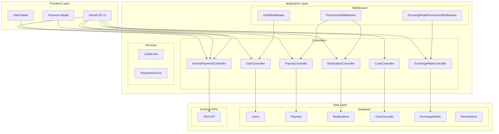
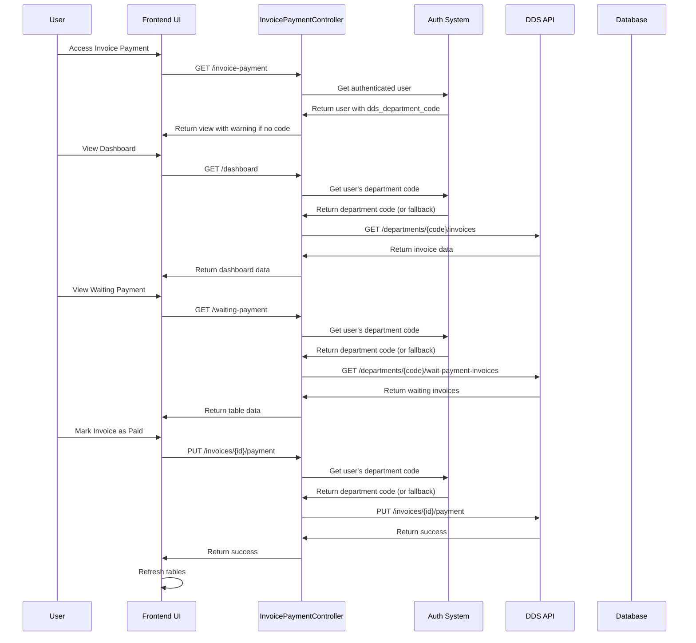

Purpose: Technical reference for understanding system design and development patterns
Last Updated: 2025-01-15

## Architecture Documentation Guidelines

### Document Purpose

This document describes the CURRENT WORKING STATE of the application architecture. It serves as:

-   Technical reference for understanding how the system currently works
-   Onboarding guide for new developers
-   Design pattern documentation for consistent development
-   Schema and data flow documentation reflecting actual implementation

### What TO Include

-   **Current Technology Stack**: Technologies actually in use
-   **Working Components**: Components that are implemented and functional
-   **Actual Database Schema**: Tables, fields, and relationships as they exist
-   **Implemented Data Flows**: How data actually moves through the system
-   **Working API Endpoints**: Routes that are active and functional
-   **Deployment Patterns**: How the system is actually deployed
-   **Security Measures**: Security implementations that are active

### What NOT to Include

-   **Issues or Bugs**: These belong in `MEMORY.md` with technical debt entries
-   **Limitations or Problems**: Document what IS working, not what isn't
-   **Future Plans**: Enhancement ideas belong in `backlog.md`
-   **Deprecated Features**: Remove outdated information rather than marking as deprecated
-   **Wishlist Items**: Planned features that aren't implemented yet

### Update Guidelines

-   **Reflect Reality**: Always document the actual current state, not intended state
-   **Schema Notes**: When database schema has unused fields, note them factually
-   **Cross-Reference**: Link to other docs when appropriate, but don't duplicate content

### For AI Coding Agents

-   **Investigate Before Updating**: Use codebase search to verify current implementation
-   **Move Issues to Memory**: If you discover problems, document them in `MEMORY.md`
-   **Factual Documentation**: Describe what exists, not what should exist

---

# System Architecture

## Overview

The Accounting One system is a comprehensive financial management application built on Laravel framework with modular architecture supporting multiple business processes.

## System Components

### Core Modules

1. **User Management**

    - User authentication and authorization
    - Role-based access control (RBAC)
    - Department-based user organization
    - User-specific API configurations

2. **Financial Management**

    - Payment requests (Payreqs)
    - Realizations
    - Cash management
    - Multi-currency support

3. **Document Management**

    - Bilyet (Promissory Notes)
    - Printable documents
    - Document approval workflows

4. **Invoice Payment**

    - DDS API integration with per-user department codes
    - Invoice status management
    - Payment processing
    - Real-time dashboard
    - User-specific department code configuration

5. **Reporting & Analytics**
    - Financial reports
    - DataTables integration
    - Export functionality

## Architecture Diagram



## Invoice Payment Module Architecture



## Technology Stack

### Backend

-   **Framework**: Laravel 10.x
-   **PHP Version**: 8.1+
-   **Database**: MySQL/MariaDB
-   **Cache**: Redis (optional)
-   **Queue**: Laravel Queue

### Frontend

-   **UI Framework**: AdminLTE 3.x
-   **JavaScript**: jQuery, DataTables
-   **CSS**: Bootstrap 4.x
-   **Charts**: Chart.js (for analytics)

### External Integrations

-   **DDS API**: Document Distribution System API
-   **Exchange Rate APIs**: External currency APIs

## Security Architecture

### Authentication & Authorization

-   Laravel's built-in authentication
-   Spatie Laravel Permission for RBAC
-   CSRF protection on all forms
-   API key authentication for external APIs

### Data Protection

-   Input validation and sanitization
-   SQL injection prevention (Eloquent ORM)
-   XSS protection (Blade templating)
-   Audit logging for sensitive operations

## Performance Considerations

### Database Optimization

-   Indexed foreign keys and frequently queried fields
-   Eager loading for relationships
-   Query optimization for complex joins

### Caching Strategy

-   Redis caching for expensive operations
-   Route caching for production
-   View caching for static content

### API Integration

-   Rate limiting for external API calls
-   Timeout handling for network issues
-   Retry logic for failed requests

## Deployment Architecture

### Environment Configuration

```env
# Database
DB_CONNECTION=mysql
DB_HOST=127.0.0.1
DB_PORT=3306
DB_DATABASE=accounting_one
DB_USERNAME=root
DB_PASSWORD=

# External APIs
DDS_API_URL=http://192.168.32.13/dds
DDS_API_KEY=your_api_key
DDS_DEPARTMENT_CODE=000HCASHO  # Fallback department code, users can have individual codes

# Cache
CACHE_DRIVER=file
SESSION_DRIVER=file
QUEUE_CONNECTION=sync
```

### File Structure

```
app/
├── Http/
│   ├── Controllers/
│   │   ├── InvoicePaymentController.php
│   │   ├── PayreqController.php
│   │   └── ...
│   └── Middleware/
├── Models/
├── Services/
└── Providers/

resources/
├── views/
│   ├── invoice-payment/
│   │   └── index.blade.php
│   └── ...

routes/
├── cashier.php
├── web.php
└── ...
```

## Monitoring & Logging

### Application Logs

-   Laravel's built-in logging system
-   Detailed API request/response logging
-   Error tracking and debugging information
-   User activity audit trails

### Performance Monitoring

-   Database query performance
-   API response times
-   Memory usage tracking
-   Error rate monitoring

## Future Considerations

### Scalability

-   Horizontal scaling with load balancers
-   Database read replicas
-   Microservices architecture for large deployments

### Integration

-   Additional external API integrations
-   Webhook support for real-time updates
-   Mobile app development
-   Third-party payment gateways

### Security Enhancements

-   Two-factor authentication
-   Advanced audit logging
-   Data encryption at rest
-   API rate limiting improvements
