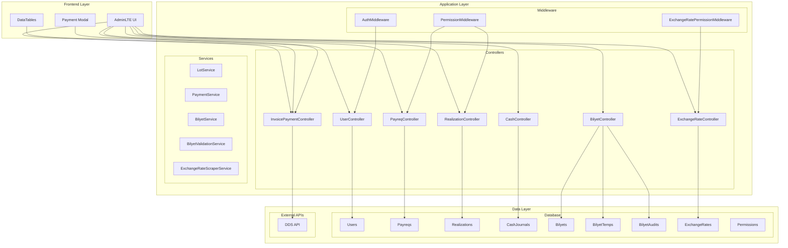
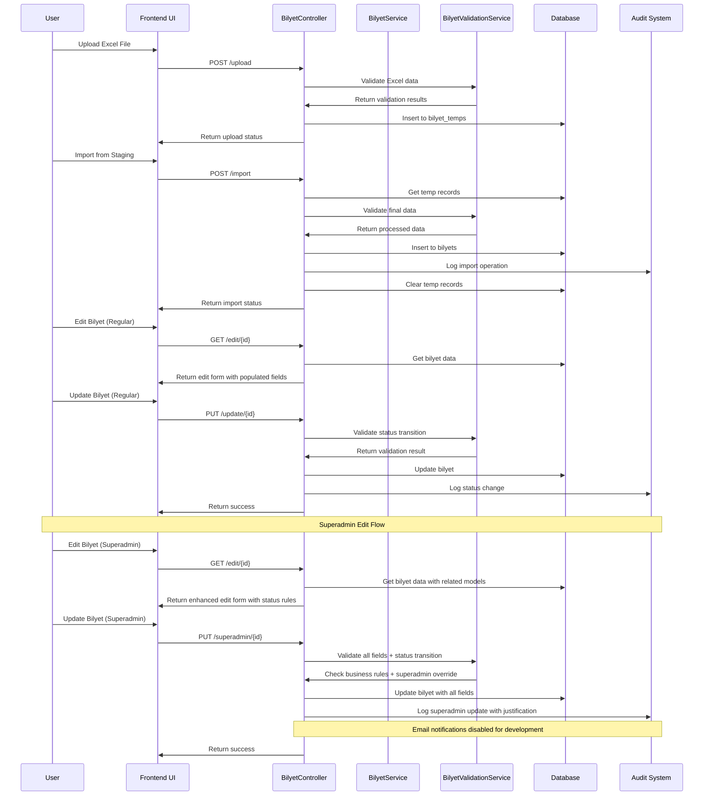
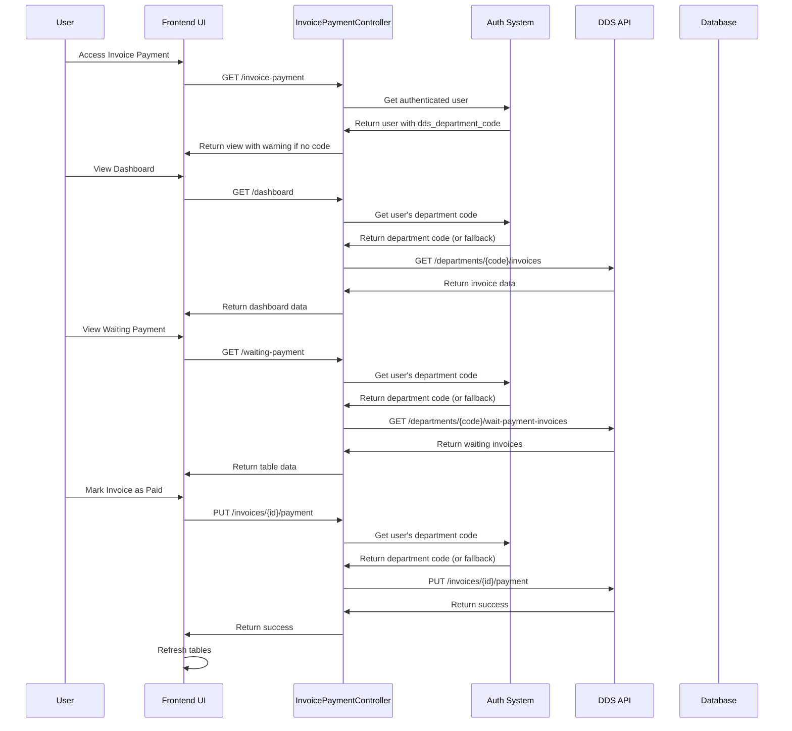
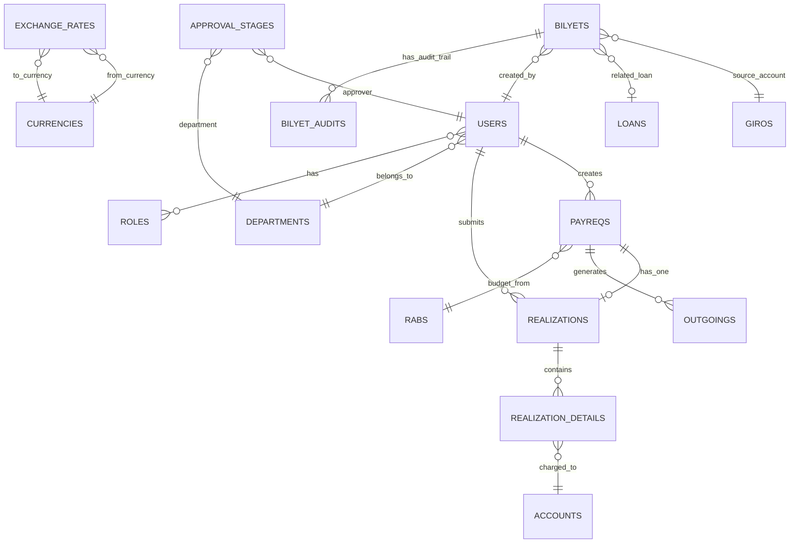

Purpose: Technical reference for understanding system design and development patterns
Last Updated: 2025-10-23

## Architecture Documentation Guidelines

### Document Purpose

This document describes the CURRENT WORKING STATE of the application architecture. It serves as:

-   Technical reference for understanding how the system currently works
-   Onboarding guide for new developers
-   Design pattern documentation for consistent development
-   Schema and data flow documentation reflecting actual implementation

### What TO Include

-   **Current Technology Stack**: Technologies actually in use
-   **Working Components**: Components that are implemented and functional
-   **Actual Database Schema**: Tables, fields, and relationships as they exist
-   **Implemented Data Flows**: How data actually moves through the system
-   **Working API Endpoints**: Routes that are active and functional
-   **Deployment Patterns**: How the system is actually deployed
-   **Security Measures**: Security implementations that are active

### What NOT to Include

-   **Issues or Bugs**: These belong in `MEMORY.md` with technical debt entries
-   **Limitations or Problems**: Document what IS working, not what isn't
-   **Future Plans**: Enhancement ideas belong in `backlog.md`
-   **Deprecated Features**: Remove outdated information rather than marking as deprecated
-   **Wishlist Items**: Planned features that aren't implemented yet

### Update Guidelines

-   **Reflect Reality**: Always document the actual current state, not intended state
-   **Schema Notes**: When database schema has unused fields, note them factually
-   **Cross-Reference**: Link to other docs when appropriate, but don't duplicate content

### For AI Coding Agents

-   **Investigate Before Updating**: Use codebase search to verify current implementation
-   **Move Issues to Memory**: If you discover problems, document them in `MEMORY.md`
-   **Factual Documentation**: Describe what exists, not what should exist

---

# System Architecture

## Overview

The Accounting One system is a comprehensive financial management application built on Laravel framework with modular architecture supporting multiple business processes.

## System Components

### Core Modules

1. **User Management**

    - User authentication and authorization with Spatie Laravel Permission
    - Role-based access control (RBAC) with granular permissions
    - Department-based user organization with hierarchical structure
    - User-specific API configurations (DDS department codes)
    - Project-based user assignment and access control

2. **Financial Management**

    - **Payment Requests (Payreqs)**: Complete CRUD with approval workflows
    - **Realizations**: Expense reporting and documentation with detailed tracking
    - **Cash Management**: Incoming/outgoing cash journals, cashier operations
    - **Multi-Currency Support**: Exchange rate management with daily updates
    - **General Ledger**: Chart of accounts with SAP integration
    - **Budget Management**: Comprehensive RAB (Rencana Anggaran Biaya) and Anggaran systems with multi-level approval workflows, budget tracking, and utilization monitoring

3. **Document Management**

    - **Bilyet (Promissory Notes)**: Complete promissory note management system with Excel import/export, status tracking, audit trails, and comprehensive reporting
    - **Printable Documents**: PDF generation with DomPDF and caching
    - **Document Approval Workflows**: Multi-level approval with status tracking
    - **Document Numbering**: Automated document number generation

4. **Invoice Payment**

    - DDS API integration with per-user department codes
    - Invoice status management (open, pending, paid, closed)
    - Payment processing with modal-based updates
    - Real-time dashboard with statistics and overdue tracking
    - User-specific department code configuration with fallback

5. **Reporting & Analytics**

    - Financial reports with DataTables integration
    - Export functionality (Excel, PDF) with Laravel Excel
    - Performance-optimized queries with database indexing
    - Real-time dashboard analytics

6. **External Integrations**

    - **DDS API**: Document Distribution System for invoice management
    - **SAP Integration**: General ledger synchronization
    - **LOT Service**: Official travel claim management
    - **BUC Sync**: Budget synchronization system

7. **Dashboard & User Interface**

    - **Modern UI/UX Design**: Comprehensive dashboard redesign with AdminLTE 3 patterns
    - **Exchange Rate Ticker**: CSS animation-based scrolling display with real-time updates
    - **Announcements System**: Permission-based announcement display with gradient headers
    - **Approval Widgets**: Real-time pending approval counts with quick action CTAs
    - **Statistics Widgets**: Completion days tracking and VJ sync status
    - **Payreqs/Realizations Cards**: Status-based displays with empty states and badges
    - **VJ Activities Chart**: Doughnut chart showing user contribution statistics
    - **Team Management Section**: Avatar-based team member displays with progress tracking
    - **Monthly Spending Chart**: Line chart with Indonesian currency formatting
    - **Permission-Based Components**: Role-specific widget visibility (approvers, team leaders, superadmin)

## Architecture Diagram



## Bilyet Module Architecture



## Invoice Payment Module Architecture



## Technology Stack

### Backend

-   **Framework**: Laravel 10.x with modern skeleton structure
-   **PHP Version**: 8.1+
-   **Database**: MySQL/MariaDB with optimized indexes
-   **Cache**: Redis (optional) for performance optimization
-   **Queue**: Laravel Queue for background processing
-   **Authentication**: Laravel Sanctum for API authentication
-   **Permissions**: Spatie Laravel Permission for RBAC

### Frontend

-   **UI Framework**: AdminLTE 3.x with responsive design
-   **JavaScript**: jQuery, DataTables (Yajra DataTables)
-   **CSS**: Bootstrap 4.x with custom styling and modern gradients
-   **Charts**: Chart.js for analytics and reporting
-   **Notifications**: SweetAlert2 for user feedback
-   **AJAX**: Laravel HTTP Client for API communication
-   **Animations**: CSS keyframes for smooth transitions and ticker animations

### Dashboard Components

-   **Exchange Rate Ticker**:

    -   CSS animation-based scrolling (30s duration)
    -   Purple gradient background (`#667eea → #764ba2`)
    -   Rotating icon animation
    -   Real-time data from Kemenkeu API (`/api/dashboard/exchange-rate-usd`)
    -   5-minute auto-refresh interval

-   **Announcements**:

    -   Permission-based visibility via `visibleToUser()` scope
    -   Pink/red gradient headers (`#f093fb → #f5576c`)
    -   Role-based targeting with badge display
    -   Dismissible alerts with period information

-   **Approval Widget**:

    -   Orange/yellow gradient (`#f6d365 → #fda085`)
    -   Real-time count from `approval_plans` table
    -   Direct CTA to approval page
    -   Permission-gated (`akses_approvals`)

-   **Statistics Widgets**:

    -   **Completion Days**: Dynamic gradient (green if ≤7, red if >7)
    -   **VJ Sync**: Blue gradient with pending count and quick action
    -   Hover effects with transform and shadow animations
    -   Permission-based visibility

-   **Payreqs/Realizations Cards**:

    -   Purple gradient for payreqs (`#667eea → #764ba2`)
    -   Pink/yellow gradient for realizations (`#fa709a → #fee140`)
    -   Status badges with color coding (draft/submitted/approved/paid/overdue)
    -   Empty states with positive messaging ("All caught up!")
    -   Indonesian currency formatting with 2 decimals
    -   Quick action "View All" buttons

-   **VJ Activities Chart**:

    -   Cyan gradient header (`#4facfe → #00f2fe`)
    -   Doughnut chart (65% cutout) with Chart.js
    -   Percentage tooltips with user contributions
    -   Total activities badge display
    -   Permission-gated (`see_activities_chart`)

-   **Team Section**:

    -   Teal/purple gradient (`#30cfd0 → #330867`)
    -   Avatar initials with gradient backgrounds
    -   Grouped member displays with payreq cards
    -   Amount formatting with 2 decimals (Rp X.XXX.XXX,XX)
    -   Status badges and days indicators
    -   Permission-gated (`see_team`)

-   **Monthly Chart**:
    -   Purple gradient header
    -   Line chart with smooth curves (tension: 0.4)
    -   Indonesian currency tooltips
    -   Enhanced data points with hover effects
    -   Responsive height adjustments

### Data Processing

-   **Excel Processing**: Laravel Excel (Maatwebsite) for import/export with two-stage validation
-   **PDF Generation**: DomPDF for printable documents
-   **Data Validation**: Laravel validation with custom rules and enhanced error reporting
-   **File Upload**: Laravel file handling with validation and progress tracking
-   **Bilyet Import System**: Two-stage import process (Excel → staging table → final table) with comprehensive logging and error handling

### External Integrations

-   **DDS API**: Document Distribution System API for invoice management
-   **SAP Integration**: General ledger synchronization
-   **LOT Service**: Official travel claim management
-   **BUC Sync**: Budget synchronization system
-   **Exchange Rate Automation**: Automated scraping from Kemenkeu Kurs Pajak with configurable target currencies
-   **Dashboard Exchange Rate Display**: Single official rate display from Kemenkeu Kurs Pajak automation system

## Security Architecture

### Authentication & Authorization

-   Laravel's built-in authentication with custom login controller
-   Spatie Laravel Permission for granular RBAC
-   CSRF protection on all forms and AJAX requests
-   API key authentication for external APIs (DDS, LOT, etc.)
-   Middleware-based route protection with permission checks
-   User session management with secure token regeneration

### Data Protection

-   Input validation and sanitization with Laravel validation
-   SQL injection prevention (Eloquent ORM with parameter binding)
-   XSS protection (Blade templating with automatic escaping)
-   Audit logging for sensitive operations (user actions, API calls)
-   File upload validation and secure storage
-   Environment variable protection for sensitive configuration

### Access Control

-   Role-based permissions (admin, user, approver, etc.)
-   Feature-specific permissions (view_exchange_rates, edit_payreqs, edit-submitted-realization, etc.)
-   Permission-based UI rendering with Blade `@can` directive
-   Department-based access control
-   Project-based data isolation
-   Middleware protection on all sensitive routes

## Database Architecture

### Core Tables

#### User Management

-   **users**: User accounts with department and project assignments
-   **departments**: Organizational structure with hierarchical relationships
-   **projects**: Project definitions and configurations
-   **roles**: User roles for RBAC system
-   **permissions**: Granular permissions for feature access
-   **model_has_roles**: Role assignments to users
-   **model_has_permissions**: Direct permission assignments

#### Financial Core

-   **accounts**: Chart of accounts with balance tracking
-   **payreqs**: Payment requests with approval workflows
-   **realizations**: Expense realizations linked to payreqs with approver modification tracking
    -   Modification tracking: `modified_by_approver` (boolean), `modified_by_approver_at` (timestamp), `modified_by_approver_id` (foreign key)
    -   Enables audit trail when approvers edit submitted realizations
    -   Drives "Needs Reprint" notification in user interface
-   **realization_details**: Detailed expense breakdowns with description, amount, department, unit information
-   **outgoings**: Cash outflow transactions
-   **incomings**: Cash inflow transactions
-   **cash_journals**: Daily cash operations and reconciliation

#### Budget Management

-   **rabs**: Rencana Anggaran Biaya (Budget Plans)
-   **anggarans**: Budget allocations and tracking with comprehensive approval workflows
-   **periode_anggarans**: Budget period management for different project cycles
-   **approval_stages**: Approval workflow configurations
-   **approval_plans**: Approval process instances

#### Approval System

The system implements comprehensive multi-level approval workflows with permission-based features:

**Approval Workflow**:

-   Multi-level approval stages configured per department and document type
-   Approvers assigned through `approval_stages` table
-   Approval tracking via `approval_plans` with status management
-   Support for approve, revise, and reject actions with remarks

**Approver Edit Capabilities** (Realizations & Payreqs):

-   Permission-controlled edit functionality (`edit-submitted-realization` permission)
-   Available on both realization approval page and payreq (reimburse) approval page
-   Inline editing of realization details after submission but before final approval
-   Editable fields: description, amount, department, unit information (unit_no, type, qty, uom, km_position)
-   Add/delete detail rows with real-time amount validation
-   Warning-based validation (allows save with amount differences, not blocking)
-   Variance calculation: Real-time display of Payreq Amount - Total Detail Amount
-   Modification tracking: Records approver ID, timestamp when details are modified
-   User notifications:
    -   "⚠ Needs Reprint" badge in user's realization list (`/user-payreqs/realizations`)
    -   "⚠ Needs Reprint" badge in user's payreq list (`/user-payreqs`) for reimburse-type payreqs
-   AJAX-based updates without page refresh for improved UX
-   Expandable unit info section for detailed equipment tracking

**Routes**:

-   `GET /approvals/request/realizations` - List pending realizations
-   `GET /approvals/request/realizations/{id}` - View realization details
-   `PUT /approvals/request/realizations/{id}/details` - Update realization details (permission-protected)
-   `GET /approvals/request/payreqs` - List pending payreqs
-   `GET /approvals/request/payreqs/{id}` - View payreq details
-   `PUT /approvals/request/payreqs/{id}/details` - Update payreq realization details (permission-protected)
-   `PUT /approvals/plan/{id}/update` - Submit approval decision

#### Multi-Currency Support

-   **currencies**: Currency definitions and codes
-   **exchange_rates**: Daily exchange rates with effective dates and automation tracking
    -   Automated scraping from Kemenkeu Kurs Pajak (https://fiskal.kemenkeu.go.id/informasi-publik/kurs-pajak)
    -   Configurable target currencies via environment variables
    -   KMK period tracking and daily rate expansion
    -   Source tracking (manual vs automated) with audit trail
    -   Dashboard API endpoint for real-time rate display (`/api/dashboard/exchange-rate-usd`)

#### Document Management

-   **bilyets**: Promissory notes with comprehensive tracking (status, dates, amounts, audit trails)
-   **bilyet_temps**: Temporary staging table for Excel import validation
-   **bilyet_audits**: Complete audit trail for all bilyet operations and status changes
-   **dokumens**: Document management system
-   **document_numbers**: Automated document numbering

#### External Integrations

-   **invoice_creations**: DDS invoice synchronization
-   **verification_journals**: SAP journal verification
-   **lot_claims**: Official travel claim management

### Database Relationships



## Performance Considerations

### Database Optimization

-   **Indexes**: Critical indexes on frequently queried fields (status, created_at, user_id)
-   **Composite Indexes**: Multi-column indexes for common query patterns
-   **Eager Loading**: Relationship loading to prevent N+1 queries
-   **Query Optimization**: Optimized joins and WHERE clauses
-   **Performance Monitoring**: 70-80% improvement through index optimization

### Caching Strategy

-   Redis caching for expensive operations
-   Route caching for production deployment
-   View caching for static content
-   Database query result caching

### API Integration

-   Rate limiting for external API calls
-   Timeout handling for network issues
-   Retry logic for failed requests
-   Comprehensive logging for debugging
-   Error handling with user-friendly messages

## Deployment Architecture

### Environment Configuration

```env
# Database
DB_CONNECTION=mysql
DB_HOST=127.0.0.1
DB_PORT=3306
DB_DATABASE=accounting_one
DB_USERNAME=root
DB_PASSWORD=

# External APIs
DDS_API_URL=http://192.168.32.13/dds
DDS_API_KEY=your_api_key
DDS_DEPARTMENT_CODE=000HCASHO  # Fallback department code, users can have individual codes

# Cache
CACHE_DRIVER=file
SESSION_DRIVER=file
QUEUE_CONNECTION=sync
```

### File Structure

```
app/
├── Http/
│   ├── Controllers/
│   │   ├── InvoicePaymentController.php
│   │   ├── PayreqController.php
│   │   └── ...
│   └── Middleware/
├── Models/
├── Services/
└── Providers/

resources/
├── views/
│   ├── invoice-payment/
│   │   └── index.blade.php
│   └── ...

routes/
├── cashier.php
├── web.php
└── ...
```

## Monitoring & Logging

### Application Logs

-   Laravel's built-in logging system
-   Detailed API request/response logging
-   Error tracking and debugging information
-   User activity audit trails

### Performance Monitoring

-   Database query performance
-   API response times
-   Memory usage tracking
-   Error rate monitoring

## Future Considerations

### Scalability

-   Horizontal scaling with load balancers
-   Database read replicas
-   Microservices architecture for large deployments

### Integration

-   Additional external API integrations
-   Webhook support for real-time updates
-   Mobile app development
-   Third-party payment gateways

### Security Enhancements

-   Two-factor authentication
-   Advanced audit logging
-   Data encryption at rest
-   API rate limiting improvements
