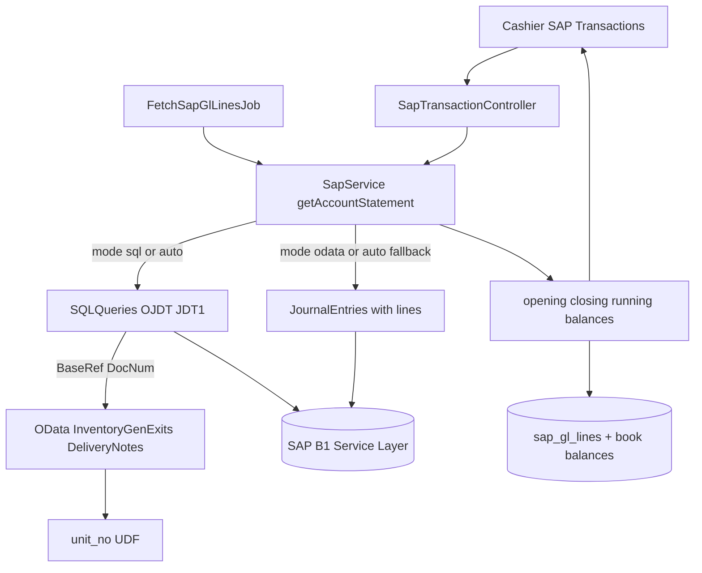
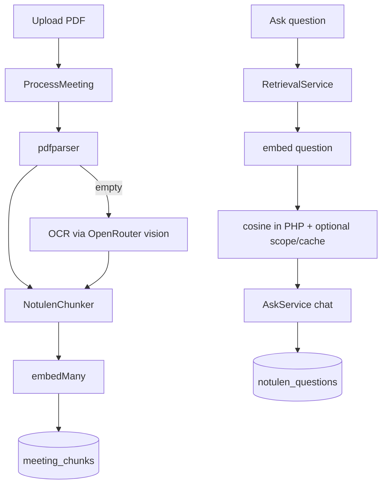

# Architecture notes

## SAP B1 account statements (Service Layer)

```mermaid
flowchart TD
    ui[Cashier SAP Transactions] --> ctrl[SapTransactionController]
    job[FetchSapGlLinesJob] --> svc[SapService getAccountStatement]
    ctrl --> svc
    svc -->|mode sql or auto| sql[SQLQueries OJDT JDT1]
    sql -->|BaseRef DocNum| enrich[OData InventoryGenExits DeliveryNotes]
    enrich --> unit[unit_no UDF]
    svc -->|mode odata or auto fallback| odata[JournalEntries with lines]
    sql --> sl[(SAP B1 Service Layer)]
    odata --> sl
    svc --> payload[opening closing running balances]
    payload --> ui
    payload --> gl[(sap_gl_lines + book balances)]
```

**Important files**

- Service: `app/Services/SapService.php` (`getAccountStatement`, `probeSqlQueries`)
- Controller: `app/Http/Controllers/Cashier/SapTransactionController.php`
- Job: `app/Jobs/FetchSapGlLinesJob.php`
- Probe: `php artisan sap:probe-sql-queries`
- Config: `config/services.php` → `sap.account_statement.*`
- Reference SQL: `docs/je_daily.sql` (unit_no from OIGE/ODLN)
- Docs: `docs/api-account-statements.md`

**Notes**

- External SAP-Bridge microservice is no longer used.
- `unit_no` enriched via OData `InventoryGenExits`/`DeliveryNotes` for TransType 60/15 (SQLQueries cannot access `OIGE`/`ODLN`). Pure OData statement path leaves `unit_no` null.
- `doc_num` = `BaseRef`; `doc_type` = mapped `JDT1.TransType` labels.

## Notulen AI (RAG)

```mermaid
flowchart TD
    Upload[Upload PDF] --> Job[ProcessMeeting]
    Job --> Parse[pdfparser]
    Parse -->|empty| Ocr[OCR via OpenRouter vision]
    Parse --> Chunk[NotulenChunker]
    Ocr --> Chunk
    Chunk --> Embed[embedMany]
    Embed --> Store[(meeting_chunks)]
    Ask[Ask question] --> Retrieve[RetrievalService]
    Retrieve --> EmbedQ[embed question]
    EmbedQ --> Cosine[cosine in PHP + optional scope/cache]
    Cosine --> LLM[AskService chat]
    LLM --> Log[(notulen_questions)]
```

**Important files**

- Controllers: `app/Http/Controllers/Notulen/*`, `Api/NotulenApiController`
- Services: `app/Services/Notulen/*`
- Job: `app/Jobs/ProcessMeeting.php`
- Config: `config/notulen.php`, `config/services.php` (openrouter/openai)
- Routes: `routes/notulen.php`, API in `routes/api.php`
- Disk: `storage/app/notulen` (`filesystems.disks.notulen`)

**Scaling note:** Retrieval still scans embeddings in PHP (with cache + max_chunks_scanned). Migrate to a DB vector index when the corpus grows.
