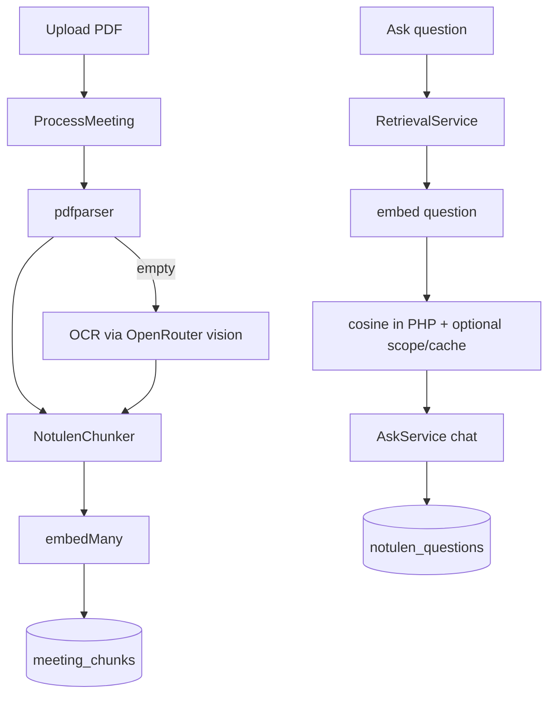

# Architecture notes

## Notulen AI (RAG)

```mermaid
flowchart TD
    Upload[Upload PDF] --> Job[ProcessMeeting]
    Job --> Parse[pdfparser]
    Parse -->|empty| Ocr[OCR via OpenRouter vision]
    Parse --> Chunk[NotulenChunker]
    Ocr --> Chunk
    Chunk --> Embed[embedMany]
    Embed --> Store[(meeting_chunks)]
    Ask[Ask question] --> Retrieve[RetrievalService]
    Retrieve --> EmbedQ[embed question]
    EmbedQ --> Cosine[cosine in PHP + optional scope/cache]
    Cosine --> LLM[AskService chat]
    LLM --> Log[(notulen_questions)]
```

**Important files**

- Controllers: `app/Http/Controllers/Notulen/*`, `Api/NotulenApiController`
- Services: `app/Services/Notulen/*`
- Job: `app/Jobs/ProcessMeeting.php`
- Config: `config/notulen.php`, `config/services.php` (openrouter/openai)
- Routes: `routes/notulen.php`, API in `routes/api.php`
- Disk: `storage/app/notulen` (`filesystems.disks.notulen`)

**Scaling note:** Retrieval still scans embeddings in PHP (with cache + max_chunks_scanned). Migrate to a DB vector index when the corpus grows.
