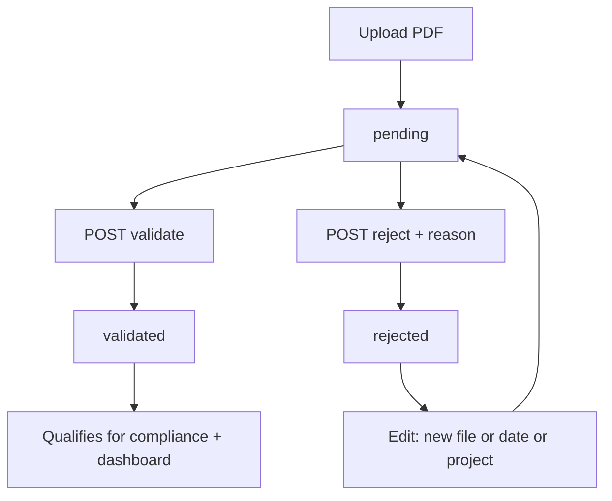
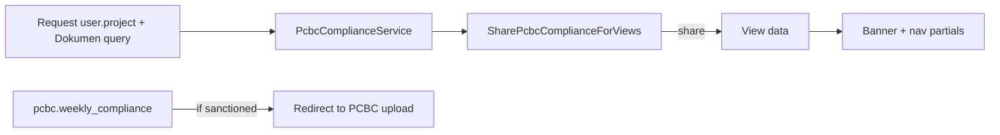

# System architecture (living document)

This file describes the **current** behavior of the application as implemented in code. Update it when structure or data flow changes.

## Cashier: PCBC (Physical cash reporting)

PCBC in this codebase serves **two related purposes**:

1. **Document uploads** — PDFs stored as `Dokumen` with `type = 'pcbc'`, file on disk, metadata includes `dokumen_date` (document date) and `project`.
2. **Structured counts** — Records in the `pcbcs` table (model `Pcbc`) for denomination entry, system vs physical vs SAP amounts, print formats.

**Weekly upload compliance (business rules)** applies to **(1)** only. Compliance uses `Dokumen.dokumen_date` to decide whether a file “covers” a given Monday–Sunday week in `Asia/Makassar`, and only rows with **`validation_status = validated`** count as a **qualifying** (official) PCBC for that week. **Pending** and **rejected** uploads do not satisfy compliance or the per-month dashboard grid. Projects listed in `config/pcbc_compliance.php` → `exception_project_codes` (APS, 026C, 023C) are exempt from the weekly rule and from sanctions.

### Key components

| Piece | Role |
|--------|------|
| `config/pcbc_compliance.php` | Timezone, exempt project codes |
| `App\Services\PcbcComplianceService` | Week boundaries, `getStatus()`, `isSanctioned()`, `shouldEnforceForUser()` |
| `App\Http\Middleware\SharePcbcComplianceForViews` | `view()->share('pcbcCompliance', …)` and `pcbcViolationSanctioned` for **all** Blade views in `web` stack (avoids only composing `templates.main`, which would leave child views like `cashier.pcbc.upload` without data) |
| `App\Http\Middleware\EnsurePcbcWeeklyCompliance` | Alias `pcbc.weekly_compliance` — blocks `cashier.approveds.*` and `cashier.incomings.*` when user is “sanctioned” |
| `components/pcbc-compliance-banner` | Bilingual (EN/ID) alert when `show_banner` is true |
| Spatie permission `see_pcbc_warning` | Required to show compliance messages in UI; not required for actual sanction enforcement on routes |
| Spatie permission `validate_pcbc_report` | May **validate** or **reject** a **pending** PCBC `Dokumen` (not required to read the upload list) |

Sanction: **no qualifying upload** in each of the **last two full calendar weeks** (W−1 and W−2) for the user’s `auth()->user()->project`. Qualifying = at least one `Dokumen` row (`type=pcbc`, **`validation_status=validated`**, matching `project`, `dokumen_date` in that week).

### PCBC PDF validation (state on `dokumens`)

| Column / field | Purpose |
|----------------|---------|
| `validation_status` | `pending` (new upload), `validated` (official for compliance and dashboard), `rejected` (not official; uploader may fix and resubmit) |
| `validated_at`, `validated_by` | Set when a validator approves or rejects; **rejector** is `validated_by` for audit |
| `rejection_reason` | Free text when status is `rejected` |

- **Grandfathering:** The migration defaults `validation_status` to `validated` so **existing** `dokumens` rows behave as already accepted; only **new** PCBC uploads from `PcbcController::upload` start as **pending**.
- **Re-validation:** `PcbcController::update` resets to **pending** (and clears validator fields) when the PCBC file, **PCBC date**, or **project** changes.
- **Routes:** `POST /cashier/pcbc/dokumen/{dokumen}/validate` and `…/reject` (names `cashier.pcbc.dokumen.validate|reject`) — `reject` requires `rejection_reason` (server- and client-side).
- **Upload list (DataTable):** Status column is rendered from `resources/views/cashier/pcbc/_validation_status_column.blade.php`. For **rejected** rows, **View reason** opens a read-only modal (reason, who rejected, when). `resources/views/cashier/pcbc/action.blade.php` shows the same reason in the **Edit** modal so uploaders see feedback when fixing a file.
- **Seeder / roles:** `database/seeders/ValidatePcbcReportPermissionSeeder.php`; `RoleController` includes `validate_pcbc_report` in “Data Upload & Import” and `ensureValidatePcbcReportPermissionExists()` on role create/edit.

```mermaid
flowchart TD
  U[Upload PDF] --> P[pending]
  P --> V[POST validate]
  P --> R[POST reject + reason]
  V --> OK[validated]
  R --> RJ[rejected]
  RJ --> E[Edit: new file or date or project]
  E --> P
  OK --> C[Qualifies for compliance + dashboard]
```

Enforcement of sanctions: users with `shouldEnforceForUser()` — not exempt, has `project`, and `can('akses_transaksi_cashier')`.

### PCBC upload DataTable

`Cashier\PcbcController@data` uses **Yajra `DataTables::of($query)`** on an **Eloquent query** (not `get()` + collection) with `->make(true)` so **server-side** sort/pagination are correct. Default client order is column index **2** (PCBC document date) **desc**. `orderColumn` for `dokumen_date` uses raw SQL `dokumen_date $1`. Display formatting uses `getRawOriginal('dokumen_date')` so model accessors do not break ordering. The table includes a **validation_status** column (`orderColumn` on `validation_status`); **raw** HTML is used for status badges and the rejection “View reason” control.

### UI notes

- **AdminLTE** (later CSS block) sets `.card-title { float: left; }` for card headers, which can cause headings and the following list to run together. The PCBC upload “Weekly report rules” heading intentionally **does not** use the `card-title` class on that `h5`.
- The upload tab compliance card shows “Set your user project…” when `getStatus()` is `null`, usually because `auth()->user()->project` is empty. After `SharePcbcComplianceForViews`, users with a project and `see_pcbc_warning` see real status in that card.

### Data flow (compliance for one request)

```mermaid
flowchart LR
  MW[SharePcbcComplianceForViews] -->|share| V[View data]
  V --> B[Banner + nav partials]
  S[PcbcComplianceService] --> MW
  R[Request user.project + Dokumen query] --> S
  WH[pcbc.weekly_compliance] -->|if sanctioned| RED[Redirect to PCBC upload]
```

## Related files

- Routes: `routes/cashier.php` — `pcbc.weekly_compliance` on `approveds` and `incomings` groups; PCBC `upload` POST, `dokumen/validate` + `dokumen/reject` POST, `data` GET, resource routes
- Menus: `resources/views/templates/partials/menu/cashier.blade.php`, `sidebar.blade.php` — use `$pcbcViolationSanctioned` for locking Ready to Pay / Incoming List
- Seeder: `database/seeders/SeePcbcWarningPermissionSeeder.php` — creates `see_pcbc_warning` and assigns to common roles
- Seeder: `database/seeders/ValidatePcbcReportPermissionSeeder.php` — creates `validate_pcbc_report` and assigns to superadmin/admin by default
- `RoleController` — includes `see_pcbc_warning` and `validate_pcbc_report` in “Data Upload & Import”; `ensurePcbcWarningPermissionExists()` and `ensureValidatePcbcReportPermissionExists()` on role create/edit
- `database/migrations/2026_04_25_030141_add_pcbc_validation_to_dokumens_table.php` — `validation_status`, `validated_at`, `validated_by`, `rejection_reason`
