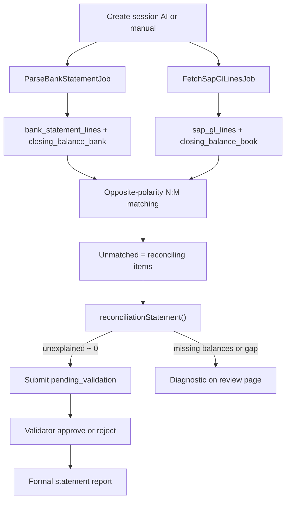
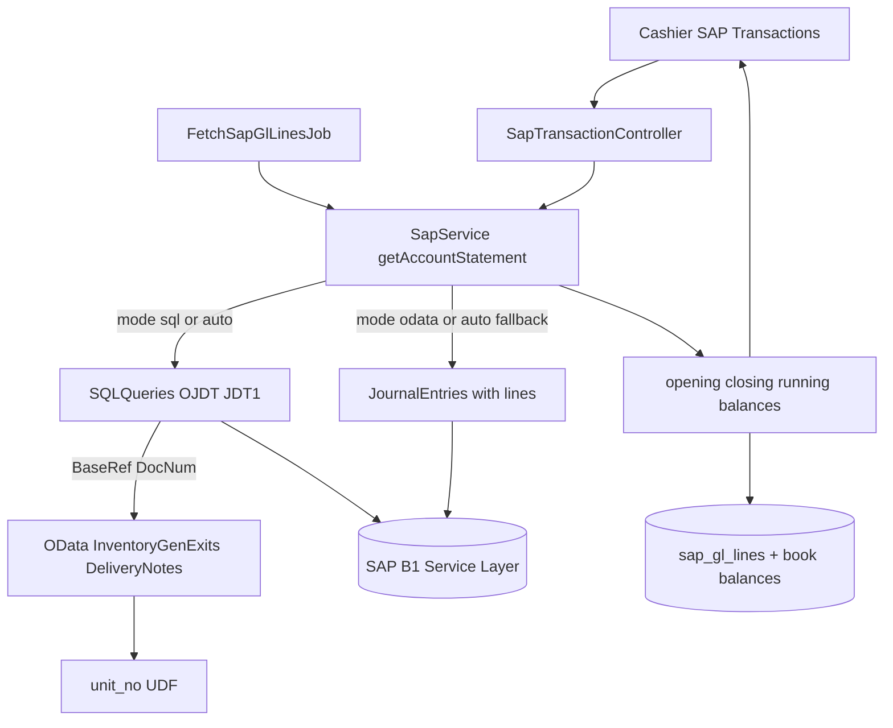
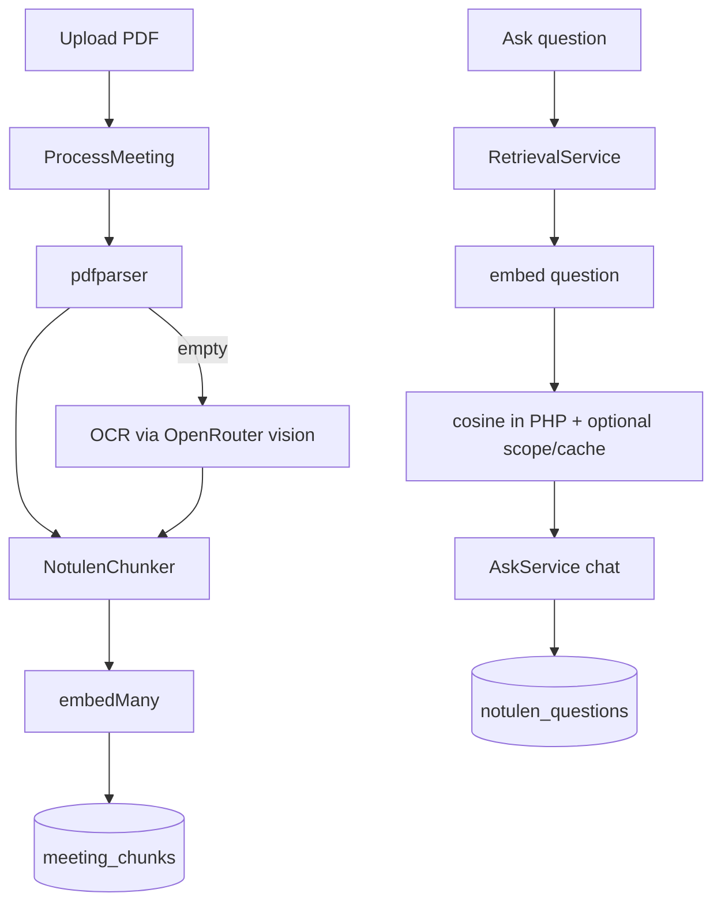

# Architecture notes

## User Dashboard (frontend)

- Shell remains **AdminLTE 3 / Bootstrap 4** (`templates.main`).
- Dashboard page styles via **Tailwind CSS v3.4** (`resources/css/dashboard.css`), Vite-built, loaded only on `/dashboard` with `prefix: tw-` and preflight disabled (see ADR-UI-01).
- Layout: action-first bento — Action Center → KPI tiles → My Work (payreqs/realizations) + side rail (charts/team) → monthly chart.
- Shared Blade components: `resources/views/components/dashboard/{kpi-card,panel,status-row,empty-state}.blade.php`.
- Controller unchanged: `DashboardUserController@index`.

## Bank Reconciliation (Cashier)

```mermaid
flowchart TD
    create[Create session AI or manual] --> parse[ParseBankStatementJob]
    create --> fetch[FetchSapGlLinesJob]
    parse --> bankLines[bank_statement_lines + closing_balance_bank]
    fetch --> sapLines[sap_gl_lines + closing_balance_book]
    bankLines --> match[Opposite-polarity N:M matching]
    sapLines --> match
    match --> unmatched[Unmatched = reconciling items]
    unmatched --> stmt["reconciliationStatement()"]
    stmt -->|"unexplained ~ 0"| submit[Submit pending_validation]
    stmt -->|"missing balances or gap"| diag[Diagnostic on review page]
    submit --> validate[Validator approve or reject]
    validate --> report[Formal statement report]
```

**Statement math** (`ReconciliationBalanceService::reconciliationStatement`):

- `adjusted_bank = closing_balance_bank + SUM(unmatched book net)`
- `adjusted_book = closing_balance_book − SUM(unmatched bank net)`
- Submit requires `abs(adjusted_bank − adjusted_book) < 0.005` and both closing balances present
- Unmatched lines categorized (deposit in transit, outstanding payment, charge/credit not booked, errors); optional `reconciling_type` override is annotation-only

**Job reliability**

- `FetchSapGlLinesJob` fetches first, then replaces lines transactionally; never wipes on failure
- Failures set `status=failed` + `notes`; UI polls `status` JSON (includes `notes`) and shows a dismissible banner
- All three jobs (`ParseBankStatementJob`, `FetchSapGlLinesJob`, `AutoMatchReconciliationJob`) use `$tries=3`, backoff, and `failed()`

**Authorization**

- Route group middleware: `permission:akses_koran`
- Policy: `app/Policies/BankReconciliationPolicy.php` (`viewAny`, `view`, `create`, `update`, `submit`, `validate`)
- Elevated roles see all projects; others scoped to their giro project
- Validate requires `validate_bank_reconciliation` and preparer ≠ validator

**P2 additions**

- Confirm before re-parse / fetch SAP (UI); parser clears match groups before replacing bank lines
- Matching: in-memory status tracking, meet-in-the-middle subset sum, fuzzy AI top-N candidates
- Notifications: submit → users with `validate_bank_reconciliation`; reject → preparer (`BankReconciliationSubmittedNotification` / `RejectedNotification`)
- Excel: `GET .../export` → `BankReconciliationExport` (FromView)

**Important files**

- Controller: `app/Http/Controllers/Cashier/BankReconciliationController.php`
- Services: `ReconciliationBalanceService`, `ReconciliationMatchingService`, `BankStatementParserService`
- Jobs: `ParseBankStatementJob`, `FetchSapGlLinesJob`, `AutoMatchReconciliationJob`
- Views: `resources/views/cashier/bank-reconciliation/*`
- Routes: `routes/cashier.php` (`cashier.bank-reconciliation.*`)
- Manuals: `docs/manuals/bank-reconciliation-manual-en.md`, `docs/manuals/bank-reconciliation-manual-id.md`

## SAP B1 account statements (Service Layer)

```mermaid
flowchart TD
    ui[Cashier SAP Transactions] --> ctrl[SapTransactionController]
    job[FetchSapGlLinesJob] --> svc[SapService getAccountStatement]
    ctrl --> svc
    svc -->|mode sql or auto| sql[SQLQueries OJDT JDT1]
    sql -->|BaseRef DocNum| enrich[OData InventoryGenExits DeliveryNotes]
    enrich --> unit[unit_no UDF]
    svc -->|mode odata or auto fallback| odata[JournalEntries with lines]
    sql --> sl[(SAP B1 Service Layer)]
    odata --> sl
    svc --> payload[opening closing running balances]
    payload --> ui
    payload --> gl[(sap_gl_lines + book balances)]
```

**Important files**

- Service: `app/Services/SapService.php` (`getAccountStatement`, `probeSqlQueries`)
- Controller: `app/Http/Controllers/Cashier/SapTransactionController.php`
- Job: `app/Jobs/FetchSapGlLinesJob.php`
- Probe: `php artisan sap:probe-sql-queries`
- Config: `config/services.php` → `sap.account_statement.*`
- Reference SQL: `docs/je_daily.sql` (unit_no from OIGE/ODLN)
- Docs: `docs/api-account-statements.md`

**Notes**

- External SAP-Bridge microservice is no longer used.
- `unit_no` enriched via OData `InventoryGenExits`/`DeliveryNotes` for TransType 60/15 (SQLQueries cannot access `OIGE`/`ODLN`). Pure OData statement path leaves `unit_no` null.
- `doc_num` = `BaseRef`; `doc_type` = mapped `JDT1.TransType` labels.

## Notulen AI (RAG)

```mermaid
flowchart TD
    Upload[Upload PDF] --> Job[ProcessMeeting]
    Job --> Parse[pdfparser]
    Parse -->|empty| Ocr[OCR via OpenRouter vision]
    Parse --> Chunk[NotulenChunker]
    Ocr --> Chunk
    Chunk --> Embed[embedMany]
    Embed --> Store[(meeting_chunks)]
    Ask[Ask question] --> Retrieve[RetrievalService]
    Retrieve --> EmbedQ[embed question]
    EmbedQ --> Cosine[cosine in PHP + optional scope/cache]
    Cosine --> LLM[AskService chat]
    LLM --> Log[(notulen_questions)]
```

**Important files**

- Controllers: `app/Http/Controllers/Notulen/*`, `Api/NotulenApiController`
- Services: `app/Services/Notulen/*`
- Job: `app/Jobs/ProcessMeeting.php`
- Config: `config/notulen.php`, `config/services.php` (openrouter/openai)
- Routes: `routes/notulen.php`, API in `routes/api.php`
- Disk: `storage/app/notulen` (`filesystems.disks.notulen`)

**Scaling note:** Retrieval still scans embeddings in PHP (with cache + max_chunks_scanned). Migrate to a DB vector index when the corpus grows.
