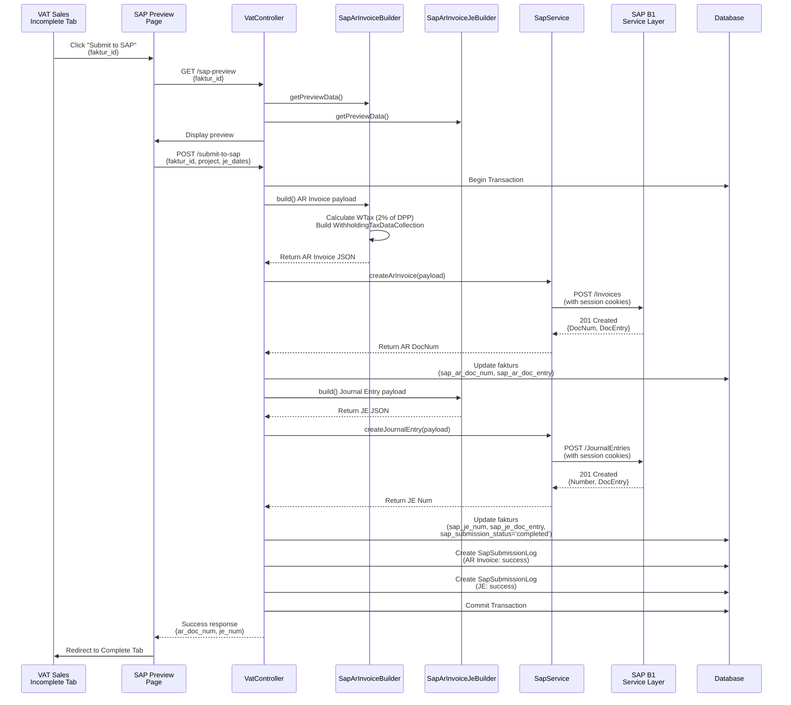
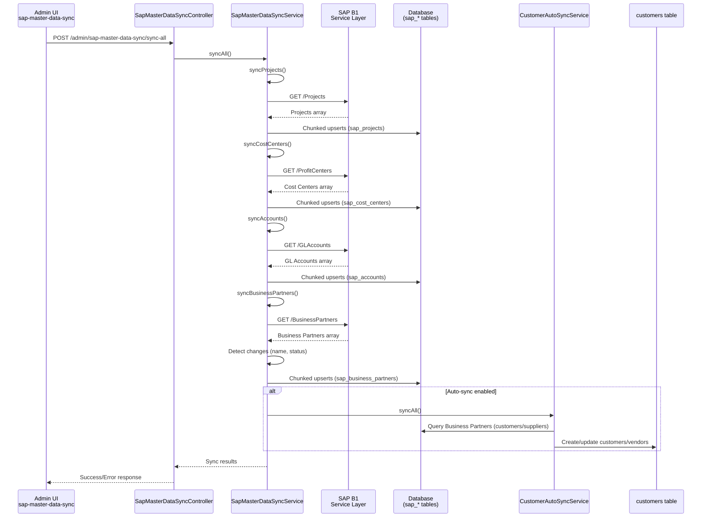

Purpose: Technical reference for understanding system design and development patterns
Last Updated: 2025-01-XX

## Architecture Documentation Guidelines

### Document Purpose

This document describes the CURRENT WORKING STATE of the application architecture. It serves as:

-   Technical reference for understanding how the system currently works
-   Onboarding guide for new developers
-   Design pattern documentation for consistent development
-   Schema and data flow documentation reflecting actual implementation

### What TO Include

-   **Current Technology Stack**: Technologies actually in use
-   **Working Components**: Components that are implemented and functional
-   **Actual Database Schema**: Tables, fields, and relationships as they exist
-   **Implemented Data Flows**: How data actually moves through the system
-   **Working API Endpoints**: Routes that are active and functional
-   **Deployment Patterns**: How the system is actually deployed
-   **Security Measures**: Security implementations that are active

### What NOT to Include

-   **Issues or Bugs**: These belong in `MEMORY.md` with technical debt entries
-   **Limitations or Problems**: Document what IS working, not what isn't
-   **Future Plans**: Enhancement ideas belong in `backlog.md`
-   **Deprecated Features**: Remove outdated information rather than marking as deprecated
-   **Wishlist Items**: Planned features that aren't implemented yet

### Update Guidelines

-   **Reflect Reality**: Always document the actual current state, not intended state
-   **Schema Notes**: When database schema has unused fields, note them factually
-   **Cross-Reference**: Link to other docs when appropriate, but don't duplicate content

### For AI Coding Agents

-   **Investigate Before Updating**: Use codebase search to verify current implementation
-   **Move Issues to Memory**: If you discover problems, document them in `MEMORY.md`
-   **Factual Documentation**: Describe what exists, not what should exist

---

# System Architecture

## Overview

The Accounting One system is a comprehensive financial management application built on Laravel framework with modular architecture supporting multiple business processes.

## System Components

### Core Modules

1. **User Management**

    - User authentication and authorization with Spatie Laravel Permission
    - Role-based access control (RBAC) with granular permissions
    - Department-based user organization with hierarchical structure
    - User-specific API configurations (DDS department codes)
    - Project-based user assignment and access control

2. **Financial Management**

    - **Payment Requests (Payreqs)**: Complete CRUD with approval workflows
    - **Realizations**: Expense reporting and documentation with detailed tracking
    - **Cash Management**: Incoming/outgoing cash journals, cashier operations
    - **Multi-Currency Support**: Exchange rate management with daily updates
    - **General Ledger**: Chart of accounts with SAP integration
    - **Budget Management**: Comprehensive RAB (Rencana Anggaran Biaya) and Anggaran systems with multi-level approval workflows, budget tracking, and utilization monitoring

3. **Document Management**

    - **Bilyet (Promissory Notes)**: Complete promissory note management system with Excel import/export, status tracking, audit trails, and comprehensive reporting
    - **Printable Documents**: PDF generation with DomPDF and caching
    - **Document Approval Workflows**: Multi-level approval with status tracking
    - **Document Numbering**: Automated document number generation

4. **Invoice Payment**

    - DDS API integration with per-user department codes
    - Invoice status management (open, pending, paid, closed)
    - Payment processing with modal-based updates
    - Real-time dashboard with statistics and overdue tracking
    - User-specific department code configuration with fallback

5. **Reporting & Analytics**

    - Financial reports with DataTables integration
    - Export functionality (Excel, PDF) with Laravel Excel
    - Performance-optimized queries with database indexing
    - Real-time dashboard analytics

6. **External Integrations**

    - **DDS API**: Document Distribution System for invoice management
    - **SAP Integration**: General ledger synchronization and journal entry submission
    - **SAP B1 Service Layer**: Direct programmatic submission of verification journals to SAP B1 Journal Entry module via REST API with cookie-based session management, automatic error handling, and comprehensive audit logging. Also supports AR Invoice and Journal Entry creation for VAT Sales fakturs with Withholding Tax (WTax) support via `WithholdingTaxDataCollection` structure.
    - **SAP Master Data Sync**: `SapMasterDataSyncService` + `sap:sync-master-data` command (scheduled daily 02:00) pulls Projects, Cost Centers, GL Accounts, and Business Partners from SAP B1 into `sap_projects`, `sap_cost_centers`, `sap_accounts`, `sap_business_partners` tables for validation, autocomplete, and audit trails. Includes unified sync UI (`/admin/sap-master-data-sync`), customer auto-sync, change detection, credit limit validation, and comprehensive reporting.
    - **SAP Bridge Account Statements**: Cashier SAP Transactions page fetches GL statement data via `/api/account-statements` using API key headers, translating SAP payloads (opening balance, running balances, summaries) directly into the UI.
    - **LOT Service**: Official travel claim management
    - **BUC Sync**: Budget synchronization system

7. **Payment Request REST API**

    - **Custom API Key Authentication**: SHA256-hashed API keys for external application access
    - **Advance Payment Requests**: Create advance payment requests via API
    - **Reimburse Payment Requests**: Create reimbursement requests with multiple detail items
    - **Workflow Management**: Support for both draft and direct submission workflows
    - **RAB Validation**: Project-specific budget requirement enforcement (000H, APS)
    - **Approval Integration**: Automatic approval plan creation and validation
    - **Comprehensive Filtering**: List payment requests with multiple filter options
    - **API Key Management UI**: Admin interface for generating and managing API keys
    - **Usage Tracking**: Last used timestamps and application identification
    - **Detailed Documentation**: Complete API documentation with cURL examples

8. **Dashboard & User Interface**

    - **Modern UI/UX Design**: Comprehensive dashboard redesign with AdminLTE 3 patterns
    - **Exchange Rate Ticker**: CSS animation-based scrolling display with real-time updates
    - **Announcements System**: Permission-based announcement display with gradient headers
    - **Approval Widgets**: Real-time pending approval counts with quick action CTAs
    - **Statistics Widgets**: Completion days tracking and VJ sync status
    - **Payreqs/Realizations Cards**: Status-based displays with empty states and badges
    - **VJ Activities Chart**: Doughnut chart showing user contribution statistics
    - **Team Management Section**: Avatar-based team member displays with progress tracking
    - **Monthly Spending Chart**: Line chart with Indonesian currency formatting
    - **Permission-Based Components**: Role-specific widget visibility (approvers, team leaders, superadmin)

### SAP B1 Journal Entry Submission Flow

The accounting `SAP Sync` module enables direct submission of verification journals to SAP B1 Journal Entry module via Service Layer REST API. Data flow:

- `resources/views/accounting/sap-sync/show.blade.php` displays "Submit to SAP B1" button (visible only when `sap_journal_no` is empty) and renders a SweetAlert2 confirmation dialog summarizing journal details, important notes, and previous failures
- User confirms inside SweetAlert dialog; a hidden form posts to `POST /accounting/sap-sync/submit-to-sap` with `verification_journal_id`
- Bulk listing pages (`resources/views/accounting/sap-sync/{project}.blade.php`) share `partials/bulk-table-script.blade.php`, which initializes DataTables for each project tab and uses SweetAlert2 for safe multi-journal submission (select-all, count badge, audit-friendly messaging)
- `SapSyncController::submitToSap()` validates permissions (superadmin, admin, cashier, approver roles), prevents resubmission if `sap_journal_no` exists, and initiates database transaction
- `SapJournalEntryBuilder` constructs journal entry payload from `VerificationJournal` and `VerificationJournalDetail` records with account codes, projects, cost centers, debits/credits
- `SapService::createJournalEntry()` handles SAP B1 authentication (cookie-based session via Guzzle CookieJar), sends POST request to `/JournalEntries` endpoint, and extracts SAP Document Number from response
- On success: Database transaction commits, local records updated with `sap_journal_no`, `posted_by`, `posted_at`, `SapSubmissionLog` entry created with success status
- On failure: Database transaction rolls back, no local updates, `SapSubmissionLog` entry created with error details, user sees error message
- UI automatically hides submit button and disables cancel button once journal is posted to SAP B1


**Key Components**:

- **SapService** (`app/Services/SapService.php`): Handles SAP B1 Service Layer authentication, session management (cookie-based), automatic re-login on expiration, and journal entry creation
- **SapJournalEntryBuilder** (`app/Services/SapJournalEntryBuilder.php`): Constructs journal entry payloads from verification journal records with validation
- **SapSubmissionLog** (`app/Models/SapSubmissionLog.php`): Audit trail model tracking all submission attempts with status, errors, SAP responses, and attempt numbers
- **Database Schema**: `verification_journals` table tracks submission status (`sap_submission_attempts`, `sap_submission_status`, `sap_submission_error`, `sap_submitted_at`, `sap_submitted_by`), `sap_submission_logs` table stores complete audit trail

**Configuration**:

- Environment: `SAP_SERVER_URL`, `SAP_DB_NAME`, `SAP_USER`, `SAP_PASSWORD`
- Config mapping: `config/services.php['sap']`
- SAP B1 Settings: General Settings → Cash Flow tab → "Assignment in Transactions with All Relevant to Cash Flow" set to "Warning Only" (allows posting without mandatory cash flow assignment)

### SAP B1 AR Invoice Submission Flow

The VAT Sales module enables direct submission of AR Invoices and Journal Entries to SAP B1 via Service Layer REST API. This feature integrates with the VAT Sales page improvements to provide a complete workflow from faktur creation to SAP B1 posting.

**Data Flow**:

- **Incomplete Tab** (`/accounting/vat?page=sales&status=incomplete`): Shows documents where `sap_ar_doc_num IS NULL` (not yet posted to SAP B1). Action buttons include "Submit to SAP" button that links to SAP preview page.
- **SAP Preview Page** (`/accounting/vat/fakturs/{id}/sap-preview`): Displays AR Invoice and Journal Entry preview with Edit/Update functionality. AR Invoice Details section allows editing of Invoice No, Faktur No, and Faktur Date. Journal Entry section allows editing of Posting Date, Tax Date, and Due Date. Fields are readonly by default, enabled via Edit buttons. Changes are saved to database via AJAX before submission. Submit button is disabled during edit mode to prevent submission with unsaved changes. User reviews, edits if needed, saves changes, and confirms submission.
- **Edit/Update Process**: `VatController::updateSapPreview()` handles updates for both AR Invoice and Journal Entry sections via `update_type` parameter. AR Invoice updates save `invoice_no`, `faktur_no`, `faktur_date`. Journal Entry updates save `je_posting_date`, `je_tax_date`, `je_due_date`, optionally `revenue_account_code`. Returns JSON responses for AJAX synchronization.
- **Submission Process**: `VatController::submitToSap()` validates permissions (`submit-sap-ar-invoice`), builds AR Invoice payload via `SapArInvoiceBuilder`, creates AR Invoice in SAP B1, then builds and creates Journal Entry via `SapArInvoiceJeBuilder`.
- **Success**: Updates `fakturs` table with `sap_ar_doc_num`, `sap_je_num`, `sap_submission_status='completed'`, creates `SapSubmissionLog` entries for both documents.
- **Complete Tab** (`/accounting/vat?page=sales&status=complete`): Shows documents where `sap_ar_doc_num IS NOT NULL` (already posted). Displays AR Invoice DocNum and JE Num columns instead of old DocNum column.



**Key Components**:

- **SapArInvoiceBuilder** (`app/Services/SapArInvoiceBuilder.php`): Constructs AR Invoice payloads with DPP amount, VAT calculation (11% handled by SAP), WTax calculation (2% of DPP), and `WithholdingTaxDataCollection` structure. Uses AR Account `11401039` (Piutang Usaha Belum Ditagih) and supports custom item codes.
- **SapArInvoiceJeBuilder** (`app/Services/SapArInvoiceJeBuilder.php`): Constructs Journal Entry payloads with AR Account debit, Revenue Account credit, PPN and WTax lines. Supports custom JE posting dates (defaults to previous end of month).
- **VatController** (`app/Http/Controllers/Accounting/VatController.php`): Handles VAT Sales page data filtering (`sap_ar_doc_num` based), SAP preview with Edit/Update functionality, and submission. `updateSapPreview()` method handles both AR Invoice and Journal Entry updates via AJAX. `previewSapSubmission()` builds preview data. `submitToSap()` handles final submission to SAP B1. Updated `data()` method filters incomplete/complete tabs based on SAP submission status.
- **Database Schema**: `fakturs` table tracks SAP submission (`sap_ar_doc_num`, `sap_ar_doc_entry`, `sap_je_num`, `sap_je_doc_entry`, `sap_submission_status`, `sap_submission_attempts`, `sap_submission_error`, `sap_submitted_at`, `sap_submitted_by`, `je_posting_date`, `je_tax_date`, `je_due_date`, `revenue_account_code`, `project`). `sap_submission_logs` table stores audit trail for both AR Invoice and Journal Entry submissions.

**SAP B1 Service Layer API Reference**:

- **AR Invoice Endpoint**: `POST /Invoices`
- **Journal Entry Endpoint**: `POST /JournalEntries`
- **Withholding Tax Structure**: `WithholdingTaxDataCollection` array with `WTCode` and `WTAmount` at document level. Line level requires `WTaxCode` and `WTaxLiable='Y'`.
- **Required Fields**: `CardCode`, `DocDate`, `DocDueDate`, `TaxDate`, `DocCurrency`, `DocRate`, `DocumentLines` (with `AccountCode`, `LineTotal`, `WTaxCode`, `WTaxLiable`), `WithholdingTaxDataCollection` (for WTax display).
- **API Documentation**: Refer to SAP B1 Service Layer API documentation for complete field specifications and data structures. Key references: AR Invoice document structure, Journal Entry document structure, Withholding Tax data collection format.
- **Developer Reference Guide**: See `docs/SAP_B1_AR_INVOICE_DEVELOPER_GUIDE.md` for comprehensive technical reference, code examples, troubleshooting, and best practices.

**Configuration**:

- Environment: `SAP_AR_INVOICE_DEFAULT_AR_ACCOUNT=11401039`, `SAP_AR_INVOICE_DEFAULT_REVENUE_ACCOUNT=41101`, `SAP_AR_INVOICE_DEFAULT_WTAX_CODE=1019`, `SAP_AR_INVOICE_WTAX_PERCENTAGE=2`
- Config mapping: `config/services.php['sap']['ar_invoice']`
- SAP B1 Requirements: WTax code must be assigned to business partner in SAP B1 master data

**Edit/Update Functionality**:

- **AR Invoice Details Section**: Fields (Invoice No, Faktur No, Faktur Date) are readonly by default with `editable-field` class. Edit button enables editing, Update button saves changes via AJAX to `updateSapPreview()` endpoint, Cancel button restores original values. Changes persist to database before submission.
- **Journal Entry Section**: Date fields (Posting Date, Tax Date, Due Date) are readonly by default with `je-editable-field` class. Edit button enables editing, Update button saves changes via AJAX to `updateSapPreview()` endpoint with `update_type='journal_entry'`, Cancel button restores original values. Changes persist to database before submission.
- **Submit Protection**: Submit button is disabled when either section is in edit mode (`isEditMode` or `isJeEditMode`). Warning dialog shown if attempting to submit with unsaved changes.
- **Visual Feedback**: Success/error alerts displayed with auto-hide after 5 seconds. Readonly fields have light background to indicate non-editable state.

**View Updates**:

- **Incomplete Tab** (`resources/views/accounting/vat/ar/incomplete.blade.php`): Shows documents not yet posted to SAP. Action buttons include "Submit to SAP" button.
- **Complete Tab** (`resources/views/accounting/vat/ar/complete.blade.php`): Shows documents already posted. Displays "AR Invoice DocNum" and "JE Num" columns instead of "DocNum".
- **Action Views**: `resources/views/accounting/vat/ar/action.blade.php` (incomplete - with Submit button), `resources/views/accounting/vat/ar/action_complete.blade.php` (complete - without Submit button)

### Verification Journal Detail Editing

The `SAP Sync` module provides comprehensive editing capabilities for verification journal details through the `/accounting/sap-sync/edit-vjdetail` route. All journal detail rows (both debit and credit entries) can be edited before posting to SAP B1, with appropriate business rule validations and visual indicators.

**Data Flow**:

- `resources/views/accounting/sap-sync/edit-vjdetail/index.blade.php` displays a DataTable of all verification journal details with visual type indicators (DEBIT: blue badge, CREDIT: red badge)
- DataTable loads data via AJAX from `GET /accounting/sap-sync/edit-vjdetail/data?vj_id={id}` endpoint
- `SapSyncController::edit_vjdetail_data()` returns DataTables-formatted JSON with enhanced columns:
  - `debit_credit_badge`: Color-coded badge (blue for debit, red for credit)
  - `akun`: Account code with account name
  - `cost_center`: Cost center code with department acronym
  - `action`: Edit button (or "Posted" badge if journal already posted to SAP)
- Each row has an Edit button that opens a modal (`resources/views/accounting/sap-sync/edit-vjdetail/action.blade.php`)
- For credit entries, the modal shows a warning alert and filters account dropdown to only show cash/bank accounts from the VJ's project
- Form submission posts to `POST /accounting/sap-sync/update-detail` with account_code, project, cost_center, description
- `SapSyncController::update_detail()` validates:
  - Journal is not already posted to SAP B1 (prevents editing posted journals)
  - For credit entries: Account type must be 'cash' or 'bank'
  - For credit entries: Account project must match VJ project
- On success: Returns JSON response, DataTable refreshes to show updated data
- On validation failure: Returns JSON error response with clear error message

**Business Rules**:

1. **Account Type Restriction**: Credit entries can only use accounts with type 'cash' or 'bank'
2. **Project Matching**: Credit entry accounts must belong to the same project as the verification journal
3. **SAP Posting Lock**: Journals already posted to SAP B1 (`sap_journal_no` exists) cannot be edited
4. **Debit Entries**: No account type restrictions (can use any account)

**Visual Indicators**:

- **DEBIT rows**: Blue badge (`badge-primary`) for clear identification
- **CREDIT rows**: Red badge (`badge-danger`) for clear identification
- **Posted journals**: "Posted" badge with lock icon instead of edit button

**Key Components**:

- **SapSyncController::edit_vjdetail_data()**: Generates DataTables JSON with badges and action buttons
- **SapSyncController::update_detail()**: Validates and updates journal detail records with business rule enforcement
- **Action View**: `resources/views/accounting/sap-sync/edit-vjdetail/action.blade.php` - Modal form with conditional account filtering and warning alerts
- **Model Relationships**: `VerificationJournalDetail::verificationJournal()` - Used for SAP posting check and project validation

**Routes**:

- `GET /accounting/sap-sync/edit-vjdetail` - Display edit page (`SapSyncController::edit_vjdetail_display`)
- `GET /accounting/sap-sync/edit-vjdetail/data` - DataTables AJAX endpoint (`SapSyncController::edit_vjdetail_data`)
- `POST /accounting/sap-sync/update-detail` - Update journal detail (`SapSyncController::update_detail`)

---

### SAP Bridge Account Statement Flow

The cashier `SAP Transactions` module now consumes the SAP-Bridge API instead of the legacy GL service. Data flow:

- `resources/views/cashier/sap-transactions/index.blade.php` posts `account_code`, `start_date`, and `end_date` to `POST /cashier/sap-transactions/data` after enforcing the 6-month window rule client-side.
- `SapTransactionController::data()` validates the payload (`Y-m-d` dates, `after_or_equal`, custom 6-month guard via Carbon) and delegates to `App\Services\SapBridge\AccountStatementService`.
- `AccountStatementService` centralizes HTTP concerns: builds `GET /api/account-statements` with `x-sap-bridge-api-key`, reads config from `config/services.php['sap_bridge']`, applies timeouts, and normalizes error responses by throwing `SapBridgeException`.
- Successful responses are relayed verbatim (`account`, `opening_balance`, `transactions`, `summary`) so the DataTable renders SAP-provided fields (posting date, project, debit/credit, running balance, tx number, unit no) without further transformation.
- Errors from SAP-Bridge (401 auth, 404 account not found, 422 range exceeded, 5xx connectivity) are surfaced to the UI so cashiers immediately see the root cause.


**Configuration**:

- Environment: `SAP_BRIDGE_URL`, `SAP_BRIDGE_API_KEY`, `SAP_BRIDGE_TIMEOUT`
- Config mapping: `config/services.php['sap_bridge']`
- Exception handling: `App\Exceptions\SapBridgeException` standardizes downstream error responses.

### SAP B1 Master Data Sync Flow

The application maintains synchronized copies of SAP B1 master data (Projects, Cost Centers, GL Accounts, Business Partners) locally for fast validation, autocomplete, and offline diagnostics. The sync system includes both command-line and UI-based synchronization.

**Data Flow**:

- `php artisan sap:sync-master-data` command (or UI sync at `/admin/sap-master-data-sync`) triggers `SapMasterDataSyncService`
- Service calls `SapService` methods (`getProjects()`, `getCostCenters()`, `getAccounts()`, `getBusinessPartners()`) to fetch data from SAP B1 Service Layer
- `SapMasterDataSyncService` maps SAP fields to local database fields and uses chunked upserts (100 records per chunk) with transaction safety
- Business Partners sync includes change detection (name changes, status changes) and stores previous values for audit trail
- Customer/Vendor auto-sync (`CustomerAutoSyncService`) automatically syncs Business Partners to `customers` table
- Credit limit validation (`FakturController`) checks customer credit limits before creating invoices
- All sync operations track `last_synced_at` timestamps and store full SAP responses in `metadata` JSON fields

**Tables Synced**:

1. **`sap_projects`**: SAP Projects master data (Code, Name, Status, Active, Start/End dates, Project Manager)
2. **`sap_cost_centers`**: SAP Profit Centers (CenterCode, CenterName, Segment, Department, Active)
3. **`sap_accounts`**: SAP GL Accounts (Code, Name, AccountType, Category, Postable, Active)
4. **`sap_business_partners`**: SAP Business Partners (CardCode, CardName, CardType, Active, VAT Liable, Federal Tax ID, Phone, Email, Address, Credit Limit, Balance, Change Tracking)
5. **`customers`** (indirect): Synced from Business Partners via `CustomerAutoSyncService`

**Scheduled Sync**:

- Daily at 02:00 via Laravel scheduler: `php artisan sap:sync-master-data`
- Can be triggered manually via command line or unified UI page

**UI Components**:

- **Unified Sync Page** (`/admin/sap-master-data-sync`): Single page to sync all master data types or individual types
- **Business Partners Admin** (`/admin/business-partners`): View, filter, and sync Business Partners with statistics and change detection
- **Projects Admin** (`/admin/projects`): Sync and manage SAP Projects with visibility controls
- **Departments Admin** (`/admin/departments`): Sync and manage SAP Cost Centers/Departments

**Key Components**:

- **SapMasterDataSyncService** (`app/Services/SapMasterDataSyncService.php`): Core sync service with chunked upserts, transaction safety, and error handling
- **SapService** (`app/Services/SapService.php`): SAP B1 Service Layer API client with session management
- **CustomerAutoSyncService** (`app/Services/CustomerAutoSyncService.php`): Auto-syncs Customers and Vendors from Business Partners
- **BusinessPartnerChangeDetectionService** (`app/Services/BusinessPartnerChangeDetectionService.php`): Tracks changes in Business Partners (name, status)
- **SapMasterDataSyncController** (`app/Http/Controllers/Admin/SapMasterDataSyncController.php`): Unified UI controller for master data sync
- **SyncSapMasterData Command** (`app/Console/Commands/SyncSapMasterData.php`): Artisan command with selective sync options

**Field Mapping (Business Partners)**:

- `CardCode` → `code` (unique identifier)
- `CardName` → `name`
- `CardType` → `type` (cCustomer, cSupplier, cLead)
- `Active` → `active` (boolean)
- `VatLiable` → `vat_liable` (boolean)
- `FederalTaxID` → `federal_tax_id` (NPWP)
- `Phone1` → `phone`
- `Email` → `email`
- `Address` → `address`
- `CreditLimit` → `credit_limit` (decimal)
- `Balance` → `balance` (decimal)
- Full SAP response → `metadata` (JSON)

**Change Tracking**:

- Tracks name changes: `previous_name`, `name_changed_at`
- Tracks status changes: `previous_active`, `status_changed_at`
- Enables audit trail and change detection reporting

**Credit Limit Validation**:

- Validates available credit before Faktur creation
- Compares invoice amount against credit limit minus current balance
- Returns clear error messages when credit limit exceeded



## Architecture Diagram


## Bilyet Module Architecture


## Loans & Bilyets Integration Architecture

### Entity Relationship Diagram


### Payment Workflow Diagram


### Business Rules

#### Payment Method Rules

1. **Bilyet Payment** (`payment_method = 'bilyet'`)

    - Requires `bilyet_id` (FK to bilyets table)
    - Creates actual Bilyet record with `purpose = 'loan_payment'`
    - Bilyet must be linked to the loan
    - Payment complete when bilyet status = 'cair'

2. **Auto-Debit Payment** (`payment_method = 'auto_debit'`)

    - NO bilyet created
    - `bilyet_id` must be NULL
    - Direct bank account debit
    - Immediate payment upon confirmation

3. **Cash/Transfer/Other** (`payment_method = 'cash|transfer|other'`)
    - NO bilyet created
    - Manual payment tracking
    - `bilyet_id` must be NULL

#### Bilyet Purpose Rules

1. **Loan Payment** (`purpose = 'loan_payment'`)

    - Must have `loan_id` set
    - Linked to specific installment
    - Shows in loan payment reports

2. **Operational Expense** (`purpose = 'operational'`)

    - No loan linkage required
    - `loan_id` should be NULL
    - Shows in operational expense reports

3. **Other** (`purpose = 'other'`)
    - Flexible usage
    - Optional loan linkage

### Integration Data Flow


### Service Layer Architecture


### Audit Trail System

Both Loans and Bilyets have comprehensive audit trails:

**LoanAudit Table**: Tracks all loan changes

-   Actions: created, updated, status_changed, deleted, installments_generated
-   Captures: old_values, new_values, user, IP, timestamp
-   Retention: Permanent

**BilyetAudit Table**: Tracks all bilyet changes

-   Actions: created, updated, status_changed, voided, bulk_updated
-   Captures: old_values, new_values, user, IP, timestamp
-   Retention: Permanent

Events fire automatically via Laravel's event system, listeners log to audit tables.

### Data Integrity Validations

**InstallmentPaymentService validations**:

-   Bilyet amount ≥ installment amount (1% tolerance)
-   Bilyet bank account matches installment account (recommended)
-   Bilyet status not 'void' when linking
-   Installment not already paid via different method

**Database constraints**:

-   bilyet_id FK with onDelete('set null') - preserve installment if bilyet deleted
-   payment_method enum - prevents invalid values
-   purpose enum - ensures valid categorization

## Payment Request REST API Architecture

### Overview

The Payment Request API provides secure REST endpoints for external applications to create and manage payment requests. It uses custom API key authentication for system-to-system integration.

### API Architecture Diagram


### Authentication Flow


### API Key Model

**Table**: `api_keys`

| Field        | Type       | Description            |
| ------------ | ---------- | ---------------------- |
| id           | bigint     | Primary key            |
| name         | string     | Descriptive name       |
| key          | string(64) | SHA256 hash of raw key |
| application  | string     | Application identifier |
| description  | text       | Optional notes         |
| is_active    | boolean    | Active status          |
| last_used_at | timestamp  | Usage tracking         |
| created_by   | bigint     | FK to users            |
| permissions  | json       | Future use             |

**Security Features**:

-   One-way SHA256 hashing (keys cannot be recovered)
-   Instant activation/deactivation
-   Usage tracking for audit
-   Application-level identification

### API Endpoints

| Method | Endpoint                 | Description             | Auth     |
| ------ | ------------------------ | ----------------------- | -------- |
| GET    | /api/payreqs             | List payment requests   | Required |
| GET    | /api/payreqs/{id}        | Get single payreq       | Required |
| POST   | /api/payreqs/advance     | Create advance payreq   | Required |
| POST   | /api/payreqs/reimburse   | Create reimburse payreq | Required |
| POST   | /api/payreqs/{id}/cancel | Cancel draft payreq     | Required |

### Business Rules Implementation

**RAB Validation**:

```php
if (in_array($project, ['000H', 'APS']) && $submit === true && !$rab_id) {
    return 422 error "RAB is required for projects 000H and APS when submitting"
}
```

**Approval Plan Handling**:

```php
if ($submit === true) {
    $approverCount = create_approval_plan('payreq', $id);
    if ($approverCount === false) {
        // Keep as draft, return error with draft payreq data
    } else {
        // Update to submitted status, assign official number
    }
}
```

**Project/Department Auto-fill**:

-   API extracts from employee record (prevents data inconsistency)
-   External apps only provide `employee_id`
-   System determines `project` and `department_id`

### Request/Response Examples

**Create Advance (Submit)**:

```json
POST /api/payreqs/advance
{
    "employee_id": 123,
    "remarks": "Travel expenses",
    "amount": 5000000,
    "rab_id": 10,
    "submit": true
}

Response 201:
{
    "success": true,
    "message": "Payment request created successfully",
    "data": {
        "payreq": {...},
        "approval_status": "submitted",
        "approvers_count": 3
    }
}
```

**Create Reimburse (Draft)**:

```json
POST /api/payreqs/reimburse
{
    "employee_id": 123,
    "remarks": "Office supplies",
    "submit": false,
    "details": [
        {"description": "Paper", "amount": 500000},
        {"description": "Ink", "amount": 300000}
    ]
}

Response 201:
{
    "success": true,
    "data": {
        "payreq": {...},
        "realization": {...},
        "approval_status": "draft"
    }
}
```

### Error Handling

| Status | Description                                |
| ------ | ------------------------------------------ |
| 401    | Invalid/missing API key                    |
| 404    | Resource not found                         |
| 422    | Validation error / business rule violation |
| 500    | Internal server error                      |

All errors return consistent JSON structure:

```json
{
    "success": false,
    "message": "Error description",
    "errors": { "field": ["error message"] }
}
```

### Integration Points

1. **PayreqController**: Reuses existing business logic for payreq creation
2. **ApprovalPlanController**: Leverages existing approval workflow
3. **DocumentNumberController**: Uses same document numbering system
4. **Realization/RealizationDetail**: Standard models for reimburse type

### API Key Management UI

Admin interface accessible at `/admin/api-keys`:

-   Generate new API keys
-   View all keys with status and usage
-   Activate/deactivate keys instantly
-   Delete keys permanently
-   Track last usage timestamp

### Logging and Audit

All API operations are logged with:

-   API key identifier (name, application)
-   Employee ID
-   Operation type (advance, reimburse)
-   Success/failure status
-   Error messages if applicable

Log entries include `api_key` field for filtering and analysis.

## Invoice Payment Module Architecture


## Technology Stack

### Backend

-   **Framework**: Laravel 10.x with modern skeleton structure
-   **PHP Version**: 8.1+
-   **Database**: MySQL/MariaDB with optimized indexes
-   **Cache**: Redis (optional) for performance optimization
-   **Queue**: Laravel Queue for background processing
-   **Authentication**: Laravel Sanctum for API authentication
-   **Permissions**: Spatie Laravel Permission for RBAC

### Frontend

-   **UI Framework**: AdminLTE 3.x with responsive design
-   **Layout**: Sidebar navigation (`sidebar-mini layout-fixed`) for better menu hierarchy and navigation
-   **JavaScript**: jQuery, DataTables (Yajra DataTables)
-   **CSS**: Bootstrap 4.x with custom styling and modern gradients
-   **Charts**: Chart.js for analytics and reporting
-   **Notifications**: SweetAlert2 for user feedback
-   **AJAX**: Laravel HTTP Client for API communication
-   **Animations**: CSS keyframes for smooth transitions and ticker animations

### Navigation Structure

-   **Layout Type**: Sidebar navigation (AdminLTE sidebar-mini layout)
-   **Main Components**:
    - Sidebar (`resources/views/templates/partials/sidebar.blade.php`) - Vertical menu with tree structure
    - Topbar (`resources/views/templates/partials/topbar.blade.php`) - Simplified top navigation with user menu
-   **Menu Organization**: Hierarchical tree structure with expandable sections
    - Dashboard
    - My PayReqs (with sub-items)
    - Cashier (with sub-items including EOD section)
    - Accounting (with sub-items)
    - Approvals (with sub-items)
    - Admin (with sub-items)
    - Search
-   **Features**:
    - Permission-based menu visibility (Spatie Laravel Permission)
    - Active route highlighting
    - Sidebar state persistence (localStorage)
    - Responsive collapse on mobile devices
    - Font Awesome icons for visual clarity

### UI/UX Patterns

#### Enhanced Form Pattern for Bulk Operations

Standardized pattern for forms that generate multiple records or perform complex operations:

**Core Components**:

1. **Contextual Information Box**

    - Displays related record details at top of form (e.g., loan principal, tenor, creditor)
    - Uses Bootstrap alert-info styling for visual prominence
    - Helps users verify they're working with correct record

2. **Enhanced Field Labels**

    - User's language (Indonesian) with descriptive English subtitles where needed
    - Required field indicators (red asterisks `<span class="text-danger">*</span>`)
    - Helpful descriptive text under each field explaining purpose and format
    - Example: "Tanggal angsuran pertama jatuh tempo" (First installment due date)

3. **Smart Defaults & Auto-Calculations**

    - Pre-fill fields with calculated or sensible default values
    - Keep fields editable for user override flexibility
    - Example: Installment amount = `round($loan->principal / $loan->tenor, 0)`
    - Example: Start date = `now()->addMonth()->startOfMonth()`

4. **Enhanced Dropdowns**

    - Select2 integration for searchable, user-friendly selection
    - Display essential information only (account number + name)
    - Format: "11201001 - Mandiri IDR - 149.0004194751"
    - Avoid verbose descriptions that clutter the dropdown

5. **Real-Time Preview/Summary**

    - JavaScript-powered dynamic summary of what will be generated
    - Updates instantly as user modifies any field
    - Yellow warning box (`alert-warning`) for visual distinction
    - Shows: count, range, dates, amounts, totals
    - Indonesian number formatting for currency (171.016.000)

6. **Validation & Confirmation**
    - Client-side validation before submission
    - Confirmation dialog with operation count (e.g., "Generate 36 installments?")
    - Loading state during submission ("Generating..." with spinner icon)
    - Clear error messages near relevant fields with Bootstrap validation classes

**Implementation Example** (Loan Installment Generation):

```blade
<!-- Contextual Info -->
<div class="alert alert-info">
  <strong>Principal:</strong> IDR {{ number_format($loan->principal, 0) }}<br>
  <strong>Tenor:</strong> {{ $loan->tenor }} months
</div>

<!-- Enhanced Field -->
<label for="installment_amount">Jumlah per Angsuran <span class="text-danger">*</span></label>
<div class="input-group">
  <div class="input-group-prepend"><span class="input-group-text">IDR</span></div>
  <input type="number" name="installment_amount"
    value="{{ old('installment_amount', round($loan->principal / $loan->tenor, 0)) }}"
    class="form-control" required>
</div>
<small class="form-text text-muted">Nilai rupiah per angsuran (auto-calculated)</small>

<!-- Enhanced Dropdown -->
<select name="account_id" class="form-control select2bs4" required>
  @foreach ($accounts as $account)
    <option value="{{ $account->id }}">
      {{ $account->account_number }} - {{ $account->account_name }}
    </option>
  @endforeach
</select>

<!-- Real-Time Summary -->
<div class="alert alert-warning" id="generation-summary">
  <h5><i class="fas fa-calculator"></i> Generation Summary:</h5>
  <div id="summary-content">
    <!-- JavaScript populates dynamically -->
  </div>
</div>

<!-- JavaScript for real-time updates -->
<script>
function calculateSummary() {
  const tenor = parseInt($('input[name="tenor"]').val()) || 0;
  const amount = parseFloat($('input[name="installment_amount"]').val()) || 0;
  // ... calculate and display summary
}
$('input[name="tenor"], input[name="installment_amount"]').on('change keyup', calculateSummary);
</script>
```

**Benefits**:

-   ✅ Increased user confidence through preview
-   ✅ Reduced data entry time via auto-calculations
-   ✅ Minimized errors through validation
-   ✅ Improved account selection with clear names
-   ✅ Maintained workflow efficiency (single page, no wizards)

**Apply This Pattern To**:

-   Bulk bilyet creation from installments
-   Bulk realization entry generation
-   Multi-period budget allocation
-   Any operation creating 10+ records at once

### Dashboard Components

-   **Exchange Rate Ticker**:

    -   CSS animation-based scrolling (30s duration)
    -   Purple gradient background (`#667eea → #764ba2`)
    -   Rotating icon animation
    -   Real-time data from Kemenkeu API (`/api/dashboard/exchange-rate-usd`)
    -   5-minute auto-refresh interval

-   **Announcements**:

    -   Permission-based visibility via `visibleToUser()` scope
    -   Pink/red gradient headers (`#f093fb → #f5576c`)
    -   Role-based targeting with badge display
    -   Dismissible alerts with period information

-   **Approval Widget**:

    -   Orange/yellow gradient (`#f6d365 → #fda085`)
    -   Real-time count from `approval_plans` table
    -   Direct CTA to approval page
    -   Permission-gated (`akses_approvals`)

-   **Statistics Widgets**:

    -   **Completion Days**: Dynamic gradient (green if ≤7, red if >7)
    -   **VJ Sync**: Blue gradient with pending count and quick action
    -   Hover effects with transform and shadow animations
    -   Permission-based visibility

-   **Payreqs/Realizations Cards**:

    -   Purple gradient for payreqs (`#667eea → #764ba2`)
    -   Pink/yellow gradient for realizations (`#fa709a → #fee140`)
    -   Status badges with color coding (draft/submitted/approved/paid/overdue)
    -   Empty states with positive messaging ("All caught up!")
    -   Indonesian currency formatting with 2 decimals
    -   Quick action "View All" buttons

-   **VJ Activities Chart**:

    -   Cyan gradient header (`#4facfe → #00f2fe`)
    -   Doughnut chart (65% cutout) with Chart.js
    -   Percentage tooltips with user contributions
    -   Total activities badge display
    -   Permission-gated (`see_activities_chart`)

-   **Team Section**:

    -   Teal/purple gradient (`#30cfd0 → #330867`)
    -   Avatar initials with gradient backgrounds
    -   Grouped member displays with payreq cards
    -   Amount formatting with 2 decimals (Rp X.XXX.XXX,XX)
    -   Status badges and days indicators
    -   Permission-gated (`see_team`)

-   **Monthly Chart**:
    -   Purple gradient header
    -   Line chart with smooth curves (tension: 0.4)
    -   Indonesian currency tooltips
    -   Enhanced data points with hover effects
    -   Responsive height adjustments

### Data Processing

-   **Excel Processing**: Laravel Excel (Maatwebsite) for import/export with two-stage validation
-   **PDF Generation**: DomPDF for printable documents
-   **Data Validation**: Laravel validation with custom rules and enhanced error reporting
-   **File Upload**: Laravel file handling with validation and progress tracking
-   **Bilyet Import System**: Two-stage import process (Excel → staging table → final table) with comprehensive logging and error handling

### External Integrations

-   **DDS API**: Document Distribution System API for invoice management
-   **SAP Integration**: General ledger synchronization
-   **LOT Service**: Official travel claim management
-   **BUC Sync**: Budget synchronization system
-   **Exchange Rate Automation**: Automated scraping from Kemenkeu Kurs Pajak with configurable target currencies
-   **Dashboard Exchange Rate Display**: Single official rate display from Kemenkeu Kurs Pajak automation system

## Security Architecture

### Authentication & Authorization

-   Laravel's built-in authentication with custom login controller
-   Spatie Laravel Permission for granular RBAC
-   CSRF protection on all forms and AJAX requests
-   API key authentication for external APIs (DDS, LOT, etc.)
-   Middleware-based route protection with permission checks
-   User session management with secure token regeneration

### Data Protection

-   Input validation and sanitization with Laravel validation
-   SQL injection prevention (Eloquent ORM with parameter binding)
-   XSS protection (Blade templating with automatic escaping)
-   Audit logging for sensitive operations (user actions, API calls)
-   File upload validation and secure storage
-   Environment variable protection for sensitive configuration

### Access Control

-   Role-based permissions (admin, user, approver, etc.)
-   Feature-specific permissions (view_exchange_rates, edit_payreqs, edit-submitted-realization, etc.)
-   Permission-based UI rendering with Blade `@can` directive
-   Department-based access control
-   Project-based data isolation
-   Middleware protection on all sensitive routes

## Database Architecture

### Core Tables

#### User Management

-   **users**: User accounts with department and project assignments
-   **departments**: Organizational structure with hierarchical relationships
-   **projects**: Project definitions and configurations
-   **roles**: User roles for RBAC system
-   **permissions**: Granular permissions for feature access
-   **model_has_roles**: Role assignments to users
-   **model_has_permissions**: Direct permission assignments

#### Financial Core

-   **accounts**: Chart of accounts with balance tracking
-   **payreqs**: Payment requests with approval workflows
-   **realizations**: Expense realizations linked to payreqs with approver modification tracking
    -   Modification tracking: `modified_by_approver` (boolean), `modified_by_approver_at` (timestamp), `modified_by_approver_id` (foreign key)
    -   Enables audit trail when approvers edit submitted realizations
    -   Drives "Needs Reprint" notification in user interface
-   **realization_details**: Detailed expense breakdowns with description, amount, department, unit information
-   **outgoings**: Cash outflow transactions
-   **incomings**: Cash inflow transactions
-   **cash_journals**: Daily cash operations and reconciliation

#### Budget Management

-   **rabs**: Rencana Anggaran Biaya (Budget Plans)
-   **anggarans**: Budget allocations and tracking with comprehensive approval workflows
-   **periode_anggarans**: Budget period management for different project cycles
-   **approval_stages**: Approval workflow configurations
-   **approval_plans**: Approval process instances

#### Approval System

The system implements comprehensive multi-level approval workflows with permission-based features:

**Approval Workflow**:

-   Multi-level approval stages configured per department and document type
-   Approvers assigned through `approval_stages` table
-   Approval tracking via `approval_plans` with status management
-   Support for approve, revise, and reject actions with remarks

**Approver Edit Capabilities** (Realizations & Payreqs):

-   Permission-controlled edit functionality (`edit-submitted-realization` permission)
-   Available on both realization approval page and payreq (reimburse) approval page
-   Inline editing of realization details after submission but before final approval
-   Editable fields: description, amount, department, project (per detail row), unit information (unit_no, type, qty, uom, km_position)
-   Project editing: Per-row dropdown in realization_details table allowing different projects per expense item
-   Add/delete detail rows with real-time amount validation
-   Warning-based validation (allows save with amount differences, not blocking)
-   Variance calculation: Real-time display of Payreq Amount - Total Detail Amount
-   Modification tracking: Records approver ID, timestamp when details are modified
-   User notifications:
    -   "⚠ Needs Reprint" badge in user's realization list (`/user-payreqs/realizations`)
    -   "⚠ Needs Reprint" badge in user's payreq list (`/user-payreqs`) for reimburse-type payreqs
-   AJAX-based updates without page refresh for improved UX
-   Expandable unit info section for detailed equipment tracking

**Advance Info Section Redesign** (2025-10-31):

-   Compact single-row layout grouping related information
-   Realization No: Shows submit timestamp directly below (📅 clock icon, format: d-M-Y H:i WITA)
-   Payreq No: Shows paid date directly below (💵 money icon when paid, ⏳ hourglass when unpaid)
-   Payment status integration: Eager loads outgoings relationship to display payment dates
-   Icon-based visual indicators for quick status scanning
-   Consistent display across both realization and payreq approval pages
-   Muted styling for secondary information using `<small class="text-muted">` tags

**Routes**:

-   `GET /approvals/request/realizations` - List pending realizations
-   `GET /approvals/request/realizations/{id}` - View realization details
-   `PUT /approvals/request/realizations/{id}/details` - Update realization details (permission-protected)
-   `GET /approvals/request/payreqs` - List pending payreqs
-   `GET /approvals/request/payreqs/{id}` - View payreq details
-   `PUT /approvals/request/payreqs/{id}/details` - Update payreq realization details (permission-protected)
-   `PUT /approvals/plan/{id}/update` - Submit approval decision

#### Multi-Currency Support

-   **currencies**: Currency definitions and codes
-   **exchange_rates**: Daily exchange rates with effective dates and automation tracking
    -   Automated scraping from Kemenkeu Kurs Pajak (https://fiskal.kemenkeu.go.id/informasi-publik/kurs-pajak)
    -   Configurable target currencies via environment variables
    -   KMK period tracking and daily rate expansion
    -   Source tracking (manual vs automated) with audit trail
    -   Dashboard API endpoint for real-time rate display (`/api/dashboard/exchange-rate-usd`)

#### Document Management

-   **bilyets**: Promissory notes with comprehensive tracking (status, dates, amounts, audit trails)
-   **bilyet_temps**: Temporary staging table for Excel import validation
-   **bilyet_audits**: Complete audit trail for all bilyet operations and status changes
-   **dokumens**: Document management system
-   **document_numbers**: Automated document numbering

#### External Integrations

-   **invoice_creations**: DDS invoice synchronization
-   **verification_journals**: SAP journal verification
-   **lot_claims**: Official travel claim management

### Database Relationships


## Performance Considerations

### Database Optimization

-   **Indexes**: Critical indexes on frequently queried fields (status, created_at, user_id)
-   **Composite Indexes**: Multi-column indexes for common query patterns
-   **Eager Loading**: Relationship loading to prevent N+1 queries
-   **Query Optimization**: Optimized joins and WHERE clauses
-   **Performance Monitoring**: 70-80% improvement through index optimization

### Caching Strategy

-   Redis caching for expensive operations
-   Route caching for production deployment
-   View caching for static content
-   Database query result caching

### API Integration

-   Rate limiting for external API calls
-   Timeout handling for network issues
-   Retry logic for failed requests
-   Comprehensive logging for debugging
-   Error handling with user-friendly messages

## Deployment Architecture

### Environment Configuration

```env
# Database
DB_CONNECTION=mysql
DB_HOST=127.0.0.1
DB_PORT=3306
DB_DATABASE=accounting_one
DB_USERNAME=root
DB_PASSWORD=

# External APIs
DDS_API_URL=http://192.168.32.13/dds
DDS_API_KEY=your_api_key
DDS_DEPARTMENT_CODE=000HCASHO  # Fallback department code, users can have individual codes

# Cache
CACHE_DRIVER=file
SESSION_DRIVER=file
QUEUE_CONNECTION=sync
```

### File Structure

```
app/
├── Http/
│   ├── Controllers/
│   │   ├── InvoicePaymentController.php
│   │   ├── PayreqController.php
│   │   └── ...
│   └── Middleware/
├── Models/
├── Services/
└── Providers/

resources/
├── views/
│   ├── invoice-payment/
│   │   └── index.blade.php
│   └── ...

routes/
├── cashier.php
├── web.php
└── ...
```

## Monitoring & Logging

### Application Logs

-   Laravel's built-in logging system
-   Detailed API request/response logging
-   Error tracking and debugging information
-   User activity audit trails

### Performance Monitoring

-   Database query performance
-   API response times
-   Memory usage tracking
-   Error rate monitoring

## Future Considerations

### Scalability

-   Horizontal scaling with load balancers
-   Database read replicas
-   Microservices architecture for large deployments

### Integration

-   Additional external API integrations
-   Webhook support for real-time updates
-   Mobile app development
-   Third-party payment gateways

### Security Enhancements

-   Two-factor authentication
-   Advanced audit logging
-   Data encryption at rest
-   API rate limiting improvements
