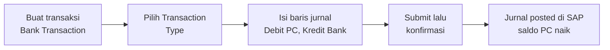
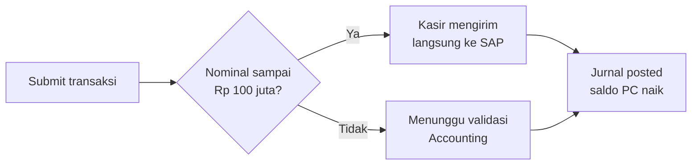

# SOP — Pencatatan Pindah Buku Bank ke Petty Cash

**Berlaku sejak:** 25 September 2026
**Pemakai:** Kasir site (Cashier) yang sudah diberi izin submit langsung
**Menu:** Cashier → Bank Transaction

## 1. Apa yang berubah

Mulai 25 September 2026, kasir dapat menyelesaikan pencatatan pindah buku dari rekening bank ke Petty Cash (PC) dalam satu kegiatan: setelah transaksi di-submit, jurnalnya langsung terkirim ke SAP, dan baris Incoming yang menambah saldo PC di aplikasi terbentuk otomatis setelah jurnal SAP berhasil. Untuk transaksi rutin di bawah ambang, tidak ada lagi langkah menunggu validasi Accounting.

Satu hal yang perlu diingat: jurnal yang sudah terkirim ke SAP tidak bisa diedit atau dihapus. Bila terjadi kekeliruan, koreksinya dilakukan Accounting melalui jurnal pembalik (storno).

## 2. Syarat sebelum mulai

| No | Syarat | Keterangan |
|---|---|---|
| 1 | PCBC minggu lalu dan dua minggu lalu sudah diunggah | Bila belum, menu kasir termasuk Incoming terkunci sampai PCBC diunggah dan divalidasi |
| 2 | Jenis transaksi termasuk yang diizinkan | Pindah buku bank ke PC, biaya admin bank, atau bunga bank |
| 3 | Nominal transaksi maksimal Rp 100.000.000 | Di atas nilai itu transaksi tetap bisa dibuat, tetapi menunggu validasi Accounting sebelum masuk SAP |
| 4 | Akun Petty Cash site sendiri | Sisi debit memakai akun Petty Cash site Anda, sisi kredit memakai akun bank yang dipilih |

## 3. Alur singkat

## 4. Langkah rinci

1. Buka menu **Cashier → Bank Transaction**, lalu klik **Create**.
2. Isi **Date**, **Project**, **Bank Account** (rekening sumber dana), dan **Description** dengan keterangan singkat, misalnya "Penarikan dana operasional petty cash".
3. Pilih **Transaction Type**: **Transfer to Petty Cash** untuk pindah buku bank ke PC site, **Bank Admin Fee** untuk biaya administrasi bank, atau **Bank Interest** untuk bunga dan jasa giro. Pilihan ini menentukan akun debit yang boleh dipakai, supaya tidak salah akun.
4. Isi baris jurnal: **Credit** pada akun bank yang dipilih di langkah 2 sebesar nominal penuh, dan **Debit** pada akun Petty Cash site Anda atau akun biaya/bunga bank sesuai jenis transaksi. **Project dan Cost Center wajib diisi pada setiap baris** — transaksi tidak akan tersimpan bila kosong. Pastikan total Debit sama dengan total Credit.
5. Klik **Save**. Transaksi tersimpan dengan status **Draft**, dan pada tahap ini masih bisa diedit atau dihapus.
6. Klik **Submit**, lalu setujui kotak konfirmasi yang muncul. Kotak itu mengingatkan bahwa jurnal akan langsung posted di SAP dan tidak bisa diedit setelahnya.
7. Periksa hasilnya: nomor jurnal SAP tampil di halaman transaksi, dan baris **Incoming** terbentuk sehingga saldo Petty Cash di aplikasi bertambah.

## 5. Perlakuan menurut nominal

| Nominal transaksi | Yang terjadi setelah Submit | Saldo PC di aplikasi |
|---|---|---|
| Sampai dengan Rp 100.000.000 | Jurnal langsung dikirim dan posted ke SAP oleh kasir | Bertambah setelah jurnal SAP berhasil |
| Di atas Rp 100.000.000 | Transaksi masuk antrean validasi Accounting lebih dulu, baru dikirim ke SAP | Bertambah setelah jurnal SAP berhasil, yaitu setelah Accounting memvalidasi |

## 6. Yang tidak boleh dilakukan

1. **Jangan memakai menu ini untuk membayar vendor atau beban lain.** Sistem akan menolak akun di luar daftar yang diizinkan; pembayaran seperti itu memakai prosedur Payreq dan Realization.
2. **Jangan membuat baris Incoming secara manual** untuk penarikan bank. Baris Incoming sudah terbentuk otomatis, dan membuat manual akan membuat saldo PC menjadi dobel.
3. **Jangan mengubah atau menghapus transaksi yang sudah posted.** Bila ada kekeliruan, ajukan koreksi ke Accounting karena koreksinya berupa jurnal pembalik (storno).

## 7. Kalau ada kendala

| Gejala | Yang perlu dilakukan |
|---|---|
| Muncul pesan error dari SAP saat Submit | Perbaiki sesuai isi pesan, lalu Submit ulang; transaksi tidak terkirim dan saldo belum berubah |
| Saldo Petty Cash tidak bertambah | Periksa nomor jurnal SAP pada halaman transaksi; bila belum ada berarti jurnal belum posted, bila sudah ada hubungi Accounting |
| Menu Incoming atau Ready to Pay terkunci | PCBC minggu lalu atau dua minggu lalu belum diunggah atau belum divalidasi |
| Akun yang dibutuhkan tidak muncul | Akun tersebut di luar daftar yang diizinkan, hubungi Accounting untuk penyesuaian |

Pertanyaan atau kendala lain dapat disampaikan ke **Tim AccountingOne** dengan menyebutkan nomor transaksi dan waktu kejadian.

---

*Dokumen ini disusun 25 September 2026. Ambang nominal dan daftar akun diatur pada menu Admin → Advance Parameters.*
