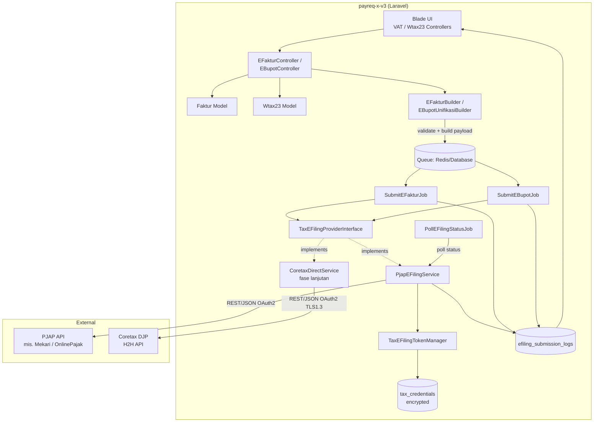
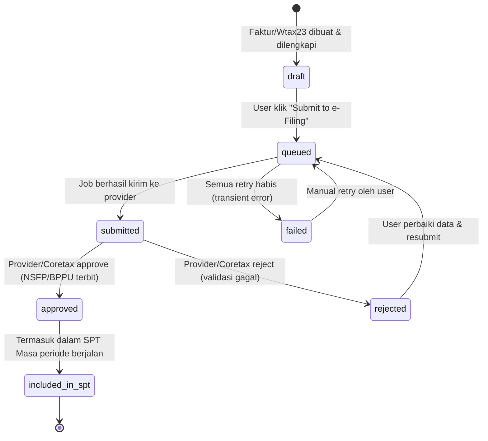
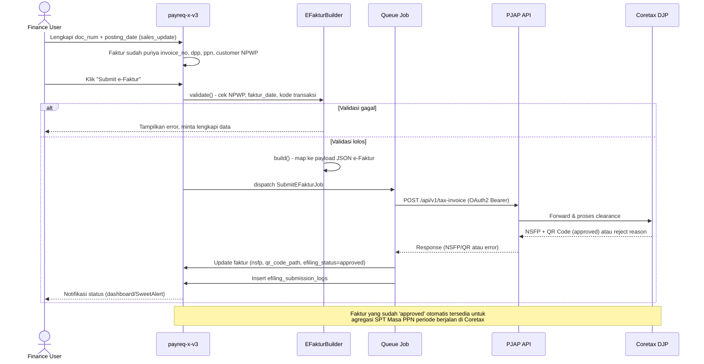
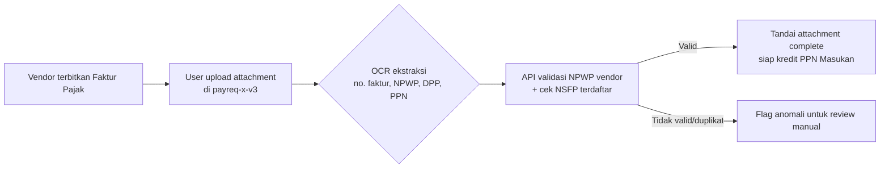
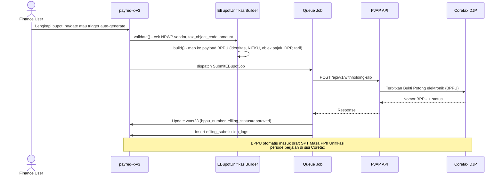
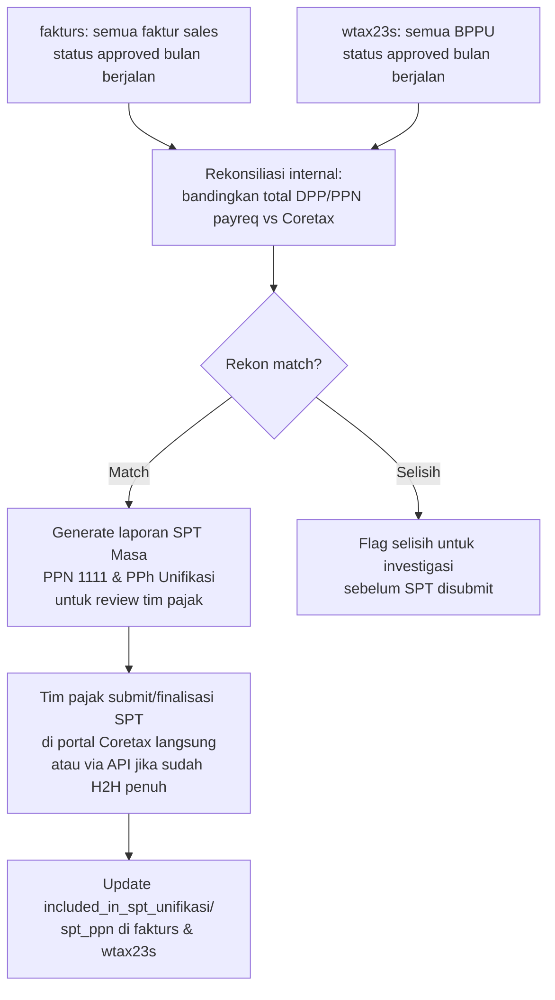

# Tax e-Filing API Integration — Rekomendasi & Konsep

> Dokumen konsep integrasi payreq-x-v3 dengan sistem e-Filing perpajakan Indonesia (Coretax DJP: e-Faktur, e-Bupot Unifikasi, SPT Masa).
>
> Status: **Konsep / Rekomendasi** — belum diimplementasikan.
> Disusun: Juli 2026.

## Daftar Isi

1. [Ringkasan Eksekutif](#1-ringkasan-eksekutif)
2. [Lanskap e-Filing Indonesia Saat Ini](#2-lanskap-e-filing-indonesia-saat-ini)
3. [Kondisi Aplikasi payreq-x-v3 Saat Ini](#3-kondisi-aplikasi-payreq-x-v3-saat-ini)
4. [API Feasibility Assessment](#4-api-feasibility-assessment)
5. [Arsitektur Integrasi yang Direkomendasikan](#5-arsitektur-integrasi-yang-direkomendasikan)
6. [Data Flow: Dari Payreq → e-Filing](#6-data-flow-dari-payreq--e-filing)
7. [Rekomendasi Prioritas Implementasi](#7-rekomendasi-prioritas-implementasi)
8. [Estimasi & Risiko](#8-estimasi--risiko)
9. [Kebutuhan Credential & Perizinan](#9-kebutuhan-credential--perizinan)
10. [Lampiran: Referensi Regulasi](#10-lampiran-referensi-regulasi)

---

## 1. Ringkasan Eksekutif

Sejak 1 Januari 2025, Direktorat Jenderal Pajak (DJP) mengoperasikan **Coretax DJP** (Core Tax Administration System / CTAS) sebagai sistem inti tunggal yang menggantikan e-Faktur Desktop lama, e-SPT, e-Bupot 21/26, e-Bupot Unifikasi, dan DJP Online. Per Juli 2026, DJP telah memperluas cakupan Coretax menjadi sistem inti untuk **seluruh** administrasi perpajakan (pengawasan, penegakan hukum, penagihan, keberatan/banding), bukan hanya pelaporan.

Untuk payreq-x-v3, temuan utama:

- **Tidak ada API publik/terbuka langsung** dari DJP untuk sembarang Wajib Pajak. Integrasi H2H (host-to-host) hanya tersedia untuk WP yang **terdaftar dan disetujui** DJP sebagai pengguna API langsung, atau melalui **PJAP (Penyedia Jasa Aplikasi Perpajakan)** berlisensi resmi (diatur PER-5/PJ/2025).
- Pendekatan paling **feasible, cepat, dan rendah-risiko regulasi** untuk payreq-x-v3 adalah **integrasi via PJAP pihak ketiga** (mis. Mekari Klikpajak, OnlinePajak/Mid Solusi Nusantara, Pajakku, dll.) menggunakan REST API mereka — bukan membangun koneksi H2H langsung ke Coretax.
- Integrasi H2H langsung ke Coretax dimungkinkan secara teknis (OAuth2, TLS 1.3, JSON) tetapi memerlukan pendaftaran aplikasi ERP sebagai *integrated system* di portal DJP, sertifikat elektronik, dan proses approval yang panjang — cocok untuk fase lanjutan, bukan quick-win.
- Modul **Faktur Pajak (VAT)** dan **Wtax23** yang sudah ada di payreq-x-v3 sudah memiliki *life-cycle tracking* yang baik (status, attachment, SAP posting) — ini adalah fondasi yang sangat baik untuk ditambahkan lapisan integrasi e-Filing tanpa mengubah struktur inti.
- Rekomendasi: bangun **Tax e-Filing Service Layer** baru (mengikuti pola `SapService`/`SapArInvoiceBuilder` yang sudah ada) yang berkomunikasi dengan PJAP API, dengan job queue untuk submission asinkron, tabel status/log terpisah (mengikuti pola `SapSubmissionLog`), dan UI tracking status per dokumen.

---

## 2. Lanskap e-Filing Indonesia Saat Ini

### 2.1 Coretax DJP (Core Tax Administration System / CTAS)

| Aspek | Status per Juli 2026 |
|---|---|
| Peluncuran | Aktif nasional sejak 1 Januari 2025 (proyek PSIAP, Perpres No. 40/2018) |
| Cakupan | Sejak Juli 2026, **seluruh** proses administrasi pajak (registrasi, e-Faktur, e-Bupot, SPT Masa/Tahunan, e-Billing, pengawasan, penegakan hukum, penagihan, keberatan & banding) terpusat di Coretax |
| Kanal akses | (1) Portal web Coretax, (2) e-Faktur Client Desktop (untuk PKP tertentu, masih diizinkan s.d. saat ini via KEP-54/PJ/2025), (3) Host-to-Host (H2H) API langsung / via PJAP |
| API resmi | **Ada**, berbasis REST/JSON dengan OAuth2 (Client ID & Client Secret), TLS 1.3, ditujukan untuk WP volume tinggi atau PJAP |
| Sandbox | Tersedia melalui Developer Portal DJP untuk uji coba sebelum go-live |
| Dampak bagi ERP | Data transaksi ber-PPN/PPh wajib dipetakan ke skema JSON/XML Coretax; NSFP (Nomor Seri Faktur Pajak), NITKU, dan validasi NPWP 16-digit menjadi mandatory |

**Implikasi untuk payreq-x-v3:** Semua rencana integrasi harus diarahkan ke Coretax, bukan ke sistem-sistem legacy (e-Faktur Desktop lama, DJP Online, e-SPT offline) yang sudah/akan di-*deprecate*.

### 2.2 e-Faktur (PPN)

- Faktur Pajak Elektronik saat ini diterbitkan melalui **3 kanal resmi** (Keterangan Tertulis KT-06/2025 DJP):
  1. Aplikasi **Coretax DJP** (kanal utama/default sejak 1 Jan 2025).
  2. **e-Faktur Client Desktop** — masih diizinkan untuk PKP tertentu yang ditetapkan (KEP-54/PJ/2025), untuk hampir semua jenis faktur kecuali kode transaksi 06 (turis asing/VAT refund), 07 (fasilitas PPN DTP/tidak dipungut), faktur cabang dengan pemusatan PPN, dan PKP yang dikukuhkan setelah 1 Jan 2025. Data dari kanal ini disinkronkan ke Coretax maksimal H+2.
  3. **Host-to-Host (H2H)** melalui PJAP berlisensi — kanal yang relevan untuk integrasi ERP volume tinggi seperti payreq-x-v3.
- **API resmi DJP untuk H2H tersedia**, tapi akses langsung memerlukan pendaftaran sebagai *integrated system* dengan Client ID/Secret dan approval DJP. Sebagian besar perusahaan menggunakan **PJAP** (mitra resmi DJP) sebagai perantara API karena proses onboarding jauh lebih cepat.
- Setiap faktur pajak yang di-clear akan mendapatkan **NSFP** dan **QR code** yang wajib disimpan sebagai bukti sah.
- Fitur yang didukung API: pembuatan faktur normal, faktur pengganti (revisi), pembatalan (retur/void), dan impor massal.

### 2.3 e-SPT (SPT Masa & Tahunan)

- **SPT Masa PPN (1111)**: pelaporan PPN Masukan/Keluaran kini otomatis terkonsolidasi dari data e-Faktur di dalam Coretax — tidak lagi perlu aplikasi e-SPT PPN terpisah. Data faktur yang sudah terbit otomatis masuk ke draft SPT Masa PPN.
- **SPT Masa PPh 21/26 & PPh Unifikasi (Pasal 4(2), 15, 22, 23, 26)**: dilaporkan melalui modul **SPT Masa PPh Unifikasi** di Coretax, yang datanya ditarik otomatis dari Bukti Potong (e-Bupot) yang sudah diterbitkan pada periode berjalan.
- **SPT Tahunan Badan (1771)**: tetap dilaporkan via Coretax (menggantikan e-SPT/e-Filing lama), dengan opsi impor data melalui template Excel-to-XML resmi DJP untuk lampiran-lampiran kompleks (daftar aset, daftar penyusutan, dll.).
- Mekanisme pelaporan sekarang: **key-in manual** di portal Coretax, **impor XML** (menggunakan template Excel-to-XML resmi DJP: `BPU Excel to XML`, `BP21 Excel to XML`, dsb.), atau **API H2H** (untuk PJAP/WP besar).
- Untuk PPh yang harus dibayar sebelum lapor, Coretax akan men-generate **kode billing** otomatis dari SPT (bukan lagi via e-Billing terpisah, kecuali untuk beberapa jenis PPh Pasal 15/4(2) tertentu).

### 2.4 e-Bupot (21/26 dan Unifikasi)

- **e-Bupot Unifikasi** kini menjadi modul terintegrasi dalam Coretax untuk PPh Pasal 4(2), 15, 22, 23, dan 26 — inilah modul yang **relevan langsung dengan tabel `wtax23s`** di payreq-x-v3 (Withholding Tax 23).
- Proses penerbitan Bukti Potong (BPPU — Bukti Potong/Pungut Unifikasi): (1) key-in satu-per-satu di portal, atau (2) impor XML massal, atau (3) **API** (untuk PJAP/H2H).
- Begitu BPPU diterbitkan, data otomatis terhubung ke **SPT Masa PPh Unifikasi** — tidak perlu input ulang.
- **e-Bupot PPh 21/26** (untuk withholding gaji/karyawan) juga sudah menyatu ke Coretax, terpisah modul dari Unifikasi, dan saat ini tidak secara langsung relevan dengan modul payreq-x-v3 yang sudah ada (fokus Wtax23 = PPh 23, transaksi vendor/AP, bukan payroll).
- **API tersedia** untuk pembuatan bukti potong secara otomatis dari sistem eksternal, dengan syarat WP terdaftar di skema H2H/PJAP.

### 2.5 Core Tax System (CTAS) — Status & Timeline

| Milestone | Tanggal | Keterangan |
|---|---|---|
| Go-live nasional | 1 Januari 2025 | Semua PKP wajib pindah ke Coretax untuk e-Faktur/e-Bupot/SPT |
| Masa transisi e-Faktur Desktop | s.d. saat ini (per KEP-54/PJ/2025) | PKP tertentu masih boleh pakai e-Faktur Desktop, data sync H+2 ke Coretax |
| Revisi ketentuan PJAP | 2 Mei 2025 (PER-5/PJ/2025) | Skema PJAP baru menyesuaikan arsitektur Coretax, definisi 5 layanan wajib PJAP |
| Perluasan cakupan penuh | Juli 2026 | Coretax menjadi sistem inti untuk **seluruh** proses administrasi pajak (pengawasan, penegakan hukum, penagihan, keberatan/banding), bukan hanya pelaporan |
| Rencana ke depan | Berkelanjutan | DJP menyatakan akan terus memperluas interoperabilitas Coretax dengan sistem lain di lingkungan Kemenkeu (pertukaran data antarlembaga) |

**Kesimpulan status:** Coretax sudah **matang secara operasional** (>1.5 tahun berjalan), API H2H tersedia dan digunakan luas oleh PJAP/enterprise, namun **akses API langsung dari WP individual** (tanpa PJAP) masih memerlukan proses approval/registrasi yang signifikan dan dokumentasi teknis resminya tidak dipublikasikan secara terbuka (tidak ada portal Swagger/OpenAPI publik) — kontras dengan API pemerintah negara lain yang lebih terbuka. Sebagian besar informasi teknis detail (skema JSON persis, endpoint, rate limit) hanya diberikan ke pihak yang sudah lolos seleksi PJAP atau disetujui sebagai *integrated system*.

---

## 3. Kondisi Aplikasi payreq-x-v3 Saat Ini

Ringkasan hasil review kode (baseline sebelum integrasi e-Filing):

### 3.1 Modul Faktur Pajak (`fakturs` table)

- Model: `app/Models/Faktur.php` — relasi ke `Customer`, `User` (created_by, response_by), atribut turunan (customer_name, attachment URL).
- Controller: `app/Http/Controllers/Accounting/VatController.php` (892 baris) — mencakup:
  - Dashboard bulanan/tahunan (count & amount, outstanding vs complete) untuk sales & purchase.
  - **Sales (AR)**: user melengkapi `doc_num` + `posting_date`, lalu bisa submit ke SAP B1 (`submitToSap()`) yang membangun **AR Invoice** (`SapArInvoiceBuilder`) dan **Journal Entry** (`SapArInvoiceJeBuilder`), termasuk perhitungan WTax (2% dari DPP) otomatis pada level dokumen SAP.
  - **Purchase (AP)**: user upload `attachment` bukti Faktur Pajak masukan (PDF/gambar).
  - Sudah ada tracking status SAP: `sap_ar_doc_num`, `sap_je_num`, `sap_submission_status` (`ar_created` / `completed` / `failed`), `sap_submission_attempts`, `sap_submission_error`, dicatat di tabel `sap_submission_logs`.
- Field kunci: `doc_num`, `type` (sales/purchase), `create_date`, `posting_date`, `invoice_no`, `invoice_date`, `faktur_no`, `faktur_date`, `dpp`, `ppn`, `customer_id`, `attachment`, `sap_ar_doc_num`, `sap_je_num`, `revenue_account_code`, `je_posting_date/tax_date/due_date`.
- **Belum ada** field terkait status e-Filing (mis. NSFP, status approval Coretax, tanggal upload ke Coretax).

### 3.2 Modul Withholding Tax 23 (`wtax23s` table)

- Model: `app/Models/Wtax23.php` — sederhana, `$guarded = []`, cast tanggal.
- Controller: `app/Http/Controllers/Accounting/Wtax23Controller.php` — dashboard bulanan/tahunan (in/out), upload Bukti Potong (`bupot_no`, `bupot_date`, `filename`), tanpa integrasi SAP (murni internal tracking, data sumber dari SAP via `Wtax23Import`).
- Field kunci: `doc_type` (in/out), `create_date`, `posting_date`, `amount`, `bupot_no`, `bupot_date`, `bupot_by`, `bupot_at`, `filename`, `project`, `account`, `vendor_code`, `invoice_no`.
- **Belum ada** field status e-Bupot Coretax (mis. bukti potong elektronik number dari Coretax, tanggal terbit BPPU, status submit SPT Unifikasi).

### 3.3 Layer Integrasi SAP B1 (pola yang bisa dicontoh)

- `SapService` — HTTP client (Guzzle) dengan cookie-based session login ke SAP Service Layer, method `login()`, `createArInvoice()`, `createJournalEntry()`, `getServiceItems()`.
- `SapArInvoiceBuilder` / `SapArInvoiceJeBuilder` — pola **Builder** dengan `build()`, `validate()`, `getPreviewData()` — memisahkan logic mapping data lokal → payload API eksternal, dengan validasi sebelum submit dan preview sebelum commit.
- `SapJournalEntryBuilder` — builder generik untuk journal entry dari `VerificationJournal`.
- `SapSubmissionLog` — tabel log audit trail submission (status, response, error, jumlah percobaan, siapa yang submit) — pola ini **sangat cocok dicontoh** untuk log submission ke Coretax/PJAP.
- Pola UI: preview sebelum submit (`previewSapSubmission`), update field sebelum commit (`updateSapPreview`), submit final dengan transaction + rollback (`submitToSap`), error handling granular dengan pesan actionable untuk user.

**Kesimpulan:** Codebase sudah punya *battle-tested pattern* integrasi API eksternal (builder + service + log + preview UI) yang tinggal direplikasi untuk Tax e-Filing, sehingga risiko teknis relatif rendah — tantangan utama justru di sisi *regulasi & akses API* DJP/PJAP, bukan arsitektur Laravel-nya.

---

## 4. API Feasibility Assessment

| Dokumen Pajak | Kanal API Resmi? | Feasibility Integrasi | Catatan |
|---|---|---|---|
| **e-Faktur (PPN Keluaran - Sales)** | Ya, via PJAP atau H2H langsung | **Tinggi** — data sudah terstruktur di `fakturs` (dpp, ppn, invoice_no, customer NPWP dari `SapBusinessPartner`) | Prioritas #1. Otomatisasi penuh dari `sales_update` → generate faktur → submit ke PJAP |
| **e-Faktur (PPN Masukan - Purchase)** | Tidak perlu API submit (faktur diterbitkan vendor) — hanya butuh **validasi/retrieval** status faktur masukan | **Sedang** — validasi NPWP vendor & cross-check nomor faktur bisa via API, tapi upload masih manual (attachment) karena faktur diterbitkan pihak vendor | Cocok untuk fase 2: OCR + auto-matching, bukan submission |
| **e-Bupot Unifikasi (dari Wtax23)** | Ya, via PJAP atau H2H | **Tinggi** — data `wtax23s` (amount, vendor_code, doc_type) sudah cukup lengkap untuk generate BPPU | Prioritas #2. Perlu tambahan field: kode objek pajak PPh 23, NPWP vendor (join ke `SapBusinessPartner`) |
| **SPT Masa PPh Unifikasi** | Ya, tapi biasanya hasil agregasi otomatis dari e-Bupot yang sudah terbit (di sisi Coretax) | **Sedang** — jika e-Bupot sudah masuk via API, SPT sebagian besar "otomatis" di sisi Coretax; app kita cukup memicu submit/generate SPT & rekonsiliasi status | Bergantung pada #2 selesai lebih dulu |
| **SPT Masa PPN (1111)** | Sama seperti di atas — hasil agregasi e-Faktur | **Sedang** — bergantung pada integrasi e-Faktur (#1) sudah berjalan | Bergantung pada #1 |
| **SPT Tahunan Badan (1771)** | Ada opsi impor XML/template, API tersedia tapi kompleksitas skema tinggi (lampiran neraca, laba-rugi, koreksi fiskal) | **Rendah** untuk full-API — kompleksitas tinggi, frekuensi rendah (1x/tahun), butuh keterlibatan konsultan pajak | Rekomendasi: generate **file XML/Excel siap-impor** dari app, upload tetap manual oleh tim pajak/konsultan |
| **e-Bupot PPh 21/26 (Payroll)** | Ada API, tapi **di luar cakupan modul payreq-x-v3 saat ini** (tidak ada modul payroll withholding) | **Tidak relevan saat ini** | Tidak masuk prioritas dokumen ini kecuali modul payroll dibangun terpisah |

### 4.1 Yang HARUS Manual / Semi-Manual

- **Faktur Pajak Masukan (Purchase)** — penerbitan sepenuhnya oleh vendor; app kita hanya menerima & menyimpan attachment. API dapat digunakan untuk **validasi** (cek keabsahan faktur via NPWP/NSFP lookup) tapi tidak untuk *submission*.
- **SPT Tahunan Badan (1771)** — kompleksitas tinggi (rekonsiliasi fiskal, lampiran neraca), disarankan tetap dikerjakan tim pajak/konsultan dengan bantuan **generate file ekspor** dari app (bukan submit API otomatis).
- **Sertifikat elektronik & digital signature** — proses request/renewal sertifikat elektronik tetap manual melalui DJP/penyelenggara sertifikat elektronik terafiliasi; tidak bisa diotomasi dari app internal.
- Kasus **koreksi/pembetulan SPT**, keberatan, banding — proses hukum yang memerlukan judgment manusia (konsultan pajak), di luar cakupan otomasi.

### 4.2 Alternatif: OCR + RPA untuk Bridge Gap

Untuk skenario di mana API resmi tidak tersedia atau terlalu mahal/lambat untuk diakses langsung (mis. tahap awal sebelum approval PJAP selesai, atau untuk SPT Tahunan Badan):

- **OCR untuk Faktur Pajak Masukan**: ekstraksi otomatis nomor faktur, NPWP vendor, DPP, PPN dari PDF/gambar attachment yang sudah diupload di modul Purchase VAT — mengurangi input manual dan mendeteksi anomali/duplikasi lebih awal.
- **RPA (Robotic Process Automation)** sebagai *last-resort bridge*: automasi browser untuk login ke portal Coretax dan mengisi form/upload XML jika API H2H belum disetujui DJP. **Risiko tinggi** (rentan terhadap perubahan UI Coretax, berpotensi melanggar ToS jika bukan mekanisme resmi) — hanya direkomendasikan sebagai solusi sementara dengan human-in-the-loop approval, bukan solusi permanen.
- Prioritas jangka panjang tetap: migrasi ke API resmi (PJAP atau H2H langsung) begitu tersedia/disetujui.

---

## 5. Arsitektur Integrasi yang Direkomendasikan

### 5.1 Prinsip Desain

1. **Ikuti pola yang sudah terbukti** di codebase: Service (HTTP client) + Builder (payload mapper + validator) + SubmissionLog (audit trail) + Preview UI sebelum commit.
2. **Async by default** — semua submission ke API eksternal (PJAP/Coretax) dijalankan via Queue Job, bukan langsung di request cycle, karena API eksternal bisa lambat/timeout.
3. **Idempotency & retry** — setiap submission harus bisa di-retry aman tanpa duplikasi (gunakan idempotency key/reference number lokal).
4. **Status tracking granular per dokumen** — setiap `Faktur`/`Wtax23` punya field status e-Filing terpisah dari status SAP, agar kedua proses (SAP posting & e-Filing) independen dan bisa dipantau terpisah.
5. **Provider-agnostic interface** — buat interface `TaxEFilingProviderInterface` agar bisa switch antara PJAP A, PJAP B, atau H2H langsung ke Coretax di masa depan tanpa mengubah business logic.

### 5.2 Modul Baru yang Perlu Dibuat

```
app/
├── Contracts/
│   └── TaxEFilingProviderInterface.php       # interface generik: submitEFaktur(), submitEBupot(), checkStatus(), cancel()
├── Services/
│   ├── TaxEFiling/
│   │   ├── PjapEFilingService.php            # implementasi konkret untuk PJAP terpilih (Guzzle client, OAuth2 token mgmt)
│   │   ├── CoretaxDirectService.php           # (fase lanjutan) H2H langsung ke Coretax, implement interface sama
│   │   ├── EFakturBuilder.php                 # mapping Faktur (sales) -> payload e-Faktur JSON/XML
│   │   ├── EBupotUnifikasiBuilder.php         # mapping Wtax23 -> payload e-Bupot Unifikasi
│   │   └── TaxEFilingTokenManager.php         # manajemen OAuth2 access/refresh token (cache-backed)
├── Jobs/
│   ├── SubmitEFakturJob.php                   # queued job submit faktur ke provider
│   ├── SubmitEBupotJob.php                    # queued job submit bupot ke provider
│   ├── PollEFilingStatusJob.php                # polling status approval (jika provider tidak pakai webhook)
│   └── SyncNpwpValidationJob.php              # validasi NPWP customer/vendor secara berkala
├── Http/Controllers/Accounting/
│   ├── EFakturController.php                  # UI: preview, submit, retry, lihat status/QR code NSFP
│   └── EBupotController.php                   # UI: preview, submit, retry, lihat status BPPU
├── Models/
│   ├── EFilingSubmissionLog.php               # audit trail (pola sama seperti SapSubmissionLog)
│   └── TaxCredential.php                       # penyimpanan credential terenkripsi (client id/secret, cert path) per company
└── Listeners/
    └── HandleEFilingWebhook.php                # (jika provider mendukung webhook callback approval/reject)
```

### 5.3 Database Schema Tambahan (Migrations)

**Tambahan kolom pada `fakturs`** (mengikuti pola migration existing seperti `add_sap_tracking_fields_to_fakturs_table`):

```php
Schema::table('fakturs', function (Blueprint $table) {
    $table->string('nsfp')->nullable()->after('faktur_no');        // Nomor Seri Faktur Pajak dari Coretax
    $table->string('efiling_status')->nullable();                   // draft|queued|submitted|approved|rejected|cancelled
    $table->string('efiling_provider')->nullable();                 // 'pjap_mekari' | 'pjap_onlinepajak' | 'coretax_direct'
    $table->string('efiling_reference')->nullable();                // reference/transaction ID dari provider
    $table->text('efiling_response')->nullable();                   // raw response JSON
    $table->string('qr_code_path')->nullable();                     // path file QR code hasil approval
    $table->timestamp('efiling_submitted_at')->nullable();
    $table->timestamp('efiling_approved_at')->nullable();
    $table->unsignedTinyInteger('efiling_attempts')->default(0);
    $table->text('efiling_error')->nullable();
});
```

**Tambahan kolom pada `wtax23s`**:

```php
Schema::table('wtax23s', function (Blueprint $table) {
    $table->string('bppu_number')->nullable();                      // Nomor Bukti Potong/Pungut Unifikasi dari Coretax
    $table->string('tax_object_code')->nullable();                  // Kode Objek Pajak PPh 23 (mis. 24-104-XX)
    $table->string('efiling_status')->nullable();                   // draft|queued|submitted|approved|rejected
    $table->string('efiling_provider')->nullable();
    $table->string('efiling_reference')->nullable();
    $table->text('efiling_response')->nullable();
    $table->timestamp('efiling_submitted_at')->nullable();
    $table->timestamp('efiling_approved_at')->nullable();
    $table->unsignedTinyInteger('efiling_attempts')->default(0);
    $table->text('efiling_error')->nullable();
    $table->boolean('included_in_spt_unifikasi')->default(false);   // flag sudah masuk SPT Masa periode berjalan
});
```

**Tabel baru `efiling_submission_logs`** (pola identik `sap_submission_logs`):

```php
Schema::create('efiling_submission_logs', function (Blueprint $table) {
    $table->id();
    $table->morphs('submittable');            // faktur atau wtax23 (polymorphic: faktur_id/wtax23_id + type)
    $table->string('document_type');          // 'e_faktur' | 'e_bupot_unifikasi' | 'spt_masa_ppn' | 'spt_masa_unifikasi'
    $table->string('provider');               // pjap identifier
    $table->enum('status', ['pending', 'success', 'failed', 'rejected']);
    $table->text('request_payload')->nullable();
    $table->text('response_payload')->nullable();
    $table->text('error_message')->nullable();
    $table->integer('attempt_number')->default(1);
    $table->foreignId('submitted_by')->nullable()->constrained('users');
    $table->timestamps();

    $table->index(['document_type', 'status']);
});
```

**Tabel baru `tax_credentials`** (penyimpanan credential terenkripsi, dienkripsi via Laravel `encrypted` cast):

```php
Schema::create('tax_credentials', function (Blueprint $table) {
    $table->id();
    $table->string('provider');               // 'pjap_mekari', 'coretax_direct', dll.
    $table->text('client_id');                // encrypted
    $table->text('client_secret');            // encrypted
    $table->text('certificate_path')->nullable();
    $table->timestamp('token_expires_at')->nullable();
    $table->text('cached_access_token')->nullable(); // encrypted, short-lived
    $table->boolean('is_active')->default(true);
    $table->timestamps();
});
```

### 5.4 Diagram Arsitektur



### 5.5 Queue / Job System untuk Async Submission

- Gunakan Laravel Queue (`ShouldQueue`) — driver **database** atau **redis** (cek konfigurasi existing di `config/queue.php`).
- `SubmitEFakturJob` / `SubmitEBupotJob`:
  - `$tries = 5`, `backoff()` dengan exponential backoff (mis. `[60, 300, 900, 3600, 7200]` detik) agar tidak membanjiri API PJAP saat gangguan.
  - Middleware `WithoutOverlapping` per `faktur_id`/`wtax23_id` agar tidak submit ganda.
  - Update `efiling_status` menjadi `queued` → `submitted` → `approved`/`rejected` sepanjang lifecycle job.
- `PollEFilingStatusJob` dijadwalkan via Laravel Scheduler (`app/Console/Kernel.php` — Laravel 10) setiap 5–15 menit untuk dokumen berstatus `submitted` (jika provider tidak mendukung webhook realtime).
- Jika provider mendukung **webhook**, tambahkan endpoint route + `HandleEFilingWebhook` listener untuk update status secara realtime (lebih efisien daripada polling).

### 5.6 Error Handling & Retry Mechanism

Mengikuti pola `submitToSap()` yang sudah ada (DB transaction + rollback + logging granular + pesan actionable):

1. **Validasi pra-submit** (`EFakturBuilder::validate()` / `EBupotUnifikasiBuilder::validate()`) — cek kelengkapan NPWP, NITKU, kode objek pajak, format tanggal, sebelum hit API (mengurangi *wasted API call* dan rejection dari DJP).
2. **Klasifikasi error**:
   - *Transient* (timeout, 5xx, rate limit) → auto-retry via queue backoff.
   - *Validation error* (4xx, skema salah, NPWP tidak valid) → tidak di-retry otomatis, ditandai `rejected`, tampil di UI untuk perbaikan manual data, lalu resubmit manual oleh user.
   - *Auth error* (token expired/invalid) → `TaxEFilingTokenManager` otomatis refresh token sebelum retry.
3. Semua percobaan (sukses/gagal) dicatat ke `efiling_submission_logs` dengan `attempt_number`, request/response payload (untuk audit & debugging), dan pesan error yang actionable (contoh pola pesan error SAP yang sudah ada di `VatController::submitToSap()`).
4. **Circuit breaker sederhana**: jika 1 provider gagal berturut-turut (mis. >10x dalam 1 jam), sistem menandai provider tersebut *degraded* dan mengirim notifikasi ke tim finance/IT (bukan terus retry membabi-buta).

### 5.7 Status Tracking per Dokumen Pajak

Status lifecycle yang direkomendasikan (disimpan di kolom `efiling_status`):



Dashboard tracking (mengikuti pola dashboard VAT/Wtax23 existing) menampilkan ringkasan per bulan: jumlah dokumen `draft` / `queued` / `submitted` / `approved` / `rejected`, sehingga tim finance bisa memantau backlog e-Filing sama seperti mereka memantau outstanding Faktur Pajak saat ini.

---

## 6. Data Flow: Dari Payreq → e-Filing

### 6.1 e-Faktur (Sales) — dari `fakturs` → Coretax



### 6.2 e-Faktur (Purchase) — validasi faktur masukan



### 6.3 e-Bupot — dari `wtax23s` → e-Bupot Unifikasi



### 6.4 e-SPT — Agregasi & Submit SPT Masa



> **Catatan penting:** Karena SPT Masa PPN & PPh Unifikasi di Coretax **secara otomatis** mengagregasi data dari e-Faktur & e-Bupot yang sudah *approved*, peran utama payreq-x-v3 di tahap SPT adalah **rekonsiliasi & reporting** (memastikan data lokal = data Coretax) — bukan re-submit data yang sama. Ini mengurangi kompleksitas & risiko double-reporting.

---

## 7. Rekomendasi Prioritas Implementasi

Diurutkan berdasarkan **dampak workflow** × **feasibility API** × **kompleksitas**:

### Fase 1 (Quick Win, 4–8 minggu): e-Faktur Sales via PJAP

- **Dampak**: Tinggi — mengeliminasi proses manual "input doc_num + posting_date" lalu upload terpisah ke Coretax; team AR saat ini melakukan pekerjaan ganda (input di payreq + input ulang di Coretax).
- **Feasibility**: Tinggi — API PJAP untuk e-Faktur paling matang & terdokumentasi (banyak PJAP komersial mendukung ini "out of the box").
- **Kompleksitas**: Sedang — mengikuti pola `SapArInvoiceBuilder` yang sudah ada, tinggal tambah builder baru + service PJAP + queue job.
- **Prasyarat**: pemilihan & kontrak dengan 1 PJAP (lihat §9), sertifikat elektronik perusahaan aktif.

### Fase 2 (6–10 minggu, paralel dengan Fase 1 tail-end): e-Bupot Unifikasi dari Wtax23

- **Dampak**: Tinggi — proses upload Bukti Potong manual (`Wtax23Controller::update`) saat ini rawan keterlambatan (deadline tanggal 20 bulan berikutnya untuk SPT Unifikasi).
- **Feasibility**: Tinggi — API sama (PJAP), skema BPPU terdokumentasi.
- **Kompleksitas**: Sedang — perlu tambahan field `tax_object_code` & join ke `SapBusinessPartner` untuk NPWP vendor yang saat ini belum eksplisit di `wtax23s`.

### Fase 3 (4–6 minggu): Rekonsiliasi & Dashboard SPT Masa (PPN + Unifikasi)

- **Dampak**: Sedang-Tinggi — visibility bagi tim pajak untuk cross-check data sebelum submit SPT, mengurangi risiko SPT kurang bayar/lebih bayar akibat selisih data.
- **Feasibility**: Tinggi (read-only API status/retrieval, tidak perlu submission kompleks).
- **Kompleksitas**: Rendah-Sedang — reporting/dashboard layer di atas data yang sudah ada dari Fase 1 & 2.

### Fase 4 (Eksploratif, 8–12 minggu): OCR untuk Faktur Pajak Masukan

- **Dampak**: Sedang — mengurangi input manual purchase VAT, deteksi dini duplikasi/faktur fiktif.
- **Feasibility**: Sedang — teknologi OCR tersedia (Google Vision, AWS Textract, atau lokal Tesseract), tapi akurasi ekstraksi PDF faktur pajak Indonesia perlu tuning/testing.
- **Kompleksitas**: Sedang-Tinggi — perlu training/tuning model, human review tetap diperlukan.

### Fase 5 (Jangka Panjang, 3–6 bulan): Migrasi ke H2H Langsung ke Coretax

- **Dampak**: Tinggi jangka panjang (menghilangkan biaya per-transaksi PJAP, kontrol penuh atas latency/keamanan).
- **Feasibility**: Rendah-Sedang saat ini — proses approval DJP untuk *integrated system* langsung panjang & belum ada dokumentasi teknis publik lengkap.
- **Kompleksitas**: Tinggi — perlu sertifikasi keamanan tambahan, whitelisting IP, tim compliance khusus.
- **Rekomendasi**: Evaluasi ulang di akhir 2026/awal 2027 setelah Fase 1–3 stabil dan volume transaksi historis sudah cukup untuk mendukung *business case* migrasi (biaya PJAP per-dokumen vs biaya development H2H).

### Fase 6 (Tidak Diprioritaskan Sekarang): SPT Tahunan Badan (1771) API

- **Dampak**: Rendah dari sisi frekuensi (1x/tahun) meski nilai pajak besar.
- **Feasibility**: Rendah — kompleksitas skema tinggi, umumnya tetap dikerjakan manual oleh konsultan pajak dengan bantuan software khusus (bukan API custom).
- **Rekomendasi**: Cukup sediakan fitur **ekspor data** (rekap Faktur & Wtax23 tahunan dalam format yang mudah diolah konsultan pajak), tanpa API submission otomatis.

---

## 8. Estimasi & Risiko

### 8.1 Estimasi Effort (asumsi 1 tim: 1 backend Laravel senior + 1 QA paruh waktu)

| Fase | Effort (person-weeks) | Durasi Kalender |
|---|---|---|
| Fase 1: e-Faktur Sales via PJAP | 6–8 PW | 4–8 minggu |
| Fase 2: e-Bupot Unifikasi dari Wtax23 | 6–8 PW | 6–10 minggu |
| Fase 3: Rekonsiliasi & Dashboard SPT | 3–4 PW | 4–6 minggu |
| Fase 4: OCR Faktur Masukan (eksploratif) | 6–10 PW | 8–12 minggu |
| Fase 5: Migrasi H2H Langsung | 12–20 PW | 3–6 bulan |
| Fase 6: Ekspor data SPT Tahunan | 1–2 PW | 1–2 minggu |

*Catatan: estimasi di luar waktu tunggu eksternal (approval PJAP/DJP, penerbitan sertifikat elektronik), yang bisa memakan waktu 2–8 minggu tambahan di luar kendali tim development.*

### 8.2 Risiko Regulasi

| Risiko | Dampak | Mitigasi |
|---|---|---|
| **Perubahan skema/endpoint Coretax** — DJP masih aktif menyempurnakan Coretax (per pernyataan Dirjen Pajak Juli 2026) | Breaking change pada integrasi, perlu maintenance berkelanjutan | Gunakan PJAP (mereka yang menanggung update skema, bukan tim internal); desain interface `TaxEFilingProviderInterface` agar loosely-coupled |
| **Perubahan tarif/kode objek pajak** (mis. perubahan PPN 11%→12% atau kode objek PPh 23) | Perhitungan salah, faktur/bupot ditolak | Simpan tarif & kode objek pajak di config/database (bukan hardcode), review berkala dengan tim pajak |
| **PJAP kehilangan lisensi/berhenti operasi** | Integrasi terputus mendadak | Desain provider-agnostic (§5.1) agar mudah switch PJAP; pilih PJAP dengan rekam jejak & basis klien besar |
| **Regulasi baru PER-5/PJ/2025 direvisi lagi** (riwayat: PER-11/2019 → PER-10/2020 → PER-5/2025) | Persyaratan teknis PJAP/H2H berubah | Monitor rilis regulasi DJP (`pajak.go.id`) secara berkala, subscribe update dari PJAP partner |
| **Sanksi keterlambatan/kesalahan lapor akibat bug integrasi** | Denda administratif, reputasi | Selalu ada tahap **preview & approval manual** sebelum submit final (jangan full-auto tanpa human checkpoint) untuk dokumen bernilai signifikan |

### 8.3 Risiko Teknis

- **Rate limiting** dari PJAP/Coretax saat volume tinggi (mis. akhir bulan saat banyak faktur diterbitkan sekaligus) — mitigasi via queue throttling (`Illuminate\Queue\Middleware\ThrottlesExceptions` atau rate limiter Laravel).
- **Downtime Coretax/PJAP** (dilaporkan cukup sering terjadi terutama musim SPT Tahunan) — mitigasi via retry + circuit breaker (§5.6), serta *graceful degradation* (fallback ke pengingat manual jika sistem down berkepanjangan).
- **Keamanan credential** (Client ID/Secret, sertifikat elektronik) — wajib dienkripsi at-rest (`encrypted` cast Laravel), tidak pernah di-commit ke repository, akses dibatasi via `.env` + permission Spatie khusus (mis. permission baru `manage-tax-efiling-credentials`).
- **Konsistensi data NPWP** — banyak reject di lapangan (dari riset: "70% error karena NPWP/NITKU tidak terdaftar aktif") terjadi karena data NPWP di `SapBusinessPartner` tidak sinkron/valid. Perlu job validasi NPWP berkala sebelum submission (`SyncNpwpValidationJob`).

### 8.4 Risiko Bisnis/Operasional

- **Biaya per-transaksi PJAP** — model bisnis PJAP komersial umumnya charge per dokumen/bulan; perlu proyeksi biaya berdasarkan volume rata-rata `fakturs`+`wtax23s` per bulan sebelum kontrak.
- **Dependency pada 1 provider** — mitigasi dengan interface provider-agnostic (§5.1), meski dalam praktiknya switching PJAP tetap butuh effort non-trivial (re-registrasi, migrasi kontrak).
- **Change management** — tim finance/AR/AP perlu training ulang workflow (dari "upload manual ke Coretax" menjadi "submit via payreq, approve, monitor status") — rekomendasikan UAT & parallel-run 1 periode pajak sebelum full cutover.

---

## 9. Kebutuhan Credential & Perizinan

Sebelum implementasi Fase 1 dapat dimulai, perusahaan (bukan tim development) perlu menyiapkan:

1. **NPWP Perusahaan (16 digit)** dan **NITKU** (Nomor Identitas Tempat Kegiatan Usaha) aktif dan tervalidasi di Coretax.
2. **Sertifikat Elektronik** (Sertel) perusahaan aktif — diterbitkan DJP/penyelenggara sertifikasi elektronik terafiliasi, digunakan untuk digital signing setiap faktur/bukti potong. Sertifikat kedaluwarsa adalah penyebab umum kegagalan integrasi.
3. **Akun Coretax aktif** dengan role PIC yang memiliki hak akses "drafter" dan/atau "signer" untuk modul e-Faktur & e-Bupot.
4. **Pemilihan & kontrak dengan PJAP** — evaluasi minimal 2–3 kandidat PJAP resmi (dari daftar PER-5/PJ/2025) berdasarkan: dukungan API/dokumentasi teknis, harga per-transaksi, SLA uptime, dan referensi klien dengan skala transaksi serupa.
5. **Client ID & Client Secret** dari PJAP terpilih (didapat setelah kontrak & aplikasi ERP terdaftar).
6. (Untuk Fase 5/H2H langsung) **Pendaftaran aplikasi ERP sebagai *integrated system*** di portal Developer DJP, termasuk dokumentasi teknis arsitektur sistem & komitmen keamanan data (proses ini melibatkan tim legal/compliance perusahaan, bukan hanya tim IT).
7. **Kebijakan internal** terkait siapa yang berwenang approve submission e-Faktur/e-Bupot bernilai di atas threshold tertentu (segregation of duties), untuk memastikan preview-before-submit di §5.6 punya proses approval yang jelas.

---

## 10. Lampiran: Referensi Regulasi

- **Perpres No. 40 Tahun 2018** — dasar hukum proyek Core Tax Administration System (PSIAP/Coretax).
- **KEP-54/PJ/2025** — Penetapan Pengusaha Kena Pajak Tertentu yang dapat menggunakan e-Faktur Client Desktop.
- **KT-06/PJ/2025 (Keterangan Tertulis)** — Penjelasan resmi DJP tentang 3 kanal penerbitan Faktur Pajak (Coretax, e-Faktur Desktop, H2H/PJAP).
- **PER-5/PJ/2025** — Penyedia Jasa Aplikasi Perpajakan (PJAP), menggantikan PER-11/PJ/2019 & PER-10/PJ/2020; menetapkan 5 layanan wajib PJAP (validasi status WP, bukti potong elektronik, modul e-Faktur, kode billing, penyaluran SPT elektronik).
- **Buku Panduan SPT Masa Unifikasi (DJP, 2025)** — mekanisme e-Bupot Unifikasi & SPT Masa PPh Unifikasi di Coretax.
- Portal resmi: [pajak.go.id/reformdjp/coretax](https://pajak.go.id/reformdjp/coretax/) — pengumuman & panduan resmi Coretax.

> **Disclaimer**: Informasi teknis detail endpoint/skema API Coretax bersifat terbatas dan sebagian besar hanya dipublikasikan ke pihak yang lolos seleksi PJAP atau disetujui sebagai *integrated system*. Dokumen ini disusun berdasarkan riset publik yang tersedia per Juli 2026 dan pemahaman umum arsitektur Coretax; detail teknis final (endpoint pasti, skema JSON/XML lengkap, rate limit) **wajib dikonfirmasi langsung** dengan PJAP terpilih atau tim teknis DJP sebelum implementasi dimulai.

---

## Ringkasan Rekomendasi Aksi Berikutnya

1. Bentuk tim kecil (finance + IT) untuk **evaluasi & seleksi PJAP** (2–4 minggu) sebagai langkah paling kritis-jalur sebelum development dimulai.
2. Sambil menunggu proses PJAP, mulai development **struktur database & service layer generik** (§5.3, §5.2) yang provider-agnostic — tidak bergantung pada PJAP mana yang akhirnya dipilih.
3. Implementasi Fase 1 (e-Faktur Sales) sebagai pilot dengan volume kecil dahulu (mis. 1 bulan pajak, subset customer) sebelum full rollout.
4. Dokumentasikan hasil pilot di `docs/decisions.md` dan `MEMORY.md` sesuai konvensi dokumentasi proyek, termasuk lesson-learned untuk Fase 2 dst.
